# Front-End Component Design - Collaborative Retro Board
**Document Version**: 1.0
**Date**: 2025-12-25
**Architecture**: React MVVM Pattern
**Status**: Design Review

---

## Table of Contents

1. [Overview](#1-overview)
2. [MVVM Architecture](#2-mvvm-architecture)
3. [Component Hierarchy](#3-component-hierarchy)
4. [View Components](#4-view-components)
5. [ViewModel Layer](#5-viewmodel-layer)
6. [Model Layer](#6-model-layer)
7. [Data Flow Patterns](#7-data-flow-patterns)
8. [Missing API Requirements](#8-missing-api-requirements)

---

## 1. Overview

### 1.1 Architecture Principles

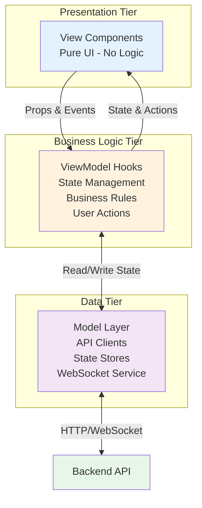

**Key Principles**:
- **View**: Only rendering logic, no state mutations
- **ViewModel**: All business logic, user interactions, state orchestration
- **Model**: Data fetching, caching, real-time sync

---

### 1.2 Technology Stack

| Layer | Technology | Purpose |
|-------|-----------|---------|
| **Framework** | React 18+ | Component-based UI |
| **Language** | TypeScript 5+ | Type safety, shared types with backend |
| **State Management** | Zustand | Lightweight global state (3KB) |
| **UI Library** | Material-UI v5 | Card, Chip, Avatar components |
| **Drag & Drop** | @dnd-kit | Accessible drag-drop, modern API |
| **Real-time** | Socket.IO Client | WebSocket connection to backend |
| **Build Tool** | Vite | Fast development server, HMR |

---

## 2. MVVM Architecture

### 2.1 Pattern Overview

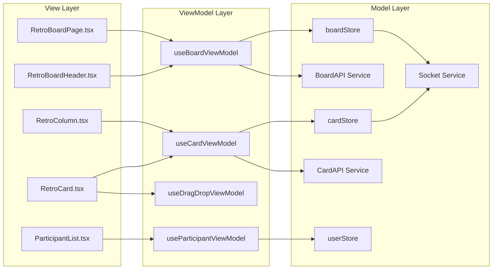

---

### 2.2 Responsibility Separation

| Layer | Responsibilities | Does NOT Handle |
|-------|-----------------|-----------------|
| **View** | - Render UI elements<br/>- Handle user events (click, type)<br/>- Pass data to children<br/>- Display loading/error states | - API calls<br/>- Business logic<br/>- State mutations<br/>- Data transformation |
| **ViewModel** | - Business logic execution<br/>- User action orchestration<br/>- State reads/writes<br/>- Data validation<br/>- Error handling | - DOM manipulation<br/>- UI styling<br/>- Direct API calls (delegates to Model) |
| **Model** | - API communication<br/>- WebSocket management<br/>- State persistence<br/>- Caching strategies<br/>- Data normalization | - UI logic<br/>- User workflows<br/>- Component state |

---

## 3. Component Hierarchy

### 3.1 Full Component Tree

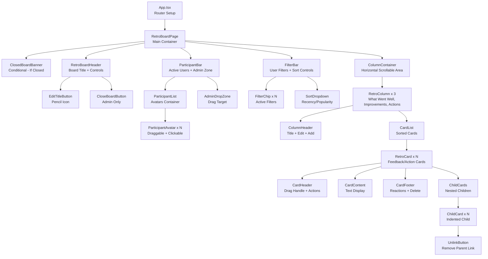

---

## 4. View Components

### 4.1 RetroBoardPage (Container)

**Purpose**: Top-level page container, orchestrates all sub-components

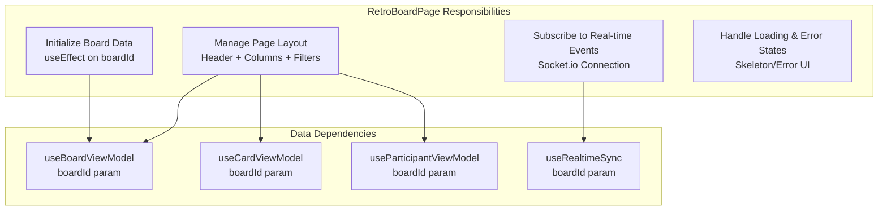

**Props**: `{ boardId: string }` (from URL param)

**State Dependencies**:
- `board` - Board metadata (name, state, columns, admins)
- `cards` - All cards for this board
- `activeUsers` - Currently active participants
- `currentUser` - Current user session info
- `isLoading` - Initial load state
- `error` - Error state

**Responsibilities**:
1. **Initialization**: Fetch board data on mount
2. **Layout Management**: Arrange header, filters, columns
3. **Real-time Sync**: Establish WebSocket connection
4. **Loading States**: Show skeleton UI during load
5. **Error Handling**: Display error messages

**Does NOT Handle**:
- Business logic (delegates to ViewModels)
- Direct API calls (handled by Model layer)
- Card sorting logic (delegated to ViewModel)

---

### 4.2 RetroBoardHeader

**Purpose**: Display board title, edit controls, close button

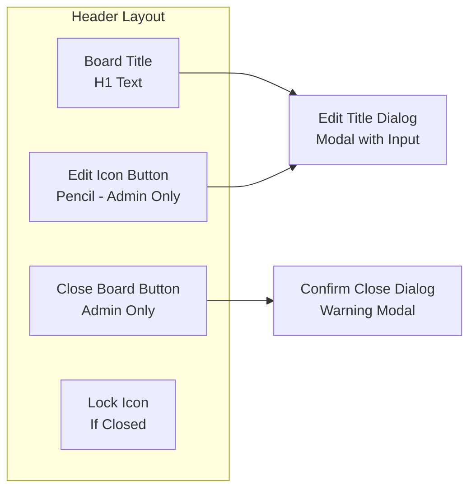

**Props**:
```typescript
{
  boardTitle: string
  isClosed: boolean
  isAdmin: boolean
  onEditTitle: (newTitle: string) => void
  onCloseBoard: () => void
}
```

**User Interactions**:
1. **Edit Title**: Click pencil → Open modal → User types → Submit → Call `onEditTitle()`
2. **Close Board**: Click close → Confirm dialog → User confirms → Call `onCloseBoard()`

**Visual States**:
- **Active Board**: Edit and Close buttons visible (if admin)
- **Closed Board**: Lock icon displayed, edit/close buttons hidden

**Responsibilities**:
- Render board title prominently
- Show/hide admin controls based on permissions
- Display closed state indicator
- Emit user actions to parent ViewModel

---

### 4.3 ParticipantBar

**Purpose**: Display active users, admin designation drop zone

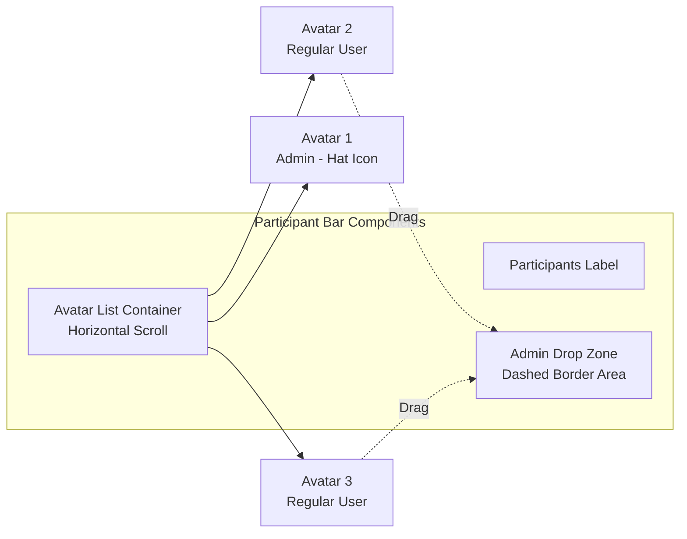

**Props**:
```typescript
{
  activeUsers: User[]
  currentUserHash: string
  admins: string[]
  onPromoteToAdmin: (userHash: string) => void
  onFilterByUser: (userHash: string) => void
}
```

**Responsibilities**:
1. **Display Active Users**: Render participant avatars
2. **Admin Indicators**: Show hat icon on admin avatars
3. **Drag-to-Admin**: Accept dragged avatars to promote
4. **Filter Activation**: Click avatar → Activate user filter

---

### 4.4 ParticipantAvatar

**Purpose**: Single user avatar, draggable, clickable for filtering

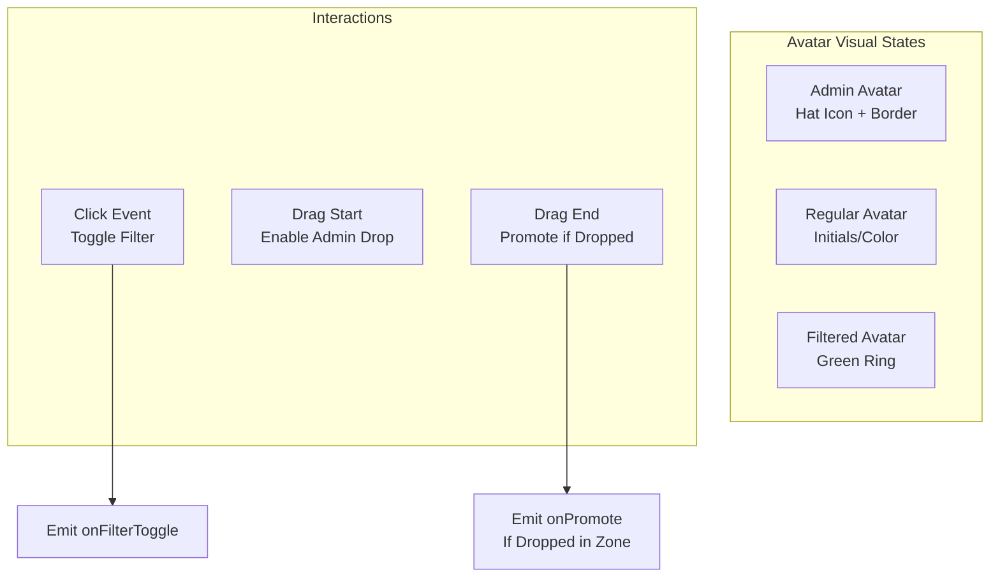

**Props**:
```typescript
{
  user: User
  isAdmin: boolean
  isFiltered: boolean
  isDraggable: boolean
  onFilterToggle: () => void
  onDragEnd: (dropped: boolean) => void
}
```

**Visual Design**:
- **Admin**: Hat emoji on top, orange border
- **Regular**: Colored circle with initials
- **Filtered**: Green ring indicator
- **Dragging**: Reduced opacity, cursor change

**Responsibilities**:
- Render user visual representation
- Handle drag gesture (if admin zone visible)
- Emit filter toggle on click
- Show appropriate visual states

---

### 4.5 FilterBar

**Purpose**: Display active filters, sort controls

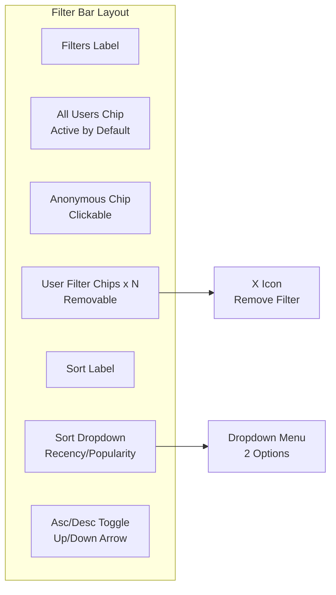

**Props**:
```typescript
{
  activeFilters: {
    users: string[]
    showAnonymous: boolean
  }
  sortMode: {
    type: 'recency' | 'popularity'
    direction: 'asc' | 'desc'
  }
  onFilterChange: (filters: Filters) => void
  onSortChange: (mode: SortMode) => void
}
```

**User Interactions**:
1. **Add User Filter**: Click avatar → Chip appears
2. **Remove Filter**: Click X on chip → Filter removed
3. **Change Sort**: Click dropdown → Select option → Cards re-sort
4. **Toggle Direction**: Click arrow → Asc/Desc toggle

**Responsibilities**:
- Display active filter chips
- Render sort controls
- Emit filter/sort changes to parent

---

### 4.6 RetroColumn

**Purpose**: Single column container (What Went Well, Improvements, Actions)

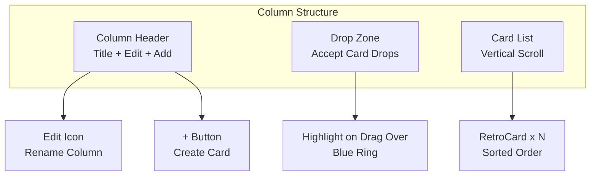

**Props**:
```typescript
{
  column: Column
  cards: Card[]
  canEdit: boolean
  onAddCard: (columnId: string) => void
  onEditColumn: (columnId: string, newName: string) => void
  onCardDropped: (cardId: string, targetColumnId: string) => void
}
```

**Responsibilities**:
1. **Render Column Layout**: Header, drop zone, card list
2. **Handle Card Drops**: Detect dropped cards, emit event
3. **Add Card Flow**: Show add button, trigger create dialog
4. **Edit Column Name**: Admin-only rename functionality
5. **Visual Feedback**: Highlight drop zone on drag-over

**Visual States**:
- **Default**: Column background color (green/orange/blue)
- **Drag Over**: Blue ring around drop zone
- **Empty**: Placeholder text if no cards

---

### 4.7 RetroCard

**Purpose**: Single card display (feedback or action)

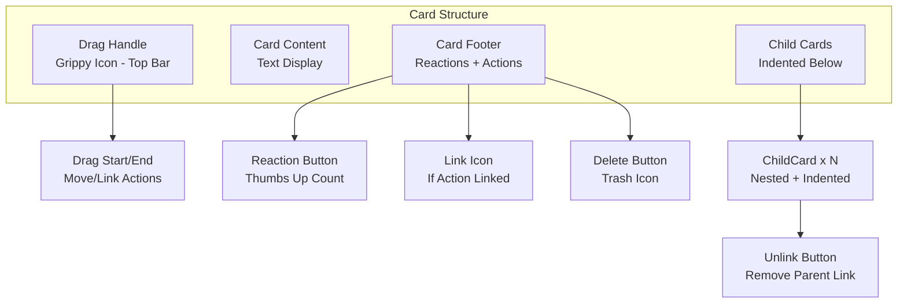

**Props**:
```typescript
{
  card: Card
  canDelete: boolean
  isParent: boolean
  hasActionLink: boolean
  onReaction: (cardId: string) => void
  onDelete: (cardId: string) => void
  onDragStart: (cardId: string) => void
  onDropOnCard: (sourceId: string, targetId: string) => void
  onUnlinkChild: (childId: string) => void
}
```

**Visual Design**:
- **Feedback Card**: White background, column border color
- **Action Card**: Light blue background
- **Parent Card**: Slightly darker background
- **Child Card**: Indented 20px, gray background, smaller font

**Drag Behaviors**:
1. **Drag Feedback Card**: Can drop on another feedback → Create parent-child
2. **Drag Action Card**: Can drop on feedback → Create action link
3. **Drag Any Card**: Can drop on column → Move to column

**Responsibilities**:
1. **Render Card UI**: Content, reactions, metadata
2. **Handle Drag Events**: Initiate drag, detect drop target
3. **Reaction Management**: Show count, handle click
4. **Delete Flow**: Show delete button (if owner), confirm, execute
5. **Display Children**: Render nested child cards
6. **Parent-Child Linking**: Accept drops to create relationship

---

### 4.8 ChildCard

**Purpose**: Nested child card under parent

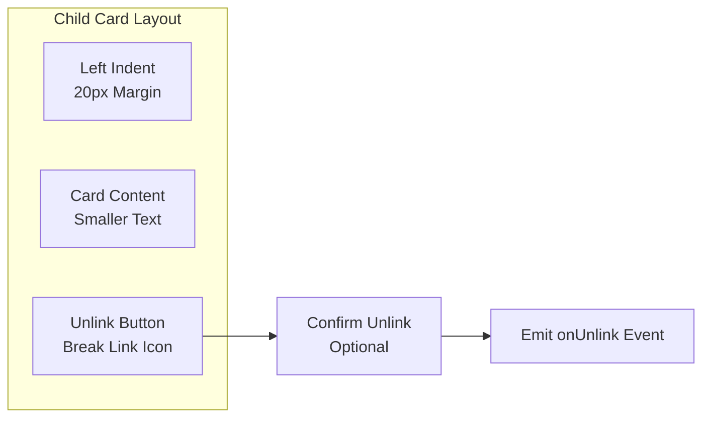

**Props**:
```typescript
{
  card: Card
  parentId: string
  onUnlink: (childId: string) => void
}
```

**Responsibilities**:
- Render child card with indentation
- Show unlink button
- Emit unlink event when clicked

**Visual Indicators**:
- Indented 20px from parent
- Gray background
- Smaller font size
- Connecting line (optional)

---

### 4.9 ClosedBoardBanner

**Purpose**: Display notification when board is closed

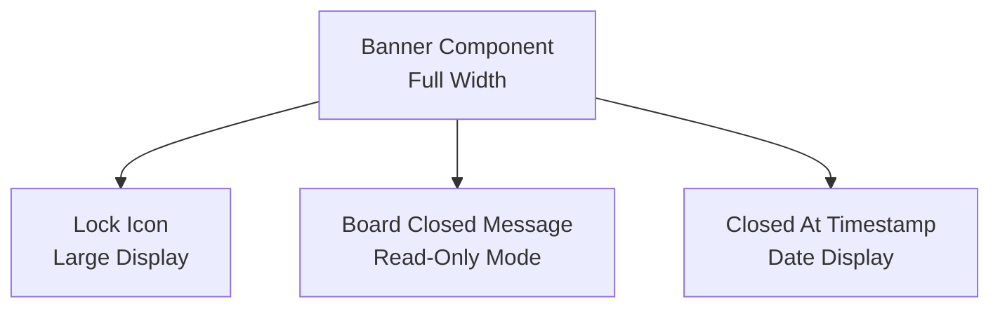

**Props**:
```typescript
{
  closedAt: Date
}
```

**Responsibilities**:
- Display prominent closed notification
- Show closure timestamp
- Persist at top of page (sticky)

---

## 5. ViewModel Layer

### 5.1 useBoardViewModel

**Purpose**: Manage board-level state and operations

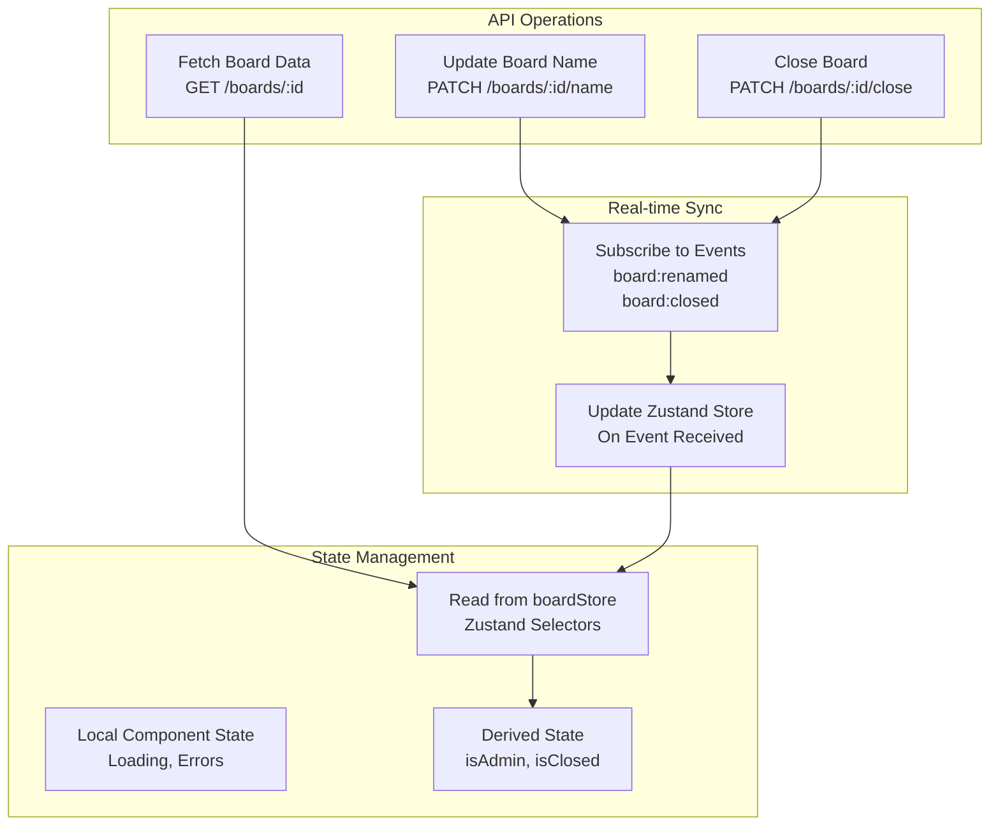

**Responsibilities**:

1. **Board Data Loading**:
   - Fetch board on mount using `boardId`
   - Handle loading and error states
   - Store in Zustand store

2. **Admin Check**:
   - Derive `isAdmin` from `board.admins.includes(currentUserHash)`
   - Re-compute when board or user changes

3. **Board State Management**:
   - Track if board is closed
   - Disable write operations when closed

4. **Board Operations**:
   - Rename board (admin only)
   - Close board (admin only)
   - Validate permissions before API calls

5. **Real-time Sync**:
   - Subscribe to `board:renamed` event → Update store
   - Subscribe to `board:closed` event → Update UI

**Return Interface**:
```typescript
{
  // State
  board: Board | null
  isLoading: boolean
  error: Error | null
  isAdmin: boolean
  isClosed: boolean

  // Actions
  handleRenameBoard: (newName: string) => Promise<void>
  handleCloseBoard: () => Promise<void>
  refreshBoard: () => Promise<void>
}
```

---

### 5.2 useCardViewModel

**Purpose**: Manage card operations, sorting, filtering

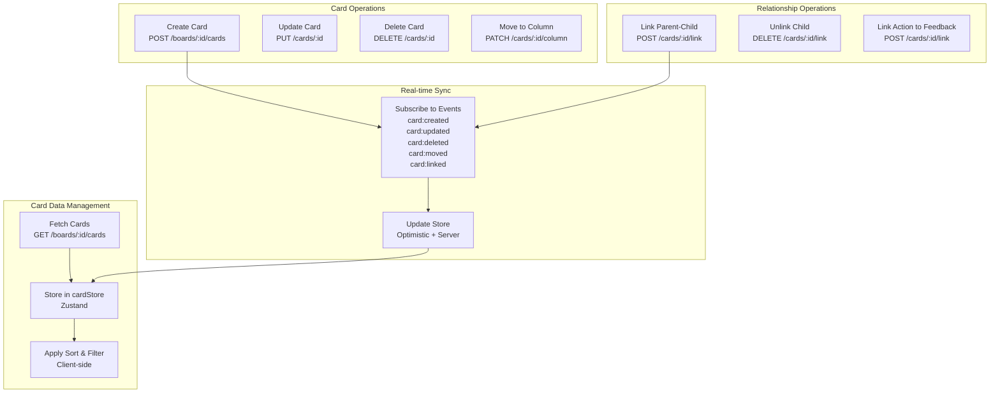

**Responsibilities**:

1. **Card Loading**:
   - Fetch all cards for board
   - Store normalized in cardStore
   - Handle parent-child relationships

2. **Card CRUD**:
   - Create card (validate limits first)
   - Update card content (owner only)
   - Delete card (cascade children, reactions)
   - Move card to different column

3. **Sorting Logic** (Client-side):
   - Sort by recency (created_at)
   - Sort by popularity (aggregated_reaction_count for parents)
   - User-specific sorting (not persisted)

4. **Filtering Logic** (Client-side):
   - Filter by user (show only user's cards)
   - Filter by anonymous (show/hide anonymous cards)
   - Multiple user filters (OR logic)

5. **Parent-Child Linking**:
   - Validate both cards are feedback type
   - Check for circular relationships
   - Update parent's aggregated count

6. **Action Linking**:
   - Validate source is action, target is feedback
   - Store link in `linked_feedback_ids` array

7. **Real-time Updates**:
   - Optimistic updates (immediate UI change)
   - Server confirmation (rollback on error)
   - Event-based sync (other users' changes)

**Return Interface**:
```typescript
{
  // State
  cards: Card[]
  sortedAndFilteredCards: Card[]
  isLoading: boolean

  // CRUD Actions
  handleCreateCard: (data: CreateCardDTO) => Promise<void>
  handleUpdateCard: (cardId: string, content: string) => Promise<void>
  handleDeleteCard: (cardId: string) => Promise<void>
  handleMoveCard: (cardId: string, columnId: string) => Promise<void>

  // Relationship Actions
  handleLinkParentChild: (parentId: string, childId: string) => Promise<void>
  handleUnlinkChild: (childId: string) => Promise<void>
  handleLinkAction: (actionId: string, feedbackId: string) => Promise<void>

  // Filtering & Sorting
  applySortFilter: (cards: Card[], mode: SortMode, filters: Filters) => Card[]
}
```

---

### 5.3 useParticipantViewModel

**Purpose**: Manage participant list, admin designation

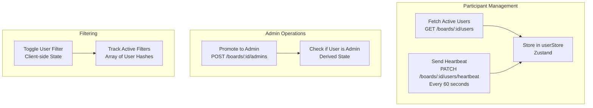

**Responsibilities**:

1. **Active User Tracking**:
   - Fetch active users (last active < 2 min)
   - Send heartbeat every 60 seconds
   - Update `last_active_at` timestamp

2. **Admin Designation**:
   - Promote user to admin (creator only)
   - Update board.admins array
   - Reflect in participant avatars (hat icon)

3. **User Filtering**:
   - Maintain list of filtered users
   - Toggle filter on avatar click
   - Clear all filters option

4. **Real-time Sync**:
   - Subscribe to `user:joined` → Add to active list
   - Subscribe to `user:alias_changed` → Update display

**Return Interface**:
```typescript
{
  // State
  activeUsers: User[]
  filteredUsers: string[]
  currentUser: User

  // Actions
  handlePromoteToAdmin: (userHash: string) => Promise<void>
  handleToggleUserFilter: (userHash: string) => void
  handleClearFilters: () => void
  sendHeartbeat: () => Promise<void>
}
```

---

### 5.4 useDragDropViewModel

**Purpose**: Manage drag-and-drop logic for cards and avatars

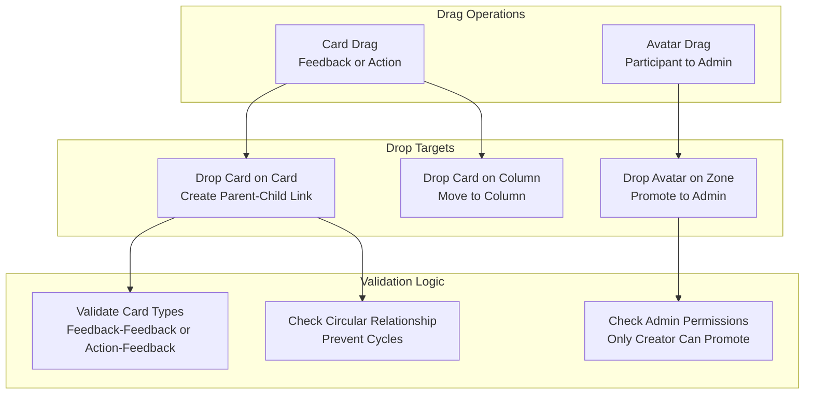

**Responsibilities**:

1. **Card Drag Initialization**:
   - Set drag data (card ID, type)
   - Show ghost image during drag
   - Highlight valid drop targets

2. **Drop Target Validation**:
   - **Card on Card**: Check card types (feedback-feedback or action-feedback)
   - **Card on Column**: Always valid (just move)
   - **Avatar on Zone**: Check if user is creator

3. **Drop Handling**:
   - **Parent-Child Link**: Call `handleLinkParentChild()`
   - **Action Link**: Call `handleLinkAction()`
   - **Move to Column**: Call `handleMoveCard()`
   - **Promote Admin**: Call `handlePromoteToAdmin()`

4. **Circular Relationship Prevention**:
   - Check if target card is ancestor of source card
   - Traverse parent chain to root
   - Block drop if circular

5. **Visual Feedback**:
   - Highlight drop zones on drag-over
   - Show error cursor if invalid drop
   - Animate drop success/failure

**Return Interface**:
```typescript
{
  // Drag State
  isDragging: boolean
  draggedItem: { id: string; type: 'card' | 'avatar' } | null

  // Card Drag Handlers
  handleCardDragStart: (cardId: string, cardType: string) => void
  handleCardDragOver: (targetId: string, targetType: 'card' | 'column') => boolean
  handleCardDrop: (sourceId: string, targetId: string, targetType: string) => void

  // Avatar Drag Handlers
  handleAvatarDragStart: (userHash: string) => void
  handleAvatarDrop: (userHash: string, droppedInZone: boolean) => void
}
```

---

## 6. Model Layer

### 6.1 Zustand State Stores

#### 6.1.1 boardStore

**Purpose**: Global state for board data

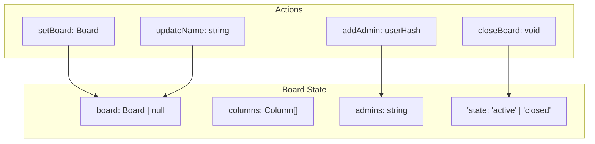

**State Shape**:
```typescript
{
  board: Board | null
  isLoading: boolean
  error: Error | null

  // Actions
  setBoard: (board: Board) => void
  updateBoardName: (name: string) => void
  closeBoard: (closedAt: Date) => void
  addAdmin: (userHash: string) => void
}
```

---

#### 6.1.2 cardStore

**Purpose**: Global state for all cards

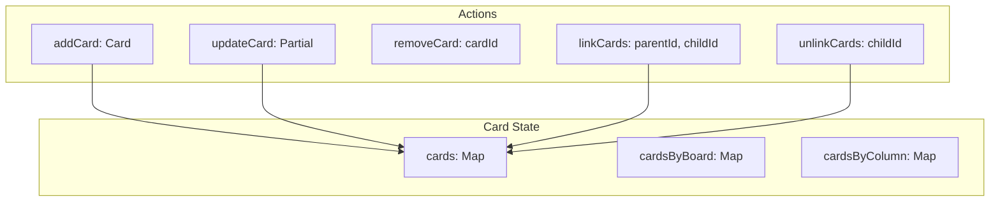

**State Shape**:
```typescript
{
  cards: Map<string, Card>

  // Normalized indexes
  cardsByBoard: Map<string, string[]>
  cardsByColumn: Map<string, string[]>

  // Actions
  addCard: (card: Card) => void
  updateCard: (cardId: string, updates: Partial<Card>) => void
  removeCard: (cardId: string) => void
  linkParentChild: (parentId: string, childId: string) => void
  unlinkChild: (childId: string) => void
  moveCardToColumn: (cardId: string, columnId: string) => void
  incrementReactionCount: (cardId: string) => void
  decrementReactionCount: (cardId: string) => void
}
```

---

#### 6.1.3 userStore

**Purpose**: Global state for participants and current user

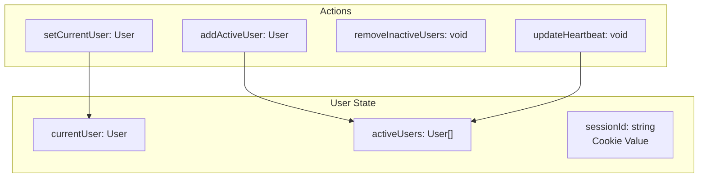

**State Shape**:
```typescript
{
  currentUser: User | null
  activeUsers: User[]
  sessionId: string

  // Actions
  setCurrentUser: (user: User) => void
  addActiveUser: (user: User) => void
  removeUser: (userHash: string) => void
  updateAlias: (userHash: string, newAlias: string) => void
  updateHeartbeat: (userHash: string) => void
}
```

---

### 6.2 API Service Layer

#### 6.2.1 BoardAPI Service

**Purpose**: Handle board-related HTTP requests

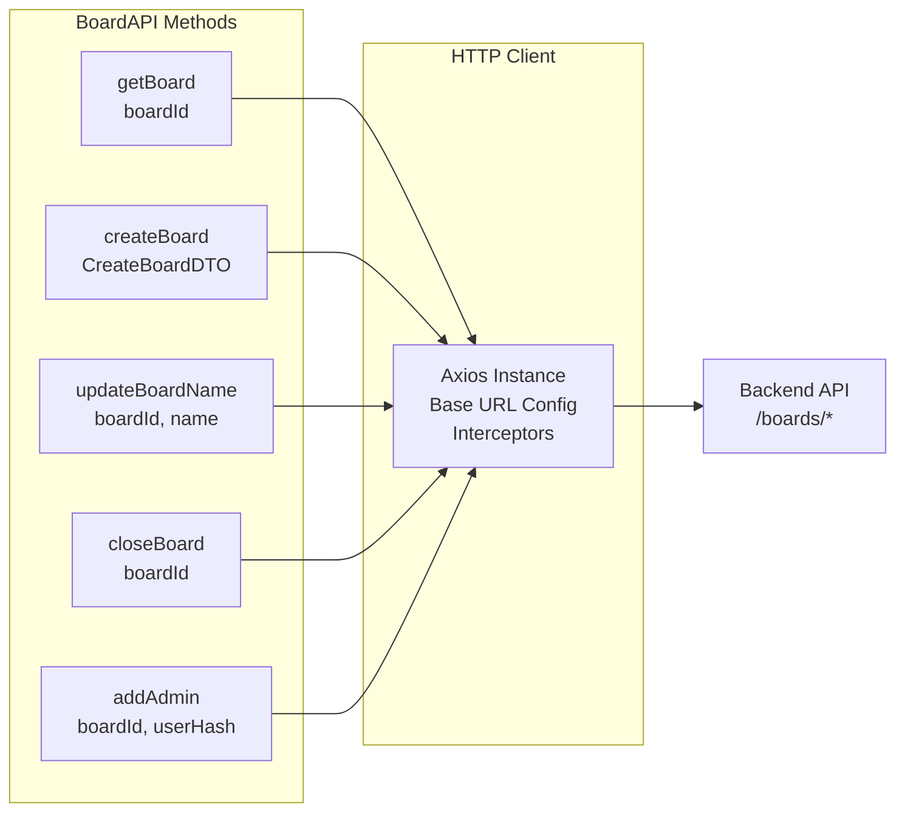

**Methods**:
```typescript
interface BoardAPI {
  getBoard(boardId: string): Promise<Board>
  createBoard(data: CreateBoardDTO): Promise<Board>
  updateBoardName(boardId: string, name: string): Promise<Board>
  closeBoard(boardId: string): Promise<Board>
  addAdmin(boardId: string, userHash: string): Promise<void>
  joinBoard(boardId: string, alias: string): Promise<UserSession>
}
```

---

#### 6.2.2 CardAPI Service

**Purpose**: Handle card-related HTTP requests

```mermaid
graph LR
    subgraph "CardAPI Methods"
        GetCards[getCards<br/>boardId]
        CreateCard[createCard<br/>CreateCardDTO]
        UpdateCard[updateCard<br/>cardId, content]
        DeleteCard[deleteCard<br/>cardId]
        MoveCard[moveCard<br/>cardId, columnId]
        LinkCards[linkCards<br/>sourceId, targetId, type]
        UnlinkCards[unlinkCards<br/>sourceId, targetId, type]
    end

    GetCards --> Axios[Axios Instance]
    CreateCard --> Axios
    LinkCards --> Axios

    Axios --> Backend[Backend API<br/>/cards/*]

```

**Methods**:
```typescript
interface CardAPI {
  getCards(boardId: string): Promise<Card[]>
  createCard(data: CreateCardDTO): Promise<Card>
  updateCard(cardId: string, content: string): Promise<Card>
  deleteCard(cardId: string): Promise<void>
  moveCard(cardId: string, columnId: string): Promise<Card>
  linkCards(sourceId: string, targetId: string, linkType: LinkType): Promise<void>
  unlinkCards(sourceId: string, targetId: string, linkType: LinkType): Promise<void>
}
```

---

#### 6.2.3 ReactionAPI Service

**Purpose**: Handle reaction operations

```mermaid
graph LR
    subgraph "ReactionAPI Methods"
        AddReaction[addReaction<br/>cardId, type]
        RemoveReaction[removeReaction<br/>cardId]
    end

    AddReaction --> Axios[Axios Instance]
    RemoveReaction --> Axios

    Axios --> Backend[Backend API<br/>/cards/:id/reactions]

```

---

### 6.3 Socket Service

**Purpose**: Manage WebSocket connection and event handling

```mermaid
graph TB
    subgraph "Socket Service"
        Connect[connect<br/>boardId]
        Disconnect[disconnect]
        Subscribe[on<br/>eventType, handler]
        Emit[emit<br/>eventType, data]
    end

    subgraph "Event Handling"
        CardCreated[card:created<br/>Add to cardStore]
        CardUpdated[card:updated<br/>Update cardStore]
        CardDeleted[card:deleted<br/>Remove from cardStore]
        BoardClosed[board:closed<br/>Update boardStore]
        UserJoined[user:joined<br/>Add to userStore]
    end

    Subscribe --> CardCreated
    Subscribe --> CardUpdated
    Subscribe --> CardDeleted
    Subscribe --> BoardClosed
    Subscribe --> UserJoined

    CardCreated --> UpdateStore[Update Zustand Stores]
    CardUpdated --> UpdateStore
```

**Interface**:
```typescript
interface SocketService {
  connect(boardId: string): void
  disconnect(): void
  on(eventType: string, handler: (data: any) => void): void
  off(eventType: string): void
  emit(eventType: string, data: any): void
}
```

**Event Subscriptions**:
- `card:created` → Add card to store
- `card:updated` → Update card in store
- `card:deleted` → Remove card from store
- `card:moved` → Update card column
- `card:linked` → Update parent-child relationship
- `reaction:added` → Increment reaction count
- `reaction:removed` → Decrement reaction count
- `board:renamed` → Update board name
- `board:closed` → Update board state
- `user:joined` → Add user to active list

---

## 7. Data Flow Patterns

### 7.1 Card Creation Flow

```mermaid
sequenceDiagram
    participant User
    participant View as RetroColumn<br/>(View)
    participant VM as useCardViewModel<br/>(ViewModel)
    participant Store as cardStore<br/>(Model)
    participant API as CardAPI<br/>(Model)
    participant Socket as SocketService<br/>(Model)
    participant Backend

    User->>View: Click "+" button
    View->>VM: handleCreateCard(data)
    VM->>VM: Validate card limit
    VM->>Store: Optimistic: addCard(tempCard)
    Store-->>View: Re-render with new card
    VM->>API: POST /boards/:id/cards
    API->>Backend: HTTP Request
    Backend-->>API: 201 Created + Card
    API-->>VM: Card object
    VM->>Store: Replace temp with real card
    Backend->>Socket: Broadcast card:created
    Socket->>Store: Update store (other users)
    Store-->>View: Re-render all clients
```

**Key Points**:
1. **Optimistic Update**: Card appears immediately (before server confirms)
2. **Rollback on Error**: Remove temp card if API fails
3. **Real-time Sync**: Other users receive update via WebSocket

---

### 7.2 Parent-Child Linking Flow

```mermaid
sequenceDiagram
    participant User
    participant View as RetroCard<br/>(View)
    participant DragVM as useDragDropViewModel<br/>(ViewModel)
    participant CardVM as useCardViewModel<br/>(ViewModel)
    participant API as CardAPI<br/>(Model)
    participant Store as cardStore<br/>(Model)

    User->>View: Drag Card A
    View->>DragVM: handleCardDragStart(cardA)
    DragVM-->>View: Set isDragging=true

    User->>View: Drop on Card B
    View->>DragVM: handleCardDrop(cardA, cardB)
    DragVM->>DragVM: Validate: both feedback type
    DragVM->>DragVM: Check circular relationship
    DragVM->>CardVM: handleLinkParentChild(B, A)
    CardVM->>API: POST /cards/B/link {target: A, type: parent_of}
    API-->>Backend: HTTP Request
    Backend-->>API: 201 Created
    API-->>CardVM: Success
    CardVM->>Store: Update card A: parent_card_id = B
    CardVM->>Store: Update card B: aggregated_count += A.direct_count
    Store-->>View: Re-render hierarchy
```

**Validation Steps**:
1. Both cards must be `card_type: "feedback"`
2. Target card must not be ancestor of source (prevent circular)
3. Update parent's aggregated reaction count

---

### 7.3 Real-time Sync Flow

```mermaid
sequenceDiagram
    participant User1 as User 1<br/>Browser
    participant User2 as User 2<br/>Browser
    participant Socket as Socket Service<br/>(Model)
    participant Store as Zustand Store<br/>(Model)
    participant View as React Components<br/>(View)

    User1->>User1: Create card (optimistic)
    User1->>Backend: POST /cards
    Backend-->>User1: 201 Created
    Backend->>Socket: Broadcast card:created
    Socket->>User2: WebSocket: card:created
    User2->>Store: addCard(card)
    Store->>View: Trigger re-render
    View-->>User2: Display new card
```

**Key Points**:
- User 1 sees card immediately (optimistic)
- User 2 receives update via WebSocket
- Both users end up in same state

---

### 7.4 Filter & Sort Flow (Client-side)

```mermaid
graph TB
    subgraph "User Action"
        ClickAvatar[User Clicks Avatar<br/>Toggle Filter]
        ClickSort[User Changes Sort<br/>Dropdown Selection]
    end

    subgraph "ViewModel Processing"
        ToggleFilter[useParticipantViewModel<br/>handleToggleFilter]
        UpdateFilters[Update activeFilters State]
        ApplySort[useCardViewModel<br/>applySortFilter]
    end

    subgraph "Card Transformation"
        FilterCards[Filter Cards Array<br/>Keep only matching users]
        SortCards[Sort Cards Array<br/>By recency or popularity]
        RenderCards[Re-render Card List<br/>With filtered/sorted cards]
    end

    ClickAvatar --> ToggleFilter
    ToggleFilter --> UpdateFilters
    UpdateFilters --> FilterCards

    ClickSort --> ApplySort
    ApplySort --> SortCards

    FilterCards --> RenderCards
    SortCards --> RenderCards
```

**Implementation Notes**:
- **Client-side only**: No API calls, instant response
- **User-specific**: Each user has own filter/sort state
- **Not persisted**: Resets on page refresh
- **Performance**: Memoized sorting function to avoid re-computing

---

## 8. Missing API Requirements

After reviewing the Backend API Specification V2, the following APIs are **available and sufficient** for the front-end design:

### 8.1 Available APIs ✅

| Feature | API Endpoint | Notes |
|---------|-------------|-------|
| Board CRUD | `POST /boards`, `GET /boards/:id`, `PATCH /boards/:id/name` | ✅ Complete |
| Column Rename | `PATCH /boards/:id/columns/:columnId` | ✅ Available |
| Join Board | `POST /boards/:id/join` | ✅ Sets user alias |
| Close Board | `PATCH /boards/:id/close` | ✅ Available |
| Admin Management | `POST /boards/:id/admins` | ✅ Creator can promote |
| Active Users | `GET /boards/:id/users` | ✅ Returns active users |
| Heartbeat | `PATCH /boards/:id/users/heartbeat` | ✅ Keeps user active |
| Card CRUD | `POST /boards/:id/cards`, `PUT /cards/:id`, `DELETE /cards/:id` | ✅ Complete |
| Card Linking | `POST /cards/:id/link`, `DELETE /cards/:id/link` | ✅ Both parent-child and action-feedback |
| Move Card | `PATCH /cards/:id/column` | ✅ Available |
| Reactions | `POST /cards/:id/reactions`, `DELETE /cards/:id/reactions` | ✅ Add/remove |

### 8.2 Additional APIs Needed ❌

**None identified.** The current backend API specification fully supports all front-end component requirements.

### 8.3 Recommendations

1. **Add User Alias Update API** (Optional enhancement):
   - Endpoint: `PATCH /boards/:id/users/alias`
   - Purpose: Allow users to change their display name after joining
   - Status: Already specified in Backend API (Section 2.2.3) ✅

2. **Bulk Card Fetch with Relationships** (Performance optimization):
   - Current: `GET /boards/:id/cards` returns all cards
   - Enhancement: Include parent-child relationships in response to avoid client-side joins
   - Status: Current API is sufficient, can optimize later

3. **Card Limit Check API** (Optional):
   - Endpoint: `GET /boards/:id/cards/count?created_by_hash=<hash>`
   - Purpose: Check if user can create more cards before showing dialog
   - Status: Can be computed client-side from existing card data

---

## Document Status

**Status**: Design Review Complete

**Next Steps**:
1. Review component hierarchy with design team
2. Validate MVVM separation with development team
3. Create UI component library (Material-UI theme)
4. Implement drag-and-drop prototype (@dnd-kit integration)
5. Set up Zustand stores with TypeScript types
6. Implement real-time sync layer (Socket.IO client)

**Related Documents**:
- [HIGH_LEVEL_TECHNICAL_DESIGN.md](./docs/HIGH_LEVEL_TECHNICAL_DESIGN.md) - Backend architecture
- [BACKEND_API_SPECIFICATION_V2.md](./docs/BACKEND_API_SPECIFICATION_V2.md) - API contracts
- [UX_DECISIONS_SUMMARY.md](./UX_DECISIONS_SUMMARY.md) - UX requirements
- [Wireframe-1-drawio.xml](./Wireframe-1-drawio.xml) - Visual wireframe
