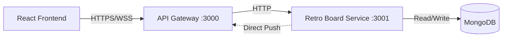

# Backend API Specification - Collaborative Retro Board

**Document Version**: 2.0
**Date**: 2025-12-25
**Architecture**: Single Service + MongoDB + Direct Push
**Status**: Approved - Ready for Implementation

---

## Table of Contents

1. [Overview](#1-overview)
2. [API Endpoints](#2-api-endpoints)
   - 2.1 [Board Management](#21-board-management)
   - 2.2 [Card Management](#22-card-management)
   - 2.3 [Reaction Management](#23-reaction-management)
   - 2.4 [Testing APIs](#24-testing-apis)
3. [Data Models](#3-data-models)
4. [Error Responses](#4-error-responses)
5. [Real-time Events](#5-real-time-events)
6. [Repository Interfaces](#6-repository-interfaces)
7. [Test Specifications](#7-test-specifications)

---

## 1. Overview

### 1.1 Architecture



**Components**:
- **API Gateway**: Express + Socket.io server, auth middleware, routing
- **Retro Board Service**: Single Node.js service containing all business logic
  - Board domain (create, join, close, admins)
  - Card domain (CRUD, link, reactions)
  - Reaction domain (add, remove, aggregate)
- **MongoDB**: Single instance, collections: boards, cards, reactions, user_sessions

**Base URL**: `https://api.retroboard.com/v1`

**Authentication**: Cookie-based sessions (`retro_session_id`), SHA-256 hashed

---

## 2. API Endpoints

### 2.1 Board Management

#### 2.1.1 Create Board

**Endpoint**: `POST /boards`

**Request**:
```json
{
  "name": "Sprint 42 Retro",
  "columns": [
    { "id": "col-1", "name": "What Went Well", "color": "#D5E8D4" },
    { "id": "col-2", "name": "Improvements", "color": "#FFE6CC" },
    { "id": "col-3", "name": "Action Items", "color": "#DAE8FC" }
  ],
  "card_limit_per_user": 5,
  "reaction_limit_per_user": 10
}
```

**Validation**:
- `name`: Required, 1-200 characters
- `columns`: Required array, 1-10 elements
  - `id`: Required string, unique within board
  - `name`: Required, 1-100 characters
  - `color`: Optional, hex format `#RRGGBB`
- `card_limit_per_user`: Optional, positive integer (null = unlimited)
- `reaction_limit_per_user`: Optional, positive integer (null = unlimited)

**Response**: `201 Created`
```json
{
  "success": true,
  "data": {
    "id": "6763b4a8f1c2d3e4f5a6b7c8",
    "name": "Sprint 42 Retro",
    "shareable_link": "https://app.retroboard.com/board/6763b4a8f1c2d3e4f5a6b7c8",
    "state": "active",
    "columns": [...],
    "created_at": "2025-12-25T10:00:00Z",
    "created_by_hash": "sha256_hash",
    "admins": ["sha256_hash"],
    "card_limit_per_user": 5,
    "reaction_limit_per_user": 10
  },
  "timestamp": "2025-12-25T10:00:01Z"
}
```

**Business Logic**:
1. Hash user cookie (SHA-256)
2. Generate unique shareable_link
3. Set creator as first admin
4. Set initial state to 'active'

---

#### 2.1.2 Join Board

**Endpoint**: `POST /boards/:id/join`

**Purpose**: User joins board and sets display alias (per-board identity)

**Request**:
```json
{
  "alias": "Alice"
}
```

**Validation**:
- `alias`: Required, 1-50 characters, pattern: `^[a-zA-Z0-9 _-]+$`

**Response**: `200 OK`
```json
{
  "success": true,
  "data": {
    "board_id": "6763b4a8f1c2d3e4f5a6b7c8",
    "user_session": {
      "cookie_hash": "sha256_hash",
      "alias": "Alice",
      "is_admin": false,
      "last_active_at": "2025-12-25T10:00:00Z",
      "created_at": "2025-12-25T10:00:00Z"
    }
  },
  "timestamp": "2025-12-25T10:00:01Z"
}
```

**Business Logic**:
1. Hash user cookie
2. Upsert user_session (update if exists, create if new)
3. Check if cookie_hash is in board.admins → set is_admin flag
4. Update last_active_at timestamp
5. Broadcast `user:joined` event to board room

**Side Effects**:
- Creates/updates document in `user_sessions` collection
- Real-time event: `user:joined` with { board_id, alias }

---

#### 2.1.3 Get Board

**Endpoint**: `GET /boards/:id`

**Response**: `200 OK`
```json
{
  "success": true,
  "data": {
    "id": "6763b4a8f1c2d3e4f5a6b7c8",
    "name": "Sprint 42 Retro",
    "shareable_link": "https://app.retroboard.com/board/6763b4a8f1c2d3e4f5a6b7c8",
    "state": "active",
    "closed_at": null,
    "columns": [...],
    "admins": ["hash1", "hash2"],
    "active_users": [
      { "alias": "Alice", "is_admin": true, "last_active_at": "..." },
      { "alias": "Bob", "is_admin": false, "last_active_at": "..." }
    ],
    "card_limit_per_user": 5,
    "reaction_limit_per_user": 10,
    "created_at": "2025-12-25T10:00:00Z"
  }
}
```

**Business Logic**:
- Fetch board from MongoDB
- Join with user_sessions where `last_active_at` > (now - 2 minutes)
- Return active users with is_admin flag

---

#### 2.1.4 Rename Board

**Endpoint**: `PATCH /boards/:id/name`

**Authorization**: Admins only

**Request**:
```json
{
  "name": "Updated Sprint 42 Retro"
}
```

**Response**: `200 OK`
```json
{
  "success": true,
  "data": {
    "id": "6763b4a8f1c2d3e4f5a6b7c8",
    "name": "Updated Sprint 42 Retro"
  }
}
```

**Errors**:
- `403 Forbidden`: User is not admin
- `409 Conflict`: Board is closed

**Side Effects**:
- Real-time event: `board:renamed` with new name

---

#### 2.1.5 Rename Column

**Endpoint**: `PATCH /boards/:id/columns/:columnId`

**Authorization**: Admins only

**Request**:
```json
{
  "name": "What Should We Continue"
}
```

**Response**: `200 OK`
```json
{
  "success": true,
  "data": {
    "board_id": "6763b4a8f1c2d3e4f5a6b7c8",
    "column_id": "col-1",
    "name": "What Should We Continue"
  }
}
```

**Business Logic**:
- Find column in board.columns array by column_id
- Update name field
- Save board document

---

#### 2.1.6 Close Board

**Endpoint**: `PATCH /boards/:id/close`

**Authorization**: Admins only

**Response**: `200 OK`
```json
{
  "success": true,
  "data": {
    "id": "6763b4a8f1c2d3e4f5a6b7c8",
    "state": "closed",
    "closed_at": "2025-12-25T15:30:00Z"
  }
}
```

**Business Logic**:
1. Set board.state = 'closed'
2. Set board.closed_at = current timestamp
3. Save board document
4. Broadcast `board:closed` event

**Side Effects**:
- All future write operations on this board return `409 Conflict`
- Users can still read cards and board data (read-only mode)

---

#### 2.1.7 Designate Co-Admin

**Endpoint**: `POST /boards/:id/admins`

**Authorization**: Only board creator (first admin in admins array)

**Request**:
```json
{
  "user_cookie_hash": "sha256_hash_of_user_to_promote"
}
```

**Response**: `201 Created`
```json
{
  "success": true,
  "data": {
    "board_id": "6763b4a8f1c2d3e4f5a6b7c8",
    "admins": ["creator_hash", "new_admin_hash"]
  }
}
```

**Business Logic**:
1. Verify requester is board creator (first element in admins array)
2. Verify target user has active session on board
3. Add user_cookie_hash to board.admins array (if not already present)

**Errors**:
- `403 Forbidden`: Only creator can designate admins
- `404 Not Found`: User not active on board

---

#### 2.1.8 Delete Board (Testing/Admin)

**Endpoint**: `DELETE /boards/:id`

**Authorization**: Board creator OR admin secret key

**Request Headers** (Alternative authentication):
```
X-Admin-Secret: {ADMIN_SECRET_KEY}
```

**Note**: If `X-Admin-Secret` header is valid, skip creator check. Otherwise, verify requester is board creator.

**Response**: `204 No Content`

**Business Logic**:
1. Verify requester is creator
2. Cascade delete:
   - All cards in board
   - All reactions on those cards
   - All user_sessions for board
3. Delete board document
4. Broadcast `board:deleted` event

**MongoDB Operations**:
```javascript
db.cards.deleteMany({ board_id })
db.reactions.deleteMany({ card_id: { $in: cardIds } })
db.user_sessions.deleteMany({ board_id })
db.boards.deleteOne({ _id: board_id })
```

---

### 2.2 User Session Management

#### 2.2.1 Get Active Users

**Endpoint**: `GET /boards/:id/users`

**Purpose**: Get list of currently active users on the board (last active within 2 minutes)

**Response**: `200 OK`
```json
{
  "success": true,
  "data": {
    "active_users": [
      {
        "alias": "Alice",
        "is_admin": true,
        "last_active_at": "2025-12-25T10:15:00Z",
        "created_at": "2025-12-25T10:00:00Z"
      },
      {
        "alias": "Bob",
        "is_admin": false,
        "last_active_at": "2025-12-25T10:14:30Z",
        "created_at": "2025-12-25T10:05:00Z"
      }
    ],
    "total_count": 2
  }
}
```

**Business Logic**:
- Query user_sessions where board_id matches and last_active_at > (now - 2 minutes)
- Include is_admin flag (check if cookie_hash in board.admins)
- Order by last_active_at descending

---

#### 2.2.2 Update User Heartbeat

**Endpoint**: `PATCH /boards/:id/users/heartbeat`

**Purpose**: Update user's last_active_at timestamp (called periodically by frontend)

**Request**: Empty body (user identified by cookie)

**Response**: `200 OK`
```json
{
  "success": true,
  "data": {
    "alias": "Alice",
    "last_active_at": "2025-12-25T10:15:30Z"
  }
}
```

**Business Logic**:
1. Find user_session by board_id and cookie_hash
2. Update last_active_at to current timestamp
3. Return updated session

**Frontend Implementation**:
- Call this endpoint every 60 seconds while user is on board
- Used to maintain "active users" list in real-time

---

#### 2.2.3 Update User Alias

**Endpoint**: `PATCH /boards/:id/users/alias`

**Purpose**: Allow user to change their display alias on a board

**Request**:
```json
{
  "alias": "Alice (Updated)"
}
```

**Validation**:
- `alias`: Required, 1-50 characters, pattern: `^[a-zA-Z0-9 _-]+$`

**Response**: `200 OK`
```json
{
  "success": true,
  "data": {
    "alias": "Alice (Updated)",
    "last_active_at": "2025-12-25T10:16:00Z"
  }
}
```

**Business Logic**:
1. Find user_session by board_id and cookie_hash
2. Update alias
3. Update last_active_at
4. Broadcast `user:alias_changed` event

**Side Effects**:
- Real-time event: `user:alias_changed` with { old_alias, new_alias }

---

### 2.3 Card Management

#### 2.3.1 Get Cards (with Embedded Relationships)

**Endpoint**: `GET /boards/:id/cards`

**Query Parameters**:
- `column_id` (optional): Filter by column
- `created_by` (optional): Filter by user hash
- `include_relationships` (optional): Include embedded children and linked cards (default: true)

**Response**: `200 OK`
```json
{
  "success": true,
  "data": {
    "cards": [
      {
        "id": "6763b5c9a1b2c3d4e5f6a7b8",
        "board_id": "6763b4a8f1c2d3e4f5a6b7c8",
        "column_id": "col-1",
        "content": "Great team collaboration!",
        "card_type": "feedback",
        "is_anonymous": false,
        "created_by_hash": "sha256_hash",
        "created_by_alias": "Alice",
        "created_at": "2025-12-25T10:05:00Z",
        "direct_reaction_count": 3,
        "aggregated_reaction_count": 5,
        "parent_card_id": null,
        "linked_feedback_ids": [],
        "children": [
          {
            "id": "6763b6d1f2e3a4b5c6d7e8f9",
            "content": "Especially during sprint planning",
            "is_anonymous": false,
            "created_by_alias": "Bob",
            "created_at": "2025-12-25T10:08:00Z",
            "direct_reaction_count": 2,
            "aggregated_reaction_count": 2
          }
        ],
        "linked_feedback_cards": []
      },
      {
        "id": "6763b7e2a3b4c5d6e7f8a9b0",
        "board_id": "6763b4a8f1c2d3e4f5a6b7c8",
        "column_id": "col-3",
        "content": "Improve test coverage",
        "card_type": "action",
        "is_anonymous": false,
        "created_by_hash": "sha256_hash_2",
        "created_by_alias": "Charlie",
        "created_at": "2025-12-25T10:12:00Z",
        "direct_reaction_count": 4,
        "aggregated_reaction_count": 4,
        "parent_card_id": null,
        "linked_feedback_ids": ["6763b5c9a1b2c3d4e5f6a7b8"],
        "children": [],
        "linked_feedback_cards": [
          {
            "id": "6763b5c9a1b2c3d4e5f6a7b8",
            "content": "Great team collaboration!",
            "created_by_alias": "Alice",
            "created_at": "2025-12-25T10:05:00Z"
          }
        ]
      }
    ],
    "total_count": 18,
    "cards_by_column": {
      "col-1": 8,
      "col-2": 6,
      "col-3": 4
    }
  }
}
```

**Business Logic**:
1. Fetch all cards matching filters (column_id, created_by)
2. If `include_relationships === true`:
   - Use MongoDB aggregation with $lookup to embed children (cards where parent_card_id matches)
   - Use MongoDB aggregation with $lookup to embed linked_feedback_cards (resolve linked_feedback_ids)
3. Calculate summary statistics (total_count, cards_by_column)

**Performance Optimization**:
- Embedded relationships avoid N+1 queries on client side
- Client receives complete card tree in single response
- MongoDB aggregation pipeline executes efficiently with indexes

---

#### 2.2.2 Create Card

**Endpoint**: `POST /boards/:id/cards`

**Request**:
```json
{
  "column_id": "col-1",
  "content": "Great collaboration during planning",
  "card_type": "feedback",
  "is_anonymous": false
}
```

**Validation**:
- `column_id`: Required, must exist in board.columns
- `content`: Required, 1-5000 characters
- `card_type`: Required, enum: "feedback" | "action"
- `is_anonymous`: Optional, boolean, default: false

**Response**: `201 Created`
```json
{
  "success": true,
  "data": {
    "id": "6763b5c9a1b2c3d4e5f6a7b8",
    "board_id": "6763b4a8f1c2d3e4f5a6b7c8",
    "column_id": "col-1",
    "content": "Great collaboration during planning",
    "card_type": "feedback",
    "is_anonymous": false,
    "created_by_hash": "sha256_hash",
    "created_by_alias": "Alice",
    "created_at": "2025-12-25T10:05:00Z",
    "direct_reaction_count": 0,
    "aggregated_reaction_count": 0,
    "parent_card_id": null,
    "linked_feedback_ids": []
  }
}
```

**Business Logic**:
1. Verify board is active (not closed)
2. If `card_type === 'feedback'` and board has card_limit:
   - Count user's existing feedback cards on this board
   - If count >= limit, return `403 Forbidden`
3. If `is_anonymous === true`, set created_by_alias to null
4. Create card document with initial reaction counts = 0
5. Broadcast `card:created` event

**Errors**:
- `400 Bad Request`: Invalid column_id or validation failure
- `403 Forbidden`: Card limit reached
- `409 Conflict`: Board is closed

**Side Effects**:
- Real-time event: `card:created` to board room

---

#### 2.2.3 Update Card

**Endpoint**: `PUT /cards/:id`

**Authorization**: Only card creator

**Request**:
```json
{
  "content": "Updated content"
}
```

**Response**: `200 OK`
```json
{
  "success": true,
  "data": {
    "id": "6763b5c9a1b2c3d4e5f6a7b8",
    "content": "Updated content",
    "updated_at": "2025-12-25T10:10:00Z"
  }
}
```

**Errors**:
- `403 Forbidden`: User is not card creator
- `409 Conflict`: Board is closed

---

#### 2.2.4 Delete Card

**Endpoint**: `DELETE /cards/:id`

**Authorization**: Only card creator

**Response**: `204 No Content`

**Business Logic**:
1. Verify user is card creator
2. If card has children (parent_card_id references):
   - Set all children's parent_card_id to null (orphan them)
3. If card is a child (has parent_card_id):
   - Update parent's aggregated_reaction_count (subtract child's direct_count)
4. Delete all reactions on this card
5. Delete card document
6. Broadcast `card:deleted` event

**MongoDB Operations**:
```javascript
// Orphan children
db.cards.updateMany(
  { parent_card_id: card_id },
  { $set: { parent_card_id: null } }
)

// Delete reactions
db.reactions.deleteMany({ card_id })

// Delete card
db.cards.deleteOne({ _id: card_id })
```

---

#### 2.2.5 Move Card to Column

**Endpoint**: `PATCH /cards/:id/column`

**Authorization**: Only card creator

**Request**:
```json
{
  "column_id": "col-2"
}
```

**Response**: `200 OK`
```json
{
  "success": true,
  "data": {
    "id": "6763b5c9a1b2c3d4e5f6a7b8",
    "column_id": "col-2"
  }
}
```

**Side Effects**:
- Real-time event: `card:moved` with new column_id

---

#### 2.2.6 Link Cards

**Endpoint**: `POST /cards/:id/link`

**Request**:
```json
{
  "target_card_id": "6763b5c9a1b2c3d4e5f6a7b8",
  "link_type": "parent_of"
}
```

**Link Types**:
- `"parent_of"`: Source becomes parent of target (both must be feedback cards)
- `"linked_to"`: Source (action card) links to target (feedback card)

**Response**: `201 Created`
```json
{
  "success": true,
  "data": {
    "source_card_id": "parent_card_id",
    "target_card_id": "child_card_id",
    "link_type": "parent_of"
  }
}
```

**Business Logic**:

**For `parent_of`**:
1. Validate both cards are `card_type: "feedback"`
2. Check for circular relationship (target is not already ancestor of source)
3. Set target.parent_card_id = source._id
4. Update source.aggregated_reaction_count += target.direct_reaction_count
5. Broadcast `card:linked` event

**For `linked_to`**:
1. Validate source is `card_type: "action"` and target is `card_type: "feedback"`
2. Add target._id to source.linked_feedback_ids array
3. Broadcast `card:linked` event

**Errors**:
- `400 Bad Request`: Invalid card types or circular relationship
- `409 Conflict`: Board is closed

---

#### 2.2.7 Unlink Cards

**Endpoint**: `DELETE /cards/:id/link`

**Request**:
```json
{
  "target_card_id": "6763b5c9a1b2c3d4e5f6a7b8",
  "link_type": "parent_of"
}
```

**Response**: `204 No Content`

**Business Logic**:

**For `parent_of`**:
1. Set target.parent_card_id = null
2. Update source.aggregated_reaction_count -= target.direct_reaction_count
3. Broadcast `card:unlinked` event

**For `linked_to`**:
1. Remove target._id from source.linked_feedback_ids array
2. Broadcast `card:unlinked` event

---

#### 2.2.8 Check Card Quota

**Endpoint**: `GET /boards/:id/cards/quota`

**Query Parameters**:
- `created_by_hash` (optional): Check quota for specific user hash (defaults to requester's cookie hash)

**Response**: `200 OK`
```json
{
  "success": true,
  "data": {
    "current_count": 3,
    "limit": 5,
    "can_create": true,
    "limit_enabled": true
  }
}
```

**Business Logic**:
1. Get board configuration (card_limit_per_user)
2. If limit is null/undefined, return `limit_enabled: false, can_create: true`
3. Count user's feedback cards on this board (exclude action cards)
4. Return current count vs limit with boolean flag

**Use Case**:
- Frontend calls this before showing "Create Card" dialog
- Shows limit warning: "You have created 3/5 cards"
- Disables "Create" button when can_create is false

**Response Examples**:

*No limit configured*:
```json
{
  "success": true,
  "data": {
    "current_count": 8,
    "limit": null,
    "can_create": true,
    "limit_enabled": false
  }
}
```

*At limit*:
```json
{
  "success": true,
  "data": {
    "current_count": 5,
    "limit": 5,
    "can_create": false,
    "limit_enabled": true
  }
}
```

---

### 2.3 Reaction Management

#### 2.3.1 Add Reaction

**Endpoint**: `POST /cards/:id/reactions`

**Request**:
```json
{
  "reaction_type": "thumbs_up"
}
```

**Response**: `201 Created`
```json
{
  "success": true,
  "data": {
    "id": "6763b6d0b1c2d3e4f5a6b7c8",
    "card_id": "6763b5c9a1b2c3d4e5f6a7b8",
    "user_cookie_hash": "sha256_hash",
    "user_alias": "Bob",
    "reaction_type": "thumbs_up",
    "created_at": "2025-12-25T10:10:00Z"
  }
}
```

**Business Logic**:
1. Verify board is active (not closed)
2. Check if user already reacted to this card:
   - If yes: Update existing reaction (upsert, don't create duplicate)
   - If no: Check reaction_limit_per_user
3. If limit enforced and user at limit: return `403 Forbidden`
4. Create/update reaction document
5. Increment card.direct_reaction_count
6. If card has parent: increment parent.aggregated_reaction_count
7. Broadcast `reaction:added` event

**Unique Constraint**: One reaction per (card_id, user_cookie_hash) pair

**Errors**:
- `403 Forbidden`: Reaction limit reached
- `409 Conflict`: Board is closed

**Side Effects**:
- Atomic increment: `db.cards.updateOne({ _id }, { $inc: { direct_reaction_count: 1 } })`
- Real-time event: `reaction:added` to board room

---

#### 2.3.2 Remove Reaction

**Endpoint**: `DELETE /cards/:id/reactions`

**Response**: `204 No Content`

**Business Logic**:
1. Find reaction by card_id and user_cookie_hash
2. If not found: return `404 Not Found`
3. Delete reaction document
4. Decrement card.direct_reaction_count
5. If card has parent: decrement parent.aggregated_reaction_count
6. Broadcast `reaction:removed` event

**MongoDB Operations**:
```javascript
// Delete reaction
db.reactions.deleteOne({ card_id, user_cookie_hash })

// Decrement counts
db.cards.updateOne({ _id: card_id }, { $inc: { direct_reaction_count: -1 } })
db.cards.updateOne({ _id: parent_id }, { $inc: { aggregated_reaction_count: -1 } })
```

---

#### 2.3.3 Check Reaction Quota

**Endpoint**: `GET /boards/:id/reactions/quota`

**Query Parameters**:
- `created_by_hash` (optional): Check quota for specific user hash (defaults to requester's cookie hash)

**Response**: `200 OK`
```json
{
  "success": true,
  "data": {
    "current_count": 7,
    "limit": 10,
    "can_react": true,
    "limit_enabled": true
  }
}
```

**Business Logic**:
1. Get board configuration (reaction_limit_per_user)
2. If limit is null/undefined, return `limit_enabled: false, can_react: true`
3. Count user's reactions across all cards on this board
4. Return current count vs limit with boolean flag

**Use Case**:
- Frontend checks before allowing user to add reaction
- Shows limit warning: "You have used 7/10 reactions"
- Disables reaction button when can_react is false
- Shows progress indicator in UI

**Response Examples**:

*No limit configured*:
```json
{
  "success": true,
  "data": {
    "current_count": 15,
    "limit": null,
    "can_react": true,
    "limit_enabled": false
  }
}
```

*At limit*:
```json
{
  "success": true,
  "data": {
    "current_count": 10,
    "limit": 10,
    "can_react": false,
    "limit_enabled": true
  }
}
```

**MongoDB Query**:
```javascript
// Count user's reactions on board
db.reactions.countDocuments({
  card_id: { $in: board_card_ids },
  user_cookie_hash: user_hash
})
```

---

### 2.5 Testing & Admin APIs

**Authentication**: Requires `X-Admin-Secret` header with configured secret key

**Configuration**: Set `ADMIN_SECRET_KEY` environment variable (generate strong random key)

**Security**:
- These APIs can be used in production for post-deployment testing
- Secret key should be rotated regularly
- Log all admin API calls for audit trail

---

#### 2.5.1 Clear Board Data

**Endpoint**: `POST /boards/:id/test/clear`

**Purpose**: Remove all cards, reactions, user sessions (keep board)

**Request Headers**:
```
X-Admin-Secret: {ADMIN_SECRET_KEY}
```

**Response**: `200 OK`
```json
{
  "success": true,
  "data": {
    "board_id": "6763b4a8f1c2d3e4f5a6b7c8",
    "deleted": {
      "cards": 42,
      "reactions": 156,
      "user_sessions": 8
    }
  }
}
```

**Errors**:
- `401 Unauthorized`: Missing or invalid X-Admin-Secret header

---

#### 2.5.2 Reset Board State

**Endpoint**: `POST /boards/:id/test/reset`

**Purpose**: Reopen board if closed, clear all data

**Request Headers**:
```
X-Admin-Secret: {ADMIN_SECRET_KEY}
```

**Response**: `200 OK`
```json
{
  "success": true,
  "data": {
    "board_id": "6763b4a8f1c2d3e4f5a6b7c8",
    "state": "active",
    "closed_at": null,
    "deleted_items": {
      "cards": 42,
      "reactions": 156,
      "user_sessions": 8
    }
  }
}
```

**Errors**:
- `401 Unauthorized`: Missing or invalid X-Admin-Secret header

---

#### 2.5.3 Seed Test Data

**Endpoint**: `POST /boards/:id/test/seed`

**Purpose**: Populate board with realistic test data for testing

**Request Headers**:
```
X-Admin-Secret: {ADMIN_SECRET_KEY}
```

**Request**:
```json
{
  "num_users": 5,
  "num_cards": 20,
  "num_action_cards": 5,
  "num_reactions": 50,
  "create_relationships": true
}
```

**Response**: `201 Created`
```json
{
  "success": true,
  "data": {
    "board_id": "6763b4a8f1c2d3e4f5a6b7c8",
    "created": {
      "users": 5,
      "feedback_cards": 20,
      "action_cards": 5,
      "reactions": 50,
      "parent_child_links": 8,
      "action_feedback_links": 5
    },
    "test_users": [
      { "alias": "TestUser1", "cookie_hash": "hash1" },
      { "alias": "TestUser2", "cookie_hash": "hash2" }
    ]
  }
}
```

---

## 3. Data Models

### 3.1 MongoDB Collections

#### boards
```typescript
{
  _id: ObjectId,
  name: string,
  shareable_link: string,          // Unique
  state: "active" | "closed",
  closed_at: Date | null,
  columns: [
    { id: string, name: string, color: string }
  ],
  card_limit_per_user: number | null,
  reaction_limit_per_user: number | null,
  created_at: Date,
  created_by_hash: string,         // SHA-256 hash
  admins: string[]                 // Array of hashed cookie IDs
}
```

**Indexes**:
- `{ shareable_link: 1 }` - Unique
- `{ state: 1 }`

---

#### cards
```typescript
{
  _id: ObjectId,
  board_id: ObjectId,              // FK to boards
  column_id: string,
  content: string,
  card_type: "feedback" | "action",
  is_anonymous: boolean,
  created_by_hash: string,         // SHA-256 hash
  created_by_alias: string | null, // null if anonymous
  created_at: Date,
  direct_reaction_count: number,
  aggregated_reaction_count: number,
  parent_card_id: ObjectId | null, // FK to cards (for parent-child)
  linked_feedback_ids: ObjectId[]  // Array of feedback card IDs (for action cards)
}
```

**Indexes**:
- `{ board_id: 1, created_at: -1 }`
- `{ board_id: 1, created_by_hash: 1, card_type: 1 }` - For limit checks
- `{ parent_card_id: 1 }` - For child lookups

---

#### reactions
```typescript
{
  _id: ObjectId,
  card_id: ObjectId,               // FK to cards
  user_cookie_hash: string,        // SHA-256 hash
  user_alias: string,
  reaction_type: string,           // "thumbs_up", etc.
  created_at: Date
}
```

**Indexes**:
- `{ card_id: 1, user_cookie_hash: 1 }` - Unique (one reaction per user per card)
- `{ card_id: 1 }`

---

#### user_sessions
```typescript
{
  _id: ObjectId,
  board_id: ObjectId,              // FK to boards
  cookie_hash: string,             // SHA-256 hash
  alias: string,
  last_active_at: Date,
  is_admin: boolean,
  created_at: Date
}
```

**Indexes**:
- `{ board_id: 1, cookie_hash: 1 }` - Unique (one session per user per board)
- `{ board_id: 1, last_active_at: -1 }` - For active users query

---

## 4. Error Responses

### 4.1 Standard Error Format

```json
{
  "success": false,
  "error": {
    "code": "ERROR_CODE",
    "message": "Human-readable error message",
    "details": {
      "field": "value"
    }
  },
  "timestamp": "2025-12-25T10:00:00Z"
}
```

### 4.2 Common Error Codes

| HTTP Status | Error Code | Description |
|-------------|-----------|-------------|
| 400 | `VALIDATION_ERROR` | Request validation failed |
| 401 | `UNAUTHORIZED` | Missing or invalid session cookie |
| 403 | `FORBIDDEN` | User lacks required permissions |
| 403 | `CARD_LIMIT_REACHED` | User has reached card limit |
| 403 | `REACTION_LIMIT_REACHED` | User has reached reaction limit |
| 404 | `BOARD_NOT_FOUND` | Board does not exist |
| 404 | `CARD_NOT_FOUND` | Card does not exist |
| 404 | `USER_NOT_FOUND` | User not active on board |
| 409 | `BOARD_CLOSED` | Cannot modify closed board |
| 409 | `CIRCULAR_RELATIONSHIP` | Card link would create circular relationship |
| 500 | `DATABASE_ERROR` | MongoDB operation failed |

---

## 5. Real-time Events

### 5.1 WebSocket Connection

**Client → Server**:
```typescript
socket.emit('join-board', { board_id: '6763b4a8f1c2d3e4f5a6b7c8' })
socket.emit('leave-board', { board_id: '6763b4a8f1c2d3e4f5a6b7c8' })
socket.emit('heartbeat', { board_id: '6763b4a8f1c2d3e4f5a6b7c8', alias: 'Alice' })
```

**Server → Client** (Broadcast to board room):
```typescript
// Event structure
{
  type: EventType,
  data: any,
  timestamp: string
}
```

### 5.2 Event Types

| Event Type | Trigger | Data |
|-----------|---------|------|
| `card:created` | Card created | `{ card }` |
| `card:updated` | Card content updated | `{ card_id, content }` |
| `card:deleted` | Card deleted | `{ card_id }` |
| `card:moved` | Card moved to column | `{ card_id, column_id }` |
| `card:linked` | Cards linked | `{ source_card_id, target_card_id, link_type }` |
| `card:unlinked` | Cards unlinked | `{ source_card_id, target_card_id, link_type }` |
| `reaction:added` | Reaction added | `{ card_id, user_alias, reaction_type }` |
| `reaction:removed` | Reaction removed | `{ card_id, user_alias }` |
| `board:renamed` | Board name changed | `{ board_id, name }` |
| `board:closed` | Board closed | `{ board_id, closed_at }` |
| `board:deleted` | Board deleted | `{ board_id }` |
| `user:joined` | User joined board | `{ board_id, alias }` |

### 5.3 Direct Push Implementation

**Service → API Gateway**:
```typescript
// After database write
this.socketGateway.broadcast(`board:${board_id}`, {
  type: 'card:created',
  data: card,
  timestamp: new Date().toISOString()
});
```

**API Gateway → Clients**:
```typescript
io.to(`board:${board_id}`).emit('card:created', event);
```

---

## 6. Repository Interfaces

### 6.1 Repository Pattern

**Purpose**: Abstract MongoDB operations for testability and portability

**Interface Example**:
```typescript
interface BoardRepository {
  create(data: CreateBoardDTO): Promise<Board>
  findById(id: string): Promise<Board | null>
  updateName(id: string, name: string): Promise<Board>
  closeBoard(id: string): Promise<Board>
  addAdmin(boardId: string, userHash: string): Promise<void>
  isAdmin(boardId: string, userHash: string): Promise<boolean>
}
```

### 6.2 Domain DTOs

**CreateBoardDTO**:
```typescript
interface CreateBoardDTO {
  name: string
  columns: Column[]
  created_by_hash: string
  card_limit_per_user?: number
  reaction_limit_per_user?: number
}
```

**CreateCardDTO**:
```typescript
interface CreateCardDTO {
  board_id: string
  column_id: string
  content: string
  card_type: 'feedback' | 'action'
  is_anonymous: boolean
  created_by_hash: string
  created_by_alias: string | null
}
```

---

## 7. Test Specifications

### 7.1 Unit Test Cases Summary

**Board APIs**: 38 test cases covering validation, authorization, state transitions

**Card APIs**: 42 test cases covering CRUD, relationships, limits, closed board behavior

**Reaction APIs**: 12 test cases covering add/remove, limits, aggregation

See detailed test matrices in section 7.1 of this document.

---

### 7.2 Integration Test: Complete Board Lifecycle

**Test Flow**:
1. Create board → Verify shareable_link, creator in admins
2. Join 3 users → Verify user_sessions created
3. Create 4 feedback cards → Verify cards in database
4. Link parent-child → Verify parent_card_id set
5. Create action card → Link to feedback card
6. Add 3 reactions → Verify aggregation (parent gets child reactions)
7. Designate co-admin → Verify admins array updated
8. Close board → Verify state='closed', cannot create new cards
9. Delete card → Verify cascade delete of reactions
10. Delete board → Verify all data removed (cards, reactions, sessions)

**Total Assertions**: 25+ database verifications

**Coverage**: All major API endpoints, relationships, authorization, limits, real-time events

---

### 7.3 Test Execution

**Unit Tests**: Mock repositories, no database
- `npm test:unit`
- ~80 test cases
- Run on every commit

**Integration Tests**: Real MongoDB
- `npm test:integration`
- ~10 lifecycle tests
- Run before deployment

**E2E Tests**: Full HTTP + WebSocket
- `npm test:e2e`
- Complete user journeys
- Run in CI/CD pipeline

---

## Document Status

**Status**: Approved - Ready for Implementation

**Next Steps**:
1. Implement service layer with domain separation (board, card, reaction)
2. Implement MongoDB repositories
3. Set up test suites (Jest + Supertest)
4. Configure Docker Compose environment
5. Implement real-time direct push to Socket.io gateway

**Related Documents**:
- [HIGH_LEVEL_TECHNICAL_DESIGN.md](./HIGH_LEVEL_TECHNICAL_DESIGN.md) - Architecture overview
- [UI_UX_DESIGN_SPECIFICATION.md](./UI_UX_DESIGN_SPECIFICATION.md) - Frontend design
- [PRD.md](./PRD.md) - Product requirements
