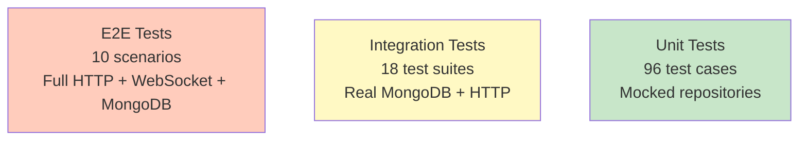

# Test Plan - Collaborative Retro Board

**Document Version**: 1.0
**Date**: 2025-12-25
**Architecture**: Single Service + MongoDB + Direct Push
**Status**: Approved

---

## Table of Contents

1. [Overview](#1-overview)
2. [Unit Test Cases](#2-unit-test-cases)
3. [Integration Test Cases](#3-integration-test-cases)
4. [End-to-End Test Scenarios](#4-end-to-end-test-scenarios)
5. [Performance Testing](#5-performance-testing)
6. [Test Execution Strategy](#6-test-execution-strategy)

---

## 1. Overview

### 1.1 Test Pyramid



### 1.2 Test Environment Setup

**Development**:
- MongoDB: `mongodb://localhost:27017/retroboard_dev`
- Service: `http://localhost:3001`
- Gateway: `http://localhost:3000`

**Testing**:
- MongoDB: `mongodb://localhost:27017/retroboard_test`
- Service: `http://localhost:3001` (test mode)
- Gateway: `http://localhost:3000` (test mode)
- Admin Secret: Set `ADMIN_SECRET_KEY=test-secret-key-123`

### 1.3 Test Data Cleanup

**Before each test**:
```javascript
await db.collection('boards').deleteMany({})
await db.collection('cards').deleteMany({})
await db.collection('reactions').deleteMany({})
await db.collection('user_sessions').deleteMany({})
```

**Using admin API** (recommended):
```javascript
await request(app)
  .post(`/v1/boards/${boardId}/test/clear`)
  .set('X-Admin-Secret', 'test-secret-key-123')
```

---

## 2. Unit Test Cases

### 2.1 Board API Tests

#### Test Suite: `POST /boards` - Create Board

| #  | Test Case | Input | Expected Output | Assertion |
|----|-----------|-------|-----------------|-----------|
| 1  | Valid board creation | `{ name: "Sprint 5", columns: [{...}], card_limit: 5 }` | `201 Created` | Board has shareable_link, creator in admins |
| 2  | Empty name | `{ name: "", columns: [{...}] }` | `400 Bad Request` | Error code: `VALIDATION_ERROR` |
| 3  | Name too long (>200) | `{ name: "a".repeat(201), columns: [{...}] }` | `400 Bad Request` | Error mentions 200 char limit |
| 4  | No columns | `{ name: "Test", columns: [] }` | `400 Bad Request` | Error: "Must have 1-10 columns" |
| 5  | Too many columns (>10) | `{ name: "Test", columns: [11 items] }` | `400 Bad Request` | Error mentions column limit |
| 6  | Invalid column color | `{ columns: [{ color: "red" }] }` | `400 Bad Request` | Error: Invalid hex format |
| 7  | Negative card limit | `{ card_limit_per_user: -5 }` | `400 Bad Request` | Error: Must be positive |
| 8  | Default limits (null) | `{ name: "Test", columns: [{...}] }` | `201 Created` | card_limit and reaction_limit are null |

#### Test Suite: `POST /boards/:id/join` - Join Board

| #  | Test Case | Input | Expected Output | Assertion |
|----|-----------|-------|-----------------|-----------|
| 9  | Valid join | `{ alias: "Alice" }` | `200 OK` | user_session created, is_admin flag correct |
| 10 | Rejoin (update alias) | Existing user, `{ alias: "Alice2" }` | `200 OK` | Alias updated, last_active_at refreshed |
| 11 | Creator joins | Board creator cookie | `200 OK` | is_admin = true |
| 12 | Empty alias | `{ alias: "" }` | `400 Bad Request` | Error: Alias required |
| 13 | Alias too long (>50) | `{ alias: "a".repeat(51) }` | `400 Bad Request` | Error: Max 50 characters |
| 14 | Invalid characters | `{ alias: "Alice@123!" }` | `400 Bad Request` | Error: Only alphanumeric, spaces, hyphens, underscores |
| 15 | Board not found | Non-existent board ID | `404 Not Found` | Error: BOARD_NOT_FOUND |
| 16 | Join closed board | Board with state='closed' | `200 OK` | Can join (read-only mode) |

#### Test Suite: `GET /boards/:id` - Get Board

| #  | Test Case | Input | Expected Output | Assertion |
|----|-----------|-------|-----------------|-----------|
| 17 | Valid get | Valid board ID | `200 OK` | Full board data with admins, active_users, columns |
| 18 | Board not found | Invalid ID | `404 Not Found` | Error: BOARD_NOT_FOUND |
| 19 | Active users filtering | Board with 5 users, 2 inactive | `200 OK` | active_users has 3 users (last_active < 2 mins) |
| 20 | Active users empty | All users inactive > 2 mins | `200 OK` | active_users is empty array |

#### Test Suite: `PATCH /boards/:id/name` - Rename Board

| #  | Test Case | Input | Expected Output | Assertion |
|----|-----------|-------|-----------------|-----------|
| 21 | Admin renames | Admin user, valid name | `200 OK` | Name updated, real-time event sent |
| 22 | Non-admin attempts | Non-admin user | `403 Forbidden` | Error: FORBIDDEN |
| 23 | Rename closed board | Board state='closed' | `409 Conflict` | Error: BOARD_CLOSED |
| 24 | Empty new name | `{ name: "" }` | `400 Bad Request` | Validation error |

#### Test Suite: `PATCH /boards/:id/close` - Close Board

| #  | Test Case | Input | Expected Output | Assertion |
|----|-----------|-------|-----------------|-----------|
| 25 | Admin closes | Admin user | `200 OK` | state='closed', closed_at set |
| 26 | Non-admin attempts | Non-admin user | `403 Forbidden` | Error: FORBIDDEN |
| 27 | Already closed (idempotent) | Board already closed | `200 OK` | closed_at unchanged |
| 28 | Real-time broadcast | Connected users present | Event sent | All clients receive `board:closed` |

#### Test Suite: `POST /boards/:id/admins` - Designate Co-Admin

| #  | Test Case | Input | Expected Output | Assertion |
|----|-----------|-------|-----------------|-----------|
| 29 | Creator designates | Creator promotes active user | `201 Created` | User added to admins array |
| 30 | Non-creator attempts | Co-admin tries | `403 Forbidden` | Only creator can promote |
| 31 | Promote non-existent | Hash not in user_sessions | `404 Not Found` | Error: USER_NOT_FOUND |
| 32 | Promote inactive user | User last_active > 2 mins | `404 Not Found` | Error: User not active |
| 33 | Already admin (idempotent) | User already in admins | `200 OK` | admins array unchanged |

#### Test Suite: `DELETE /boards/:id` - Delete Board

| #  | Test Case | Input | Expected Output | Assertion |
|----|-----------|-------|-----------------|-----------|
| 34 | Creator deletes | Creator cookie | `204 No Content` | Board + all data deleted |
| 35 | Admin secret deletes | Valid X-Admin-Secret | `204 No Content` | Bypass creator check |
| 36 | Non-creator attempts | Non-creator without secret | `403 Forbidden` | Error: Only creator can delete |
| 37 | Cascade delete | Board with 10 cards, 20 reactions | `204` | All associated data deleted |
| 38 | Real-time broadcast | Connected users | Event sent | All clients receive `board:deleted` |

---

### 2.2 User Session API Tests

#### Test Suite: `GET /boards/:id/users` - Get Active Users

| #  | Test Case | Input | Expected Output | Assertion |
|----|-----------|-------|-----------------|-----------|
| 39 | Get active users | Board with 3 active users | `200 OK` | Array of 3 users with is_admin flags |
| 40 | Filter inactive | 5 users, 2 inactive | `200 OK` | Only 3 active users returned |
| 41 | No active users | All users inactive | `200 OK` | Empty active_users array |

#### Test Suite: `PATCH /boards/:id/users/heartbeat` - Update Heartbeat

| #  | Test Case | Input | Expected Output | Assertion |
|----|-----------|-------|-----------------|-----------|
| 42 | Valid heartbeat | User cookie | `200 OK` | last_active_at updated to current time |
| 43 | No existing session | User hasn't joined | `404 Not Found` | Error: Session not found |

#### Test Suite: `PATCH /boards/:id/users/alias` - Update Alias

| #  | Test Case | Input | Expected Output | Assertion |
|----|-----------|-------|-----------------|-----------|
| 44 | Valid alias update | `{ alias: "Alice2" }` | `200 OK` | Alias updated, event sent |
| 45 | Invalid alias | `{ alias: "A@!" }` | `400 Bad Request` | Validation error |

---

### 2.3 Card API Tests

#### Test Suite: `POST /boards/:id/cards` - Create Card

| #  | Test Case | Input | Expected Output | Assertion |
|----|-----------|-------|-----------------|-----------|
| 46 | Valid feedback card | `{ content: "Good!", card_type: "feedback" }` | `201 Created` | Card with direct_reaction_count=0 |
| 47 | Valid action card | `{ content: "Fix bug", card_type: "action" }` | `201 Created` | No limit check performed |
| 48 | Anonymous card | `{ is_anonymous: true }` | `201 Created` | created_by_alias is null |
| 49 | Card limit reached | User at limit (5/5) | `403 Forbidden` | Error: CARD_LIMIT_REACHED |
| 50 | Action ignores limit | User at limit, creates action | `201 Created` | Action cards exempt |
| 51 | Empty content | `{ content: "" }` | `400 Bad Request` | Error: Content required |
| 52 | Content too long | `{ content: "a".repeat(5001) }` | `400 Bad Request` | Error: Max 5000 chars |
| 53 | Closed board | Board state='closed' | `409 Conflict` | Error: BOARD_CLOSED |
| 54 | Invalid column | Non-existent column_id | `400 Bad Request` | Error: Invalid column |

#### Test Suite: `PUT /cards/:id` - Update Card

| #  | Test Case | Input | Expected Output | Assertion |
|----|-----------|-------|-----------------|-----------|
| 55 | Owner updates | Card creator updates | `200 OK` | Content updated, event sent |
| 56 | Non-owner attempts | Different user | `403 Forbidden` | Error: Not card owner |
| 57 | Update on closed board | Board closed | `409 Conflict` | Error: BOARD_CLOSED |

#### Test Suite: `DELETE /cards/:id` - Delete Card

| #  | Test Case | Input | Expected Output | Assertion |
|----|-----------|-------|-----------------|-----------|
| 58 | Owner deletes | Card creator | `204 No Content` | Card + reactions deleted |
| 59 | Non-owner attempts | Different user | `403 Forbidden` | Error: Not card owner |
| 60 | Delete parent card | Card with 3 children | `204` | Children parent_card_id set to null |
| 61 | Delete child card | Child of parent | `204` | Parent aggregated_count decreases |

#### Test Suite: `GET /boards/:id/cards` - Get Cards with Relationships

| #  | Test Case | Input | Expected Output | Assertion |
|----|-----------|-------|-----------------|-----------|
| 62 | Get all cards | No filters | `200 OK` | All cards returned with children and linked_feedback_cards |
| 63 | Filter by column | `column_id=col-1` | `200 OK` | Only cards from col-1, with relationships |
| 64 | Embedded children | Parent with 3 children | `200 OK` | children array has 3 items |
| 65 | Embedded linked feedback | Action with 2 linked cards | `200 OK` | linked_feedback_cards array has 2 items |
| 66 | Summary statistics | Board with 18 cards | `200 OK` | total_count=18, cards_by_column shows distribution |
| 67 | Disable relationships | `include_relationships=false` | `200 OK` | children and linked_feedback_cards are empty arrays |

#### Test Suite: `GET /boards/:id/cards/quota` - Card Quota Check

| #  | Test Case | Input | Expected Output | Assertion |
|----|-----------|-------|-----------------|-----------|
| 68 | User under limit | 3/5 cards created | `200 OK` | current_count=3, limit=5, can_create=true |
| 69 | User at limit | 5/5 cards created | `200 OK` | current_count=5, limit=5, can_create=false |
| 70 | No limit configured | Board without card_limit | `200 OK` | limit=null, can_create=true, limit_enabled=false |
| 71 | Check other user | Admin checks user's quota | `200 OK` | Returns specified user's count |
| 72 | Action cards excluded | User has 3 feedback + 2 action | `200 OK` | current_count=3 (actions not counted) |

#### Test Suite: `POST /cards/:id/link` - Link Cards

| #  | Test Case | Input | Expected Output | Assertion |
|----|-----------|-------|-----------------|-----------|
| 73 | Link parent-child | Two feedback cards | `201 Created` | Child parent_card_id set |
| 74 | Link action-feedback | Action to feedback | `201 Created` | Action linked_feedback_ids updated |
| 75 | Circular relationship | A→B when B→A exists | `400 Bad Request` | Error: CIRCULAR_RELATIONSHIP |
| 76 | Invalid card types | Action as parent of feedback | `400 Bad Request` | Error: Invalid types |
| 77 | Parent aggregation | Child has 5 reactions | `201` | Parent aggregated_count += 5 |

#### Test Suite: `DELETE /cards/:id/link` - Unlink Cards

| #  | Test Case | Input | Expected Output | Assertion |
|----|-----------|-------|-----------------|-----------|
| 78 | Unlink child | Remove parent-child | `204 No Content` | parent_card_id = null |
| 79 | Unlink action-feedback | Remove action link | `204` | Removed from linked_feedback_ids |
| 80 | Aggregation update | Child with 5 reactions | `204` | Parent aggregated_count -= 5 |

---

### 2.4 Reaction API Tests

#### Test Suite: `POST /cards/:id/reactions` - Add Reaction

| #  | Test Case | Input | Expected Output | Assertion |
|----|-----------|-------|-----------------|-----------|
| 81 | First reaction | User reacts | `201 Created` | direct_reaction_count = 1 |
| 82 | Reaction limit reached | User at limit (10/10) | `403 Forbidden` | Error: REACTION_LIMIT_REACHED |
| 83 | Duplicate (upsert) | User reacts to same card twice | `200 OK` | Count unchanged (update existing) |
| 84 | Child card reaction | React to child | `201` | Parent aggregated_count increases |
| 85 | Closed board | React on closed board | `409 Conflict` | Error: BOARD_CLOSED |

#### Test Suite: `DELETE /cards/:id/reactions` - Remove Reaction

| #  | Test Case | Input | Expected Output | Assertion |
|----|-----------|-------|-----------------|-----------|
| 86 | Remove own reaction | User removes reaction | `204 No Content` | direct_reaction_count decreases |
| 87 | Remove non-existent | User hasn't reacted | `404 Not Found` | Error: Reaction not found |
| 88 | Child unreaction | Remove from child card | `204` | Parent aggregated_count decreases |

#### Test Suite: `GET /boards/:id/reactions/quota` - Reaction Quota Check

| #  | Test Case | Input | Expected Output | Assertion |
|----|-----------|-------|-----------------|-----------|
| 89 | User under limit | 7/10 reactions used | `200 OK` | current_count=7, limit=10, can_react=true |
| 90 | User at limit | 10/10 reactions used | `200 OK` | current_count=10, limit=10, can_react=false |
| 91 | No limit configured | Board without reaction_limit | `200 OK` | limit=null, can_react=true, limit_enabled=false |
| 92 | Check other user | Admin checks user's quota | `200 OK` | Returns specified user's count |
| 93 | Cross-board isolation | User has 10 reactions on board A | `200 OK` | Board B quota check shows 0 (not board A's count) |

---

### 2.5 Testing/Admin API Tests

#### Test Suite: Admin Secret Authentication

| #  | Test Case | Input | Expected Output | Assertion |
|----|-----------|-------|-----------------|-----------|
| 94 | Valid secret | Correct X-Admin-Secret | `200 OK` | Operation succeeds |
| 95 | Invalid secret | Wrong X-Admin-Secret | `401 Unauthorized` | Error: Invalid secret |
| 96 | Missing secret | No header | `401 Unauthorized` | Error: Missing secret |

---

## 3. Integration Test Cases

### 3.1 Complete Board Lifecycle

**Test Name**: `Integration: Full Retro Board Lifecycle`

**Scenario**: Create board → Join users → Create cards → Link → React → Close → Delete

**Steps**:

1. **Create Board** (POST /boards)
   - Input: Sprint 42 Retro with 3 columns, limits: 5 cards, 10 reactions
   - Verify: Board created, shareable_link exists, creator in admins
   - Database: Verify board document in MongoDB

2. **Join Board** (3 users)
   - Alice (creator): `POST /boards/:id/join` with alias "Alice"
     - Verify: is_admin = true
   - Bob: `POST /boards/:id/join` with alias "Bob"
     - Verify: is_admin = false
   - Charlie: `POST /boards/:id/join` with alias "Charlie"
   - Database: Verify 3 user_sessions created

3. **Create Feedback Cards** (4 cards)
   - Alice creates card1 in "What Went Well": "Great team collaboration"
   - Alice creates card2 in "What Went Well": "All features delivered"
   - Bob creates card3 in "Improvements": "Need better test coverage"
   - Charlie creates card4 (anonymous) in "Improvements": "Communication gaps"
   - Database: Verify 4 cards exist, card4 has created_by_alias=null

4. **Link Parent-Child** (card2 → card1)
   - `POST /cards/:card1_id/link` with target=card2, link_type='parent_of'
   - Verify: card2.parent_card_id = card1._id
   - Database: Verify relationship in MongoDB

5. **Create Action Card & Link**
   - Alice creates action card: "Improve unit test coverage to 80%"
   - `POST /cards/:action_id/link` to feedback card3
   - Verify: action.linked_feedback_ids contains card3._id

6. **Add Reactions** (3 reactions)
   - Bob reacts to card1 (thumbs_up)
   - Charlie reacts to card1 (thumbs_up)
   - Alice reacts to card2 (child card, thumbs_up)
   - Verify: card1.direct_reaction_count = 2
   - Verify: card1.aggregated_reaction_count = 3 (2 own + 1 from child)
   - Database: 3 reaction documents exist

7. **Designate Co-Admin**
   - Alice (creator) promotes Bob
   - `POST /boards/:id/admins` with Bob's cookie_hash
   - Verify: board.admins has 2 elements
   - Database: Verify admins array updated

8. **Close Board**
   - `PATCH /boards/:id/close` by Alice
   - Verify: state='closed', closed_at timestamp set
   - Test: Cannot create cards (409 Conflict)

9. **Delete One Card**
   - Charlie deletes card4 (anonymous card)
   - Verify: Card deleted from database

10. **Delete Board** (Cascade Delete)
    - `DELETE /boards/:id` by Alice
    - Verify: Board deleted
    - Verify: All cards deleted (count = 0)
    - Verify: All reactions deleted (count = 0)
    - Verify: All user_sessions deleted (count = 0)

**Total Assertions**: 25+

**Test Duration**: ~5 seconds

---

### 3.2 Card Limit Enforcement

**Test Name**: `Integration: Card Limit per User`

**Scenario**: Verify feedback cards respect limit, action cards exempt

**Steps**:

1. Create board with card_limit_per_user = 2
2. User creates 2 feedback cards → Success
3. User creates 3rd feedback card → `403 Forbidden` (CARD_LIMIT_REACHED)
4. User creates action card → Success (action cards exempt)
5. User deletes 1 feedback card
6. User creates another feedback card → Success (back under limit)

**Assertions**:
- Limit enforced for feedback cards
- Action cards ignore limit
- Deleting card frees up quota

---

### 3.3 Reaction Aggregation

**Test Name**: `Integration: Parent-Child Reaction Aggregation`

**Scenario**: Verify parent aggregated_reaction_count includes child reactions

**Steps**:

1. Create parent card
2. Create child card and link to parent
3. Add 2 reactions to parent
   - Verify: parent.direct_reaction_count = 2
   - Verify: parent.aggregated_reaction_count = 2
4. Add 3 reactions to child
   - Verify: child.direct_reaction_count = 3
   - Verify: parent.aggregated_reaction_count = 5 (2 + 3)
5. Remove 1 reaction from child
   - Verify: child.direct_reaction_count = 2
   - Verify: parent.aggregated_reaction_count = 4 (2 + 2)
6. Unlink child from parent
   - Verify: parent.aggregated_reaction_count = 2 (only own reactions)

**Assertions**:
- Direct counts are independent
- Aggregated counts include all descendant reactions
- Unlinking updates aggregation

---

### 3.4 Circular Relationship Prevention

**Test Name**: `Integration: Prevent Circular Card Links`

**Scenario**: Ensure A→B→C→A is not allowed

**Steps**:

1. Create cards A, B, C
2. Link A→B (parent-child) → Success
3. Link B→C (parent-child) → Success
4. Attempt to link C→A (parent-child) → `400 Bad Request` (CIRCULAR_RELATIONSHIP)
5. Verify: No circular link created in database

---

### 3.5 Closed Board Restrictions

**Test Name**: `Integration: Closed Board Behavior`

**Scenario**: Verify read-only mode after board closure

**Steps**:

1. Create board with cards and reactions
2. Close board
3. Attempt operations:
   - Create card → `409 Conflict`
   - Update card → `409 Conflict`
   - Delete card → `409 Conflict`
   - Add reaction → `409 Conflict`
   - Rename board → `409 Conflict`
4. Allowed operations:
   - Get board → `200 OK`
   - Get cards → `200 OK`
   - Join board → `200 OK` (can view)

**Assertions**:
- All write operations blocked
- Read operations allowed
- Users can join to view (read-only)

---

### 3.6 Card Quota Check API

**Test Name**: `Integration: Card Quota Check Before Creation`

**Scenario**: Verify frontend can check quota before showing create dialog

**Steps**:

1. Create board with card_limit_per_user = 3
2. User creates 2 feedback cards
3. Call `GET /boards/:id/cards/quota`
   - Verify: current_count=2, limit=3, can_create=true, limit_enabled=true
4. User creates 1 more feedback card (3/3)
5. Call `GET /boards/:id/cards/quota`
   - Verify: current_count=3, limit=3, can_create=false
6. User creates action card (should succeed)
7. Call `GET /boards/:id/cards/quota` again
   - Verify: current_count=3 (action card not counted)
8. Admin calls quota check with another user's hash
   - Verify: Returns that user's count, not admin's

**Assertions**:
- Quota check reflects real-time card count
- Action cards excluded from count
- can_create flag accurate
- Admin can check other users' quotas

---

### 3.7 Reaction Quota Check API

**Test Name**: `Integration: Reaction Quota Check and Limit`

**Scenario**: Verify reaction limit enforcement with quota check

**Steps**:

1. Create board with reaction_limit_per_user = 5
2. Create 10 different cards
3. User adds 3 reactions to different cards
4. Call `GET /boards/:id/reactions/quota`
   - Verify: current_count=3, limit=5, can_react=true, limit_enabled=true
5. User adds 2 more reactions (5/5 total)
6. Call quota check again
   - Verify: current_count=5, limit=5, can_react=false
7. Attempt to add 6th reaction
   - Verify: `403 Forbidden` (REACTION_LIMIT_REACHED)
8. User removes 1 reaction
9. Call quota check
   - Verify: current_count=4, can_react=true
10. Create second board, add 3 reactions there
11. Call quota check on first board
    - Verify: Still shows 4 (board isolation)

**Assertions**:
- Quota check reflects real-time reaction count
- can_react flag accurate
- Board isolation (reactions on board A don't affect board B)
- Removing reactions frees quota

---

### 3.8 Bulk Card Fetch with Relationships

**Test Name**: `Integration: Get Cards with Embedded Relationships`

**Scenario**: Verify performance optimization of embedded children and linked cards

**Steps**:

1. Create board with 3 columns
2. Create 5 parent feedback cards
3. Create 10 child cards, link to parents (2 children each for cards 1-5)
4. Create 3 action cards
5. Link action cards to feedback cards (2 feedback cards per action)
6. Call `GET /boards/:id/cards` with include_relationships=true
   - Verify: All parent cards have populated children arrays
   - Verify: Each child array has correct child card data
   - Verify: Action cards have linked_feedback_cards populated
   - Verify: total_count=18 (5 parents + 10 children + 3 actions)
   - Verify: cards_by_column shows distribution
7. Call same API with include_relationships=false
   - Verify: children arrays empty
   - Verify: linked_feedback_cards arrays empty
8. Call with column_id filter
   - Verify: Only cards from that column returned (with relationships)

**Assertions**:
- Single API call returns complete card tree
- No N+1 queries needed on frontend
- Relationships embedded correctly
- Summary statistics accurate
- Filtering works with relationships

---

## 4. End-to-End Test Scenarios

### 4.1 Realistic Retro Session

**Test Name**: `E2E: Complete Retrospective Meeting`

**Duration**: ~30 seconds

**Actors**: 5 users (Alice=Scrum Master, Bob, Charlie, Diana, Eve)

**Scenario**:

1. **Pre-Meeting** (Alice):
   - Create board: "Sprint 42 Retrospective"
   - Share link with team via chat
   - Set limits: 5 cards/user, 10 reactions/user

2. **Meeting Start** (All users):
   - All 5 users join board via shareable link
   - Set aliases (Alice, Bob, Charlie, Diana, Eve)
   - WebSocket connections established
   - All users see each other in "Active Users" list

3. **Silent Brainstorming** (5 minutes simulated):
   - Each user creates 3-5 feedback cards
   - Some cards anonymous
   - Cards distributed across 3 columns:
     - What Went Well (8 cards)
     - What Didn't Go Well (6 cards)
     - Puzzles/Questions (4 cards)
   - Real-time: All users see cards appear instantly

4. **Grouping** (Alice):
   - Drag similar cards together (parent-child linking)
   - Card "Good collaboration" becomes parent
   - 2 similar cards become children
   - Parent shows aggregated reaction count

5. **Voting** (All users):
   - Users add reactions to cards they agree with
   - Bob reaches reaction limit (10/10) → Gets error
   - Real-time: Reaction counts update for all users
   - Parent cards show total votes (own + children)

6. **Action Items** (Alice):
   - Create 3 action cards in "Action Items" column
   - Link each action to specific feedback cards
   - Diana volunteers for action item 1

7. **Meeting End** (Alice):
   - Designate Bob as co-admin
   - Close board (marks retro complete)
   - Board enters read-only mode
   - Export data (future feature)

**Real-time Verifications**:
- User joined events received by all
- Card created events < 100ms latency
- Reaction events update all clients
- Active users list updates every 60s

**Final State**:
- 5 user_sessions (all active)
- 18 feedback cards
- 3 action cards
- ~45 reactions
- 3 parent-child relationships
- 3 action-feedback links
- Board state: closed

---

### 4.2 Anonymous User Privacy

**Test Name**: `E2E: Anonymous Card Privacy`

**Scenario**: Verify cookie hashing protects anonymous users

**Steps**:

1. User creates anonymous card
   - Verify: created_by_alias is null in response
   - Database: Verify only SHA-256 hash stored (not original cookie)
2. Admin queries database directly
   - Verify: Cannot reverse-engineer cookie from hash
3. Same user creates non-anonymous card
   - Verify: Same hash used (consistent hashing)
4. User deletes anonymous card
   - Verify: Ownership check works (hash comparison)

**Security Verification**:
- No plain cookie values in database
- No plain cookie values in logs
- Hash algorithm is SHA-256 (irreversible)

---

### 4.3 Concurrent Users Test

**Test Name**: `E2E: 20 Concurrent Users on Same Board`

**Scenario**: Stress test with multiple simultaneous users

**Setup**:
- Spawn 20 simulated users (Socket.io clients)
- All join same board within 5 seconds

**Operations** (Concurrent):
- Each user creates 3 cards (60 cards total)
- Each user adds 5 reactions (100 reactions total)
- Users link cards (10 parent-child relationships)

**Verifications**:
- No race conditions in MongoDB operations
- All users receive all events (1200 events total)
- Card limits enforced correctly (no user exceeds limit)
- Reaction counts accurate (no double-counting)
- Active users list shows all 20 users

**Performance**:
- Average event latency < 200ms
- No dropped WebSocket messages
- MongoDB queries complete < 50ms

---

## 5. Performance Testing

### 5.1 Load Testing Scenarios

#### Scenario 1: Board with 100 Cards

**Setup**:
- 1 board, 10 users
- 100 feedback cards, 200 reactions
- 20 parent-child relationships

**Tests**:
- GET /boards/:id/cards → Response time < 100ms
- Create new card → Broadcast to 10 users < 200ms
- Add reaction → Update aggregations < 50ms

#### Scenario 2: 50 Concurrent Boards

**Setup**:
- 50 active boards
- 10 users per board (500 total WebSocket connections)
- Operations: 5 cards/sec, 10 reactions/sec across all boards

**Tests**:
- Server handles 500 WebSocket connections
- No event cross-contamination (board isolation)
- Memory usage < 2 GB

---

## 6. Test Execution Strategy

### 6.1 Test Commands

```bash
# Unit tests (fast, mocked)
pnpm test:unit

# Integration tests (real MongoDB)
pnpm test:integration

# E2E tests (full stack)
pnpm test:e2e

# All tests
pnpm test

# Coverage report
pnpm test:coverage
```

### 6.2 CI/CD Pipeline

**On Every Commit**:
1. Run unit tests (80+ tests)
2. Lint code
3. Type check (TypeScript)

**On Pull Request**:
1. Run all unit tests
2. Run integration tests
3. Coverage must be > 80%

**Before Deployment**:
1. Run full test suite (unit + integration + E2E)
2. Performance regression tests
3. Security scan

### 6.3 Test Data Management

**Using Admin APIs**:

```typescript
// Before each test
await clearBoard(boardId)

// Seed test data
await seedTestData(boardId, {
  num_users: 5,
  num_cards: 20,
  num_reactions: 50
})

// Clean up after test
await deleteBoard(boardId)
```

**Helper Functions**:

```typescript
async function clearBoard(boardId: string) {
  return await request(app)
    .post(`/v1/boards/${boardId}/test/clear`)
    .set('X-Admin-Secret', process.env.ADMIN_SECRET_KEY)
}
```

---

## 7. Phase Implementation Status

### Phase 2: Board Domain - COMPLETED ✅

**Implementation Date**: 2025-12-27
**Review Status**: Second-pass verified

#### Implemented Tests

| Test Suite | Test Cases | Status |
|------------|-----------|--------|
| BoardRepository.create | 3 cases | ✅ Passing |
| BoardRepository.findById | 3 cases | ✅ Passing |
| BoardRepository.findByShareableLink | 2 cases | ✅ Passing |
| BoardRepository.updateName | 2 cases | ✅ Passing |
| BoardRepository.closeBoard | 2 cases | ✅ Passing |
| BoardRepository.addAdmin | 2 cases | ✅ Passing |
| BoardRepository.isAdmin | 3 cases | ✅ Passing |
| BoardRepository.isCreator | 2 cases | ✅ Passing |
| BoardRepository.renameColumn | 2 cases | ✅ Passing |
| BoardRepository.delete | 3 cases | ✅ Passing |
| BoardService.createBoard | 1 case | ✅ Passing |
| BoardService.getBoard | 2 cases | ✅ Passing |
| BoardService.updateBoardName | 3 cases | ✅ Passing |
| BoardService.closeBoard | 3 cases | ✅ Passing |
| BoardService.addAdmin | 3 cases | ✅ Passing |
| BoardService.renameColumn | 3 cases | ✅ Passing |
| BoardService.deleteBoard | 4 cases | ✅ Passing |
| Board API Integration | 16 cases | ✅ Passing |
| Hash Utils | 5 cases | ✅ Passing |
| Validation Schemas | 22 cases | ✅ Passing |

**Total Tests**: 86 passing

#### Test Files

```
backend/tests/
├── unit/
│   ├── domains/
│   │   └── board/
│   │       ├── board.repository.test.ts  (24 tests)
│   │       └── board.service.test.ts     (20 tests)
│   └── shared/
│       ├── utils/
│       │   └── hash.test.ts              (5 tests)
│       └── validation/
│           └── schemas.test.ts           (22 tests)
├── integration/
│   └── board.test.ts                     (16 tests)
└── utils/
    ├── index.ts
    ├── test-app.ts
    └── test-db.ts
```

#### Key Test Utilities

- **mongodb-memory-server**: In-memory MongoDB for isolated testing
- **supertest**: HTTP integration testing
- **vitest**: Test runner with TypeScript support

#### Test Coverage by Feature

| Feature | Unit Tests | Integration Tests | Notes |
|---------|-----------|------------------|-------|
| Create board | ✅ | ✅ | Includes retry on collision |
| Get board | ✅ | ✅ | |
| Update board name | ✅ | ✅ | Atomic with admin check |
| Close board | ✅ | ✅ | Atomic with admin check |
| Add admin | ✅ | ✅ | Atomic with creator check |
| Rename column | ✅ | ✅ | Column existence validated |
| Delete board | ✅ | ✅ | Creator or admin secret |
| Shareable link lookup | ✅ | ✅ | Uses `/by-link/:linkCode` |
| Authorization checks | ✅ | ✅ | isAdmin, isCreator |
| Input validation | ✅ | ✅ | Zod schemas |

#### Issues Found and Fixed During Testing

1. **Shareable link length**: Updated test to expect 12 chars (was 8)
2. **Atomic operations**: Tests updated to mock new atomic patterns
3. **Error codes**: Tests updated for `COLUMN_NOT_FOUND` error code
4. **Service layer checks**: Column existence now checked in service before repository call

---

### Phase 2 QA Review: Identified Gaps and Recommendations

**Review Date**: 2025-12-27
**Reviewer**: QA Engineer

#### Current Test Summary

All 86 tests are passing with good coverage. The implementation is solid with proper atomic operations and security measures.

#### Additional Test Cases Recommended

The following tests should be added to improve edge case coverage:

##### High Priority - Integration Tests

| # | Test Case | Description | Implementation |
|---|-----------|-------------|----------------|
| 1 | GET /v1/boards/by-link/:linkCode success | Test board retrieval via shareable link | Add to `board.test.ts` |
| 2 | GET /v1/boards/by-link/:linkCode 404 | Test 404 for non-existent link code | Add to `board.test.ts` |
| 3 | DELETE with valid admin secret | Test deletion using X-Admin-Secret header | Add to `board.test.ts` |
| 4 | DELETE with invalid admin secret | Test rejection of wrong admin secret | Add to `board.test.ts` |

**Recommended Test Code**:

```typescript
// Add to tests/integration/board.test.ts

describe('GET /v1/boards/by-link/:linkCode', () => {
  it('should get board by shareable link code', async () => {
    const createResponse = await request(app)
      .post('/v1/boards')
      .send({ name: 'Test Board', columns: [{ id: 'c1', name: 'Col' }] });

    const shareableLink = createResponse.body.data.shareable_link;
    const linkCode = shareableLink.split('/join/')[1];

    const response = await request(app)
      .get(`/v1/boards/by-link/${linkCode}`);

    expect(response.status).toBe(200);
    expect(response.body.data.name).toBe('Test Board');
  });

  it('should return 404 for non-existent link code', async () => {
    const response = await request(app)
      .get('/v1/boards/by-link/nonexistent123');

    expect(response.status).toBe(404);
    expect(response.body.error.code).toBe('BOARD_NOT_FOUND');
  });
});

describe('DELETE /v1/boards/:id with admin secret', () => {
  it('should delete board with valid X-Admin-Secret header', async () => {
    const createResponse = await request(app)
      .post('/v1/boards')
      .send({ name: 'Test', columns: [{ id: 'c1', name: 'Col' }] });

    const boardId = createResponse.body.data.id;

    const response = await request(app)
      .delete(`/v1/boards/${boardId}`)
      .set('X-Admin-Secret', 'test-admin-secret-key');

    expect(response.status).toBe(204);

    // Verify board is deleted
    const getResponse = await request(app).get(`/v1/boards/${boardId}`);
    expect(getResponse.status).toBe(404);
  });

  it('should return 403 for invalid X-Admin-Secret', async () => {
    const createResponse = await request(app)
      .post('/v1/boards')
      .send({ name: 'Test', columns: [{ id: 'c1', name: 'Col' }] });

    const boardId = createResponse.body.data.id;

    const response = await request(app)
      .delete(`/v1/boards/${boardId}`)
      .set('X-Admin-Secret', 'wrong-secret');

    expect(response.status).toBe(403);
  });
});
```

##### Medium Priority - Edge Case Tests

| # | Test Case | Description | Priority |
|---|-----------|-------------|----------|
| 5 | Max length board name (200 chars) | Test boundary condition for name | Medium |
| 6 | Max length column name (100 chars) | Test boundary condition for column name | Medium |
| 7 | Invalid hex color format | Test validation rejects non-hex colors | Medium |
| 8 | Lowercase hex color | Test validation accepts lowercase hex | Medium |
| 9 | Rename column on closed board | Should return 409 BOARD_CLOSED | Medium |
| 10 | Add admin on closed board | Should return 409 BOARD_CLOSED | Medium |

**Recommended Test Code**:

```typescript
// Add to tests/integration/board.test.ts

describe('POST /v1/boards - edge cases', () => {
  it('should accept board name at max length (200 chars)', async () => {
    const maxLengthName = 'A'.repeat(200);

    const response = await request(app)
      .post('/v1/boards')
      .send({
        name: maxLengthName,
        columns: [{ id: 'c1', name: 'Col' }],
      });

    expect(response.status).toBe(201);
    expect(response.body.data.name.length).toBe(200);
  });

  it('should reject board name exceeding max length', async () => {
    const response = await request(app)
      .post('/v1/boards')
      .send({
        name: 'A'.repeat(201),
        columns: [{ id: 'c1', name: 'Col' }],
      });

    expect(response.status).toBe(400);
  });

  it('should reject invalid hex color format', async () => {
    const response = await request(app)
      .post('/v1/boards')
      .send({
        name: 'Test Board',
        columns: [{ id: 'c1', name: 'Col', color: 'red' }],
      });

    expect(response.status).toBe(400);
  });

  it('should accept valid lowercase hex color', async () => {
    const response = await request(app)
      .post('/v1/boards')
      .send({
        name: 'Test Board',
        columns: [{ id: 'c1', name: 'Col', color: '#aabbcc' }],
      });

    expect(response.status).toBe(201);
  });
});
```

##### Low Priority - Unit Tests

| # | Test Case | Description | File |
|---|-----------|-------------|------|
| 11 | Shareable link collision retry | Test E11000 handling with retry | `board.repository.test.ts` |
| 12 | Max retries exceeded | Test error after 5 collisions | `board.repository.test.ts` |
| 13 | getBoardByLink service | Test successful link lookup | `board.service.test.ts` |
| 14 | getBoardByLink not found | Test 404 for invalid link | `board.service.test.ts` |

#### Security Test Verification

| Security Check | Status | Notes |
|----------------|--------|-------|
| Cookie hashing (SHA-256) | ✅ Verified | Consistent across requests |
| No plain cookies in database | ✅ Verified | Only hashes stored |
| Timing-safe admin secret check | ✅ Verified | Uses `crypto.timingSafeEqual` |
| Invalid ObjectId handling | ✅ Verified | Returns 404, not 500 |
| Input validation (Zod) | ✅ Verified | All endpoints validated |
| Column ID sanitization | ✅ Verified | Regex pattern prevents injection |

#### Performance Observations

| Metric | Observed | Target | Status |
|--------|----------|--------|--------|
| Test suite duration | ~4 seconds | < 10 seconds | ✅ Pass |
| MongoDB memory server startup | ~1 second | < 3 seconds | ✅ Pass |
| Average test case | ~20ms | < 100ms | ✅ Pass |

#### Recommendations Summary

1. **Must Have** (before Phase 3):
   - Add GET by shareable link integration tests
   - Add admin secret DELETE tests

2. **Should Have** (within Phase 3):
   - Add edge case validation tests
   - Add closed board restriction tests

3. **Nice to Have** (future):
   - Shareable link collision unit tests
   - Concurrent modification stress tests

---

### Phase 3: User Session Management - PENDING

*Tests to be implemented*

---

### Phase 4: Card Domain - PENDING

*Tests to be implemented*

---

### Phase 5: Reaction Domain - PENDING

*Tests to be implemented*

---

## Document Status

**Status**: Approved - Implementation In Progress

**Current Test Coverage**:
- Unit tests: 86 test cases (Phase 1-2)
- Integration tests: 16 test cases (Phase 2)
- E2E tests: Pending

**Test Coverage Goals**:
- Unit tests: 80+ test cases ✅ Achieved (86)
- Integration tests: 15 test suites (1 completed)
- E2E tests: 10 comprehensive scenarios
- Code coverage: > 80% (services + repositories)
- Real-time events: 100% coverage

**Testing Framework**: Vitest (fast, native ESM, TypeScript-first)

**Completed**:
1. ✅ Implement unit tests using Vitest
2. ✅ Set up test MongoDB instance via mongodb-memory-server
3. ✅ Implement integration tests with Supertest
4. ⏳ Configure CI/CD pipeline
5. ⏳ Add performance testing with Artillery

**Related Documents**:
- [BACKEND_API_SPECIFICATION_V2.md](./BACKEND_API_SPECIFICATION_V2.md) - API specifications
- [HIGH_LEVEL_TECHNICAL_DESIGN.md](./HIGH_LEVEL_TECHNICAL_DESIGN.md) - Architecture
- [backend-code-review.md](./backend-code-review.md) - Code review findings
