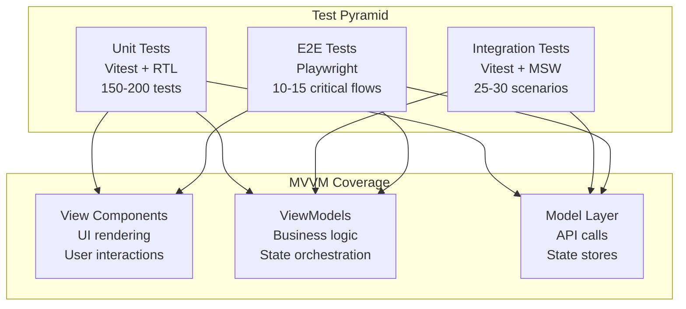
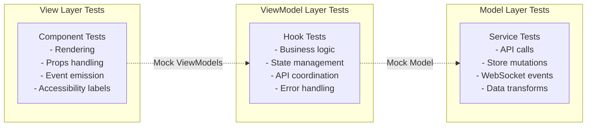
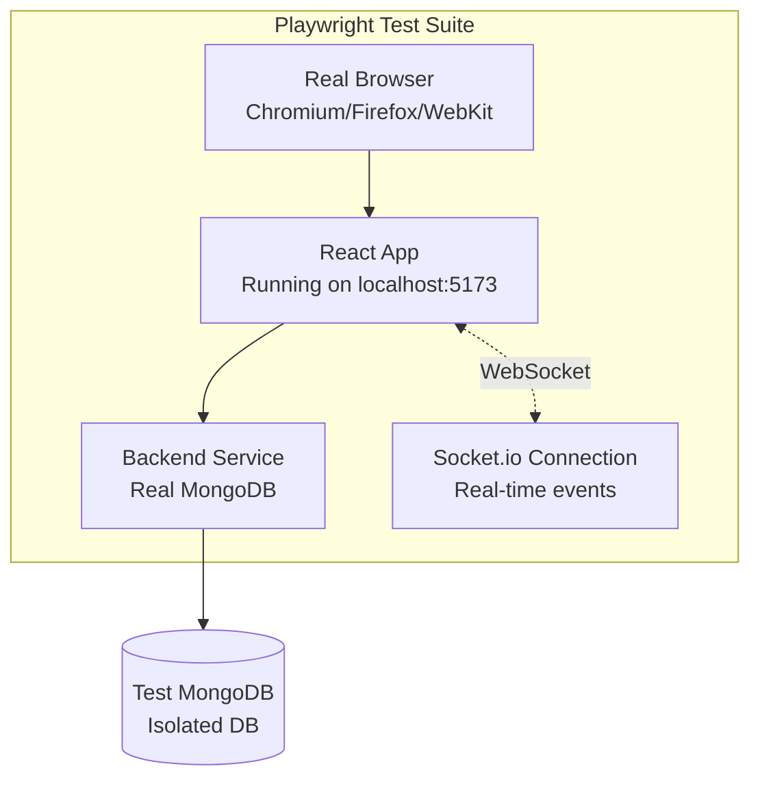
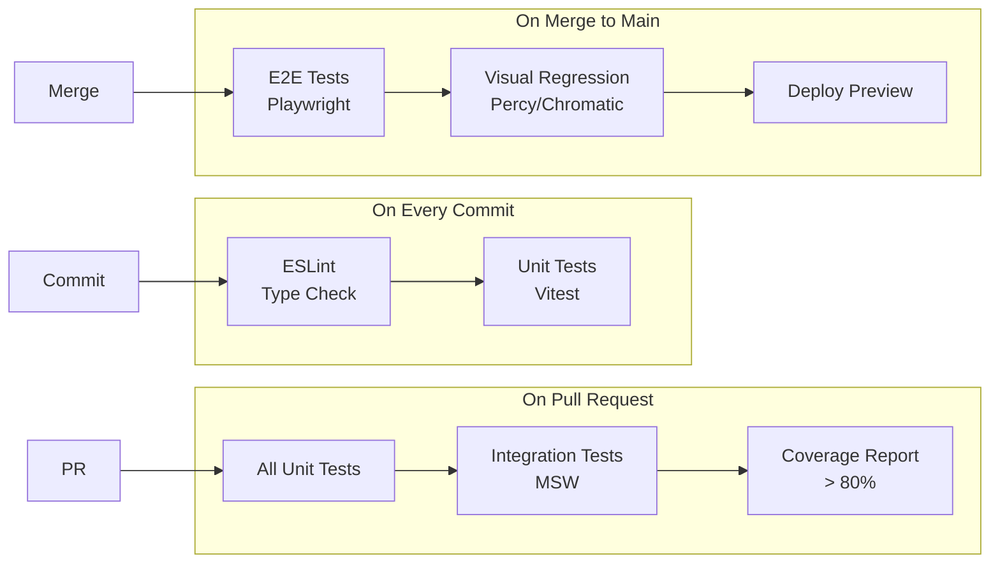

# Frontend Test Plan - Collaborative Retro Board

**Document Version**: 1.0
**Date**: 2025-12-25
**Architecture**: React MVVM + Vitest + Playwright
**Status**: Draft - Awaiting Review

---

## Table of Contents

1. [Overview](#1-overview)
2. [MVVM Testing Strategy](#2-mvvm-testing-strategy)
3. [Component Testing (View Layer)](#3-component-testing-view-layer)
4. [ViewModel Testing (Business Logic)](#4-viewmodel-testing-business-logic)
5. [Model Testing (API & State)](#5-model-testing-api--state)
6. [Integration Testing](#6-integration-testing)
7. [End-to-End Testing](#7-end-to-end-testing)
8. [Real-time Testing](#8-real-time-testing)
9. [Drag-and-Drop Testing](#9-drag-and-drop-testing)
10. [Test Automation & CI/CD](#10-test-automation--cicd)
11. [Missing Components Analysis](#11-missing-components-analysis)

---

## 1. Overview

### 1.1 Testing Philosophy

This test plan follows the MVVM architecture defined in [FRONTEND_COMPONENT_DESIGN_V2.md](FRONTEND_COMPONENT_DESIGN_V2.md), ensuring clear separation of concerns and comprehensive coverage across all layers.



### 1.2 Technology Stack

| Layer | Technology | Purpose |
|-------|-----------|---------|
| Unit Testing | Vitest + React Testing Library | Fast, Vite-native, component testing |
| Integration Testing | Vitest + MSW (Mock Service Worker) | API mocking, ViewModel integration |
| E2E Testing | Playwright | Real browser, WebSocket, drag-drop |
| Coverage | Vitest Coverage (c8) | Code coverage reporting |
| CI/CD | GitHub Actions / GitLab CI | Automated test execution |

### 1.3 Coverage Goals

| Layer | Coverage Target | Test Count Estimate |
|-------|----------------|---------------------|
| View Components | 85%+ | 80-100 tests |
| ViewModels | 90%+ | 50-70 tests |
| Model Layer | 85%+ | 20-30 tests |
| Integration | Critical paths | 25-30 scenarios |
| E2E | User journeys | 10-15 flows |

---

## 2. MVVM Testing Strategy

### 2.1 Architecture Test Separation



### 2.2 Testing Boundaries

**View Components**:
- Test ONLY rendering and user interactions
- Mock ViewModel hooks entirely
- Verify correct props passed to children
- Test conditional rendering (loading, error states)
- DO NOT test business logic or API calls

**ViewModels**:
- Test business logic and state orchestration
- Mock Model layer (API services, stores)
- Verify state transformations
- Test error handling and edge cases
- DO NOT test UI rendering

**Model Layer**:
- Test API request/response handling
- Test Zustand store mutations
- Test WebSocket event processing
- Mock backend API responses
- DO NOT test business logic

---

## 3. Component Testing (View Layer)

### 3.1 RetroBoardPage Container Tests

**File**: `RetroBoardPage.test.tsx`

**Test Suite**: `RetroBoardPage - Main Container`

#### Pattern: Mock ViewModel, Test Rendering

```typescript
// Test pattern - mock the ViewModel
vi.mock('../viewmodels/useBoardViewModel')
vi.mock('../viewmodels/useCardViewModel')

describe('RetroBoardPage', () => {
  test('renders loading skeleton when isLoading is true', () => {
    // Arrange
    mockUseBoardViewModel.mockReturnValue({
      board: null,
      isLoading: true,
      error: null
    })

    // Act
    render(<RetroBoardPage boardId="123" />)

    // Assert
    expect(screen.getByTestId('board-skeleton')).toBeInTheDocument()
    expect(screen.queryByRole('heading')).not.toBeInTheDocument()
  })

  test('renders error message when error state exists', () => {
    // Arrange
    mockUseBoardViewModel.mockReturnValue({
      board: null,
      isLoading: false,
      error: new Error('Board not found')
    })

    // Act
    render(<RetroBoardPage boardId="123" />)

    // Assert
    expect(screen.getByRole('alert')).toHaveTextContent('Board not found')
  })

  test('renders full board layout when loaded', () => {
    // Arrange
    const mockBoard = { id: '123', name: 'Sprint 42', state: 'active' }
    mockUseBoardViewModel.mockReturnValue({
      board: mockBoard,
      isLoading: false,
      error: null
    })

    // Act
    render(<RetroBoardPage boardId="123" />)

    // Assert
    expect(screen.getByRole('heading', { name: 'Sprint 42' })).toBeInTheDocument()
    expect(screen.getByTestId('participant-bar')).toBeInTheDocument()
    expect(screen.getByTestId('my-user-card')).toBeInTheDocument()
    expect(screen.getByTestId('sort-bar')).toBeInTheDocument()
  })
})
```

**Coverage**: 15-20 tests
- Loading states
- Error states
- Successful data display
- Closed board UI (lock icon)
- Component composition

---

### 3.2 RetroBoardHeader Tests

**File**: `RetroBoardHeader.test.tsx`

**Test Suite**: `RetroBoardHeader - Title and Controls`

#### Key Test Cases

| # | Test Case | Scenario | Assertion |
|---|-----------|----------|-----------|
| 1 | Admin sees edit controls | `isAdmin: true` | Edit and Close buttons visible |
| 2 | Non-admin no controls | `isAdmin: false` | Edit and Close buttons hidden |
| 3 | Closed board shows lock | `isClosed: true` | Lock icon visible, edit buttons hidden |
| 4 | Edit title dialog | Click edit icon | Modal opens with input field |
| 5 | Close board confirmation | Click close button | Confirmation dialog appears |
| 6 | Submit new title | User types and submits | `onEditTitle` called with new value |
| 7 | Cancel edit | User cancels dialog | Modal closes, no callback fired |

**Pattern Example**:

```typescript
test('admin can open edit title dialog', async () => {
  const mockOnEdit = vi.fn()
  render(
    <RetroBoardHeader
      boardTitle="Sprint 42"
      isAdmin={true}
      isClosed={false}
      onEditTitle={mockOnEdit}
      onCloseBoard={vi.fn()}
    />
  )

  // Click edit button
  const editBtn = screen.getByRole('button', { name: /edit/i })
  await userEvent.click(editBtn)

  // Dialog appears
  expect(screen.getByRole('dialog')).toBeInTheDocument()
  expect(screen.getByLabelText(/board name/i)).toHaveValue('Sprint 42')

  // User edits and submits
  const input = screen.getByLabelText(/board name/i)
  await userEvent.clear(input)
  await userEvent.type(input, 'Sprint 43')
  await userEvent.click(screen.getByRole('button', { name: /save/i }))

  // Callback fired
  expect(mockOnEdit).toHaveBeenCalledWith('Sprint 43')
})
```

**Coverage**: 10-12 tests

---

### 3.3 MyUserCard Tests

**File**: `MyUserCard.test.tsx`

**Test Suite**: `MyUserCard - User Identity Display`

#### Key Test Cases

| # | Test Case | Scenario | Assertion |
|---|-----------|----------|-----------|
| 1 | Display UUID and alias | Valid user | UUID truncated, alias shown |
| 2 | UUID tooltip | Hover over UUID | Full UUID in tooltip |
| 3 | Edit alias button appears | Hover state | Edit button visible |
| 4 | Alias edit dialog | Click edit | Modal with input field |
| 5 | Validate alias pattern | Invalid chars (e.g., @) | Error message shown |
| 6 | Update alias success | Valid new alias | `onUpdateAlias` called |
| 7 | Default alias format | AdjectiveAnimalNumber | Matches pattern regex |

**Pattern Example**:

```typescript
test('validates alias against pattern', async () => {
  const mockUpdate = vi.fn()
  render(
    <MyUserCard
      currentUser={{ uuid: 'abc-123', alias: 'SneakyPanda42' }}
      onUpdateAlias={mockUpdate}
    />
  )

  // Open edit dialog
  await userEvent.click(screen.getByRole('button', { name: /edit alias/i }))

  // Try invalid alias
  const input = screen.getByLabelText(/alias/i)
  await userEvent.clear(input)
  await userEvent.type(input, 'Invalid@Alias!')
  await userEvent.click(screen.getByRole('button', { name: /save/i }))

  // Error shown
  expect(screen.getByText(/only alphanumeric/i)).toBeInTheDocument()
  expect(mockUpdate).not.toHaveBeenCalled()
})
```

**Coverage**: 8-10 tests

---

### 3.4 ParticipantBar Tests

**File**: `ParticipantBar.test.tsx`

**Test Suite**: `ParticipantBar - User List and Filters`

#### Key Test Cases

| # | Test Case | Scenario | Assertion |
|---|-----------|----------|-----------|
| 1 | Special avatars render | All Users + Anonymous | Both special avatars visible |
| 2 | Admin has hat icon | User is admin | Hat emoji/icon displayed |
| 3 | All Users filter active | Default state | All Users avatar highlighted |
| 4 | Click avatar toggles filter | Click participant | `onToggleUserFilter` called |
| 5 | Anonymous filter toggle | Click ghost icon | `onToggleAnonymousFilter` called |
| 6 | Admin dropdown visible | User is creator | Dropdown button shown |
| 7 | Promote user from dropdown | Select user | `onPromoteToAdmin` called |
| 8 | Multiple filter states | 2 users + anonymous | Correct avatars highlighted |

**Pattern Example**:

```typescript
test('clicking All Users avatar toggles filter', async () => {
  const mockToggle = vi.fn()
  render(
    <ParticipantBar
      activeUsers={[{ alias: 'Alice', is_admin: true }]}
      activeFilters={{ showAll: true, showAnonymous: false, users: [] }}
      onToggleAllUsersFilter={mockToggle}
      onToggleUserFilter={vi.fn()}
      {...otherProps}
    />
  )

  // Find All Users avatar (*)
  const allUsersAvatar = screen.getByLabelText(/all users/i)
  await userEvent.click(allUsersAvatar)

  expect(mockToggle).toHaveBeenCalled()
})
```

**Coverage**: 15-18 tests

---

### 3.5 RetroCard Tests

**File**: `RetroCard.test.tsx`

**Test Suite**: `RetroCard - Card Display and Interactions`

#### Key Test Cases

| # | Test Case | Scenario | Assertion |
|---|-----------|----------|-----------|
| 1 | Standalone card has drag handle | No parent_card_id | Drag handle icon visible |
| 2 | Linked card shows link icon | Has parent_card_id | Link icon replaces drag handle |
| 3 | Click link icon to unlink | Child card | `onUnlinkFromParent` called |
| 4 | Delete button only for owner | User is creator | Delete button visible |
| 5 | Reaction button shows count | 5 reactions | Badge shows "5" |
| 6 | Recursive child rendering | Card with 2 children | 2 child RetroCards rendered |
| 7 | No gap between parent-child | Visual regression | Children directly below parent |
| 8 | Anonymous card no author | is_anonymous: true | No creator name shown |
| 9 | Aggregated count for parent | Parent with children | Shows combined count |

**Pattern Example**:

```typescript
test('linked child card shows link icon instead of drag handle', () => {
  const mockUnlink = vi.fn()
  const childCard = {
    id: 'child-1',
    content: 'Child card',
    parent_card_id: 'parent-1',
    children: []
  }

  render(
    <RetroCard
      card={childCard}
      isChild={true}
      onUnlinkFromParent={mockUnlink}
      {...otherProps}
    />
  )

  // Link icon present
  expect(screen.getByLabelText(/unlink from parent/i)).toBeInTheDocument()

  // Drag handle NOT present
  expect(screen.queryByLabelText(/drag card/i)).not.toBeInTheDocument()
})

test('recursively renders child cards with no gap', () => {
  const parentCard = {
    id: 'parent-1',
    content: 'Parent card',
    parent_card_id: null,
    children: [
      { id: 'child-1', content: 'Child 1', children: [] },
      { id: 'child-2', content: 'Child 2', children: [] }
    ]
  }

  render(<RetroCard card={parentCard} {...props} />)

  expect(screen.getByText('Parent card')).toBeInTheDocument()
  expect(screen.getByText('Child 1')).toBeInTheDocument()
  expect(screen.getByText('Child 2')).toBeInTheDocument()

  // Visual: Check no margin (requires custom matcher or snapshot)
  const childContainer = screen.getByTestId('child-cards-container')
  expect(childContainer).toHaveStyle({ marginTop: '0' })
})
```

**Coverage**: 20-25 tests

---

### 3.6 RetroColumn Tests

**File**: `RetroColumn.test.tsx`

**Test Suite**: `RetroColumn - Column Container`

#### Key Test Cases

| # | Test Case | Scenario | Assertion |
|---|-----------|----------|-----------|
| 1 | Render column header | Column name | Header shows correct title |
| 2 | Edit column name (admin) | Admin clicks edit | Edit dialog appears |
| 3 | Add card button enabled | canCreateCard: true | + button clickable |
| 4 | Add card button disabled | canCreateCard: false | + button disabled with tooltip |
| 5 | Quota warning tooltip | User at limit | Tooltip shows "5/5 cards" |
| 6 | Drag-over highlight | Card dragged over | Drop zone highlighted |
| 7 | Drop card triggers callback | Card dropped | `onCardDropped` called with IDs |
| 8 | Cards sorted correctly | Sort by recency | Cards in expected order |

**Pattern Example**:

```typescript
test('+ button disabled when quota reached, shows tooltip', async () => {
  render(
    <RetroColumn
      column={{ id: 'col-1', name: 'What Went Well' }}
      cards={[]}
      canCreateCard={false}
      onAddCard={vi.fn()}
      {...otherProps}
    />
  )

  const addBtn = screen.getByRole('button', { name: /add card/i })

  expect(addBtn).toBeDisabled()

  // Hover to show tooltip
  await userEvent.hover(addBtn)
  expect(await screen.findByRole('tooltip')).toHaveTextContent(/card limit reached/i)
})
```

**Coverage**: 12-15 tests

---

## 4. ViewModel Testing (Business Logic)

### 4.1 useBoardViewModel Tests

**File**: `useBoardViewModel.test.ts`

**Test Suite**: `useBoardViewModel - Board State Management`

#### Test Pattern: renderHook + Mock Model

```typescript
import { renderHook, waitFor } from '@testing-library/react'
import { vi } from 'vitest'
import { useBoardViewModel } from './useBoardViewModel'

// Mock the Model layer
vi.mock('../models/BoardAPI')
vi.mock('../models/boardStore')

describe('useBoardViewModel', () => {
  beforeEach(() => {
    vi.clearAllMocks()
  })

  test('loads board data on mount', async () => {
    const mockBoard = { id: '123', name: 'Sprint 42', state: 'active' }
    mockBoardAPI.getBoard.mockResolvedValue(mockBoard)

    const { result } = renderHook(() => useBoardViewModel('123'))

    // Initial loading state
    expect(result.current.isLoading).toBe(true)
    expect(result.current.board).toBeNull()

    // Wait for data load
    await waitFor(() => {
      expect(result.current.isLoading).toBe(false)
    })

    expect(result.current.board).toEqual(mockBoard)
    expect(mockBoardAPI.getBoard).toHaveBeenCalledWith('123')
  })

  test('derives isAdmin from board.admins and currentUser', () => {
    const mockBoard = {
      id: '123',
      admins: ['hash1', 'hash2'],
      state: 'active'
    }
    mockBoardStore.getState.mockReturnValue({ board: mockBoard })
    mockUserStore.getState.mockReturnValue({
      currentUser: { cookie_hash: 'hash1' }
    })

    const { result } = renderHook(() => useBoardViewModel('123'))

    expect(result.current.isAdmin).toBe(true)
    expect(result.current.isCreator).toBe(true) // First in admins array
  })

  test('handleRenameBoard calls API and updates store', async () => {
    mockBoardAPI.updateBoardName.mockResolvedValue({
      id: '123',
      name: 'Updated Name'
    })

    const { result } = renderHook(() => useBoardViewModel('123'))

    await result.current.handleRenameBoard('Updated Name')

    expect(mockBoardAPI.updateBoardName).toHaveBeenCalledWith('123', 'Updated Name')
    expect(mockBoardStore.updateBoardName).toHaveBeenCalledWith('Updated Name')
  })

  test('handleCloseBoard sets closed state', async () => {
    const closedBoard = {
      id: '123',
      state: 'closed',
      closed_at: new Date()
    }
    mockBoardAPI.closeBoard.mockResolvedValue(closedBoard)

    const { result } = renderHook(() => useBoardViewModel('123'))

    await result.current.handleCloseBoard()

    expect(result.current.isClosed).toBe(true)
    expect(mockBoardStore.closeBoard).toHaveBeenCalled()
  })

  test('handles API error gracefully', async () => {
    const error = new Error('Network error')
    mockBoardAPI.getBoard.mockRejectedValue(error)

    const { result } = renderHook(() => useBoardViewModel('123'))

    await waitFor(() => {
      expect(result.current.isLoading).toBe(false)
    })

    expect(result.current.error).toEqual(error)
    expect(result.current.board).toBeNull()
  })
})
```

**Coverage**: 12-15 tests
- Data loading (success, error)
- Derived state (isAdmin, isCreator, isClosed)
- Board operations (rename, close)
- Real-time sync subscriptions
- Error handling

---

### 4.2 useCardViewModel Tests

**File**: `useCardViewModel.test.ts`

**Test Suite**: `useCardViewModel - Card Operations`

#### Key Test Cases

| # | Test Case | Scenario | Mock Setup | Assertion |
|---|-----------|----------|------------|-----------|
| 1 | Fetch cards with children | include_relationships=true | API returns nested | cards state has children |
| 2 | Create card checks quota first | User at limit | Quota API returns can_create:false | API call blocked, error shown |
| 3 | Create card success | Valid card data | API returns 201 | Card added to store |
| 4 | Link parent-child updates aggregation | Link 2 cards | API success | Parent aggregated_count increases |
| 5 | Unlink child from parent | Remove link | API success | Parent aggregated_count decreases |
| 6 | Delete card orphans children | Parent with children | API success | Children parent_card_id set to null |
| 7 | Sorting by recency | Client-side sort | Multiple cards | Cards sorted by created_at desc |
| 8 | Sorting by popularity | Client-side sort | Cards with reactions | Cards sorted by aggregated_count desc |
| 9 | Filter by user | User filter active | 3 users, filter 1 | Only filtered user's cards shown |
| 10 | Filter by All Users | Default filter | All cards | All cards visible |
| 11 | Optimistic update rollback | API error | Create fails | Card removed from UI |

**Pattern Example**:

```typescript
test('checkCardQuota before create prevents API call if at limit', async () => {
  mockCardAPI.checkCardQuota.mockResolvedValue({
    current_count: 5,
    limit: 5,
    can_create: false
  })

  const { result } = renderHook(() => useCardViewModel('board-123'))

  // Wait for quota check
  await waitFor(() => expect(result.current.cardQuota).toBeDefined())

  // Try to create card
  await expect(
    result.current.handleCreateCard({
      content: 'New card',
      card_type: 'feedback'
    })
  ).rejects.toThrow('Card limit reached')

  // API create NOT called
  expect(mockCardAPI.createCard).not.toHaveBeenCalled()
})

test('applySortFilter sorts by popularity correctly', () => {
  const cards = [
    { id: '1', aggregated_reaction_count: 3 },
    { id: '2', aggregated_reaction_count: 10 },
    { id: '3', aggregated_reaction_count: 5 }
  ]
  const sortMode = { type: 'popularity', direction: 'desc' }
  const filters = { showAll: true, showAnonymous: true, users: [] }

  const { result } = renderHook(() => useCardViewModel('board-123'))

  const sorted = result.current.applySortFilter(cards, sortMode, filters)

  expect(sorted.map(c => c.id)).toEqual(['2', '3', '1'])
})
```

**Coverage**: 18-22 tests

---

### 4.3 useParticipantViewModel Tests

**File**: `useParticipantViewModel.test.ts`

**Test Suite**: `useParticipantViewModel - Participant Management`

#### Key Test Cases

| # | Test Case | Scenario | Assertion |
|---|-----------|----------|-----------|
| 1 | Fetch active users on mount | API call | Active users populated |
| 2 | Filter inactive users | last_active > 2 mins | User not in active list |
| 3 | Update alias success | Valid alias | API called, store updated |
| 4 | Promote user to admin | Creator action | Admin API called |
| 5 | Toggle All Users filter | Click action | Filter state updated |
| 6 | Toggle Anonymous filter | Click action | showAnonymous toggled |
| 7 | Toggle user-specific filter | Click avatar | User added to filters array |
| 8 | Heartbeat sent periodically | 60s interval | Heartbeat API called |

**Pattern Example**:

```typescript
test('handleUpdateAlias calls API and updates store', async () => {
  mockBoardAPI.updateAlias.mockResolvedValue({
    alias: 'NewAlias123',
    last_active_at: new Date()
  })

  const { result } = renderHook(() => useParticipantViewModel('board-123'))

  await result.current.handleUpdateAlias('NewAlias123')

  expect(mockBoardAPI.updateAlias).toHaveBeenCalledWith('board-123', 'NewAlias123')
  expect(mockUserStore.updateAlias).toHaveBeenCalledWith('NewAlias123')
})

test('heartbeat sent every 60 seconds', async () => {
  vi.useFakeTimers()

  renderHook(() => useParticipantViewModel('board-123'))

  // Initially not called
  expect(mockBoardAPI.updateHeartbeat).not.toHaveBeenCalled()

  // After 60s
  vi.advanceTimersByTime(60000)
  await waitFor(() => {
    expect(mockBoardAPI.updateHeartbeat).toHaveBeenCalledTimes(1)
  })

  // After another 60s
  vi.advanceTimersByTime(60000)
  await waitFor(() => {
    expect(mockBoardAPI.updateHeartbeat).toHaveBeenCalledTimes(2)
  })

  vi.useRealTimers()
})
```

**Coverage**: 12-15 tests

---

### 4.4 useDragDropViewModel Tests

**File**: `useDragDropViewModel.test.ts`

**Test Suite**: `useDragDropViewModel - Drag and Drop Logic`

#### Key Test Cases

| # | Test Case | Scenario | Assertion |
|---|-----------|----------|-----------|
| 1 | Drag start sets dragged item | Card drag initiated | isDragging: true, draggedItem set |
| 2 | Drop on card validates types | Feedback on feedback | Validation passes |
| 3 | Drop action on feedback | Action links to feedback | handleLinkAction called |
| 4 | Circular relationship blocked | A→B when B→A exists | Drop prevented, error shown |
| 5 | Drop on column moves card | Card dropped on column | handleMoveCard called |
| 6 | Drag end clears state | Drag completed | isDragging: false, draggedItem: null |

**Pattern Example**:

```typescript
test('prevents circular relationship when dropping', () => {
  const cardA = { id: 'A', parent_card_id: 'B' }
  const cardB = { id: 'B', parent_card_id: null }

  const { result } = renderHook(() => useDragDropViewModel())

  // Try to make B a child of A (would create B → A → B cycle)
  result.current.handleCardDragStart('B', 'feedback')

  const canDrop = result.current.handleCardDragOver('A', 'card')

  expect(canDrop).toBe(false)
  // Error state set
  expect(result.current.dropError).toBe('Circular relationship detected')
})
```

**Coverage**: 10-12 tests

---

## 5. Model Testing (API & State)

### 5.1 BoardAPI Service Tests

**File**: `BoardAPI.test.ts`

**Test Suite**: `BoardAPI - HTTP Client`

#### Test Pattern: Mock axios

```typescript
import axios from 'axios'
import { vi } from 'vitest'
import { BoardAPI } from './BoardAPI'

vi.mock('axios')

describe('BoardAPI', () => {
  const api = new BoardAPI()

  beforeEach(() => {
    vi.clearAllMocks()
  })

  test('getBoard makes GET request with correct URL', async () => {
    const mockBoard = { id: '123', name: 'Sprint 42' }
    axios.get.mockResolvedValue({ data: { success: true, data: mockBoard } })

    const result = await api.getBoard('123')

    expect(axios.get).toHaveBeenCalledWith('/v1/boards/123')
    expect(result).toEqual(mockBoard)
  })

  test('updateBoardName makes PATCH request', async () => {
    axios.patch.mockResolvedValue({
      data: { success: true, data: { id: '123', name: 'New Name' } }
    })

    await api.updateBoardName('123', 'New Name')

    expect(axios.patch).toHaveBeenCalledWith(
      '/v1/boards/123/name',
      { name: 'New Name' }
    )
  })

  test('handles API error responses', async () => {
    axios.get.mockRejectedValue({
      response: {
        status: 404,
        data: { error: { code: 'BOARD_NOT_FOUND' } }
      }
    })

    await expect(api.getBoard('invalid')).rejects.toThrow('Board not found')
  })
})
```

**Coverage**: 6-8 tests per API service
- Correct HTTP method and URL
- Request payload structure
- Response data extraction
- Error handling (4xx, 5xx)

---

### 5.2 Zustand Store Tests

**File**: `cardStore.test.ts`

**Test Suite**: `cardStore - Card State Management`

#### Test Pattern: Direct store testing

```typescript
import { cardStore } from './cardStore'

describe('cardStore', () => {
  beforeEach(() => {
    // Reset store
    cardStore.setState({ cards: new Map(), cardsByBoard: new Map() })
  })

  test('addCard adds card to store', () => {
    const card = { id: '1', board_id: 'board-1', content: 'Test' }

    cardStore.getState().addCard(card)

    expect(cardStore.getState().cards.get('1')).toEqual(card)
    expect(cardStore.getState().cardsByBoard.get('board-1')).toContain('1')
  })

  test('setCardsWithChildren populates embedded children', () => {
    const cards = [
      {
        id: 'parent',
        children: [
          { id: 'child1', content: 'Child 1' },
          { id: 'child2', content: 'Child 2' }
        ]
      }
    ]

    cardStore.getState().setCardsWithChildren(cards)

    const parent = cardStore.getState().cards.get('parent')
    expect(parent.children).toHaveLength(2)
  })

  test('incrementReactionCount updates count', () => {
    cardStore.getState().addCard({
      id: '1',
      direct_reaction_count: 5
    })

    cardStore.getState().incrementReactionCount('1')

    expect(cardStore.getState().cards.get('1').direct_reaction_count).toBe(6)
  })
})
```

**Coverage**: 8-10 tests per store

---

### 5.3 Socket Service Tests

**File**: `SocketService.test.ts`

**Test Suite**: `SocketService - WebSocket Events`

#### Test Pattern: Mock socket.io-client

```typescript
import { vi } from 'vitest'
import { SocketService } from './SocketService'
import { io } from 'socket.io-client'

vi.mock('socket.io-client')

describe('SocketService', () => {
  let mockSocket

  beforeEach(() => {
    mockSocket = {
      on: vi.fn(),
      off: vi.fn(),
      emit: vi.fn(),
      connect: vi.fn(),
      disconnect: vi.fn()
    }
    io.mockReturnValue(mockSocket)
  })

  test('connect establishes socket connection', () => {
    const service = new SocketService()
    service.connect('board-123')

    expect(io).toHaveBeenCalledWith(expect.any(String), expect.any(Object))
    expect(mockSocket.emit).toHaveBeenCalledWith('join-board', {
      board_id: 'board-123'
    })
  })

  test('subscribes to events with handler', () => {
    const service = new SocketService()
    const handler = vi.fn()

    service.on('card:created', handler)

    expect(mockSocket.on).toHaveBeenCalledWith('card:created', handler)
  })

  test('disconnect removes listeners and closes socket', () => {
    const service = new SocketService()
    service.connect('board-123')

    service.disconnect()

    expect(mockSocket.off).toHaveBeenCalled()
    expect(mockSocket.disconnect).toHaveBeenCalled()
  })
})
```

**Coverage**: 6-8 tests

---

## 6. Integration Testing

### 6.1 Card Creation Flow Integration

**File**: `cardCreation.integration.test.tsx`

**Test Suite**: Integration: Card Creation with Quota Check

#### Pattern: MSW + Real Components + Real Hooks

```typescript
import { render, screen, waitFor } from '@testing-library/react'
import userEvent from '@testing-library/user-event'
import { setupServer } from 'msw/node'
import { http, HttpResponse } from 'msw'
import { RetroColumn } from './RetroColumn'
import { useCardViewModel } from './useCardViewModel'

const server = setupServer(
  // Mock quota check
  http.get('/v1/boards/:id/cards/quota', () => {
    return HttpResponse.json({
      success: true,
      data: { current_count: 3, limit: 5, can_create: true }
    })
  }),
  // Mock card creation
  http.post('/v1/boards/:id/cards', async ({ request }) => {
    const body = await request.json()
    return HttpResponse.json({
      success: true,
      data: {
        id: 'new-card-123',
        ...body,
        created_at: new Date()
      }
    }, { status: 201 })
  })
)

beforeAll(() => server.listen())
afterEach(() => server.resetHandlers())
afterAll(() => server.close())

test('Integration: Create card with quota check', async () => {
  // Render with REAL ViewModel (not mocked)
  render(<RetroColumnWithViewModel boardId="board-123" columnId="col-1" />)

  // Click + button
  const addBtn = await screen.findByRole('button', { name: /add card/i })
  await userEvent.click(addBtn)

  // Dialog opens (quota check passed)
  expect(await screen.findByRole('dialog')).toBeInTheDocument()

  // Fill form
  const input = screen.getByLabelText(/card content/i)
  await userEvent.type(input, 'New feedback card')

  const submitBtn = screen.getByRole('button', { name: /create/i })
  await userEvent.click(submitBtn)

  // Wait for API call and card to appear
  await waitFor(() => {
    expect(screen.getByText('New feedback card')).toBeInTheDocument()
  })

  // Verify API calls
  expect(server.requests.quota).toHaveBeenCalled()
  expect(server.requests.createCard).toHaveBeenCalled()
})
```

**Coverage**: 12-15 integration scenarios
- Card creation flow
- Parent-child linking flow
- Reaction addition flow
- Board rename flow
- User alias update flow

---

### 6.2 Parent-Child Linking Integration

**File**: `parentChildLinking.integration.test.tsx`

**Test Suite**: Integration: Link Cards with Aggregation

#### Key Scenarios

| # | Scenario | Steps | Assertion |
|---|----------|-------|-----------|
| 1 | Link two feedback cards | Drag child onto parent | parent_card_id set, aggregation updated |
| 2 | Unlink child from parent | Click link icon | parent_card_id null, parent count decreases |
| 3 | Add reaction to child | React to child card | Parent aggregated_count increases |
| 4 | Delete child card | Delete child | Parent aggregated_count decreases |
| 5 | Prevent circular link | Try A→B when B→A exists | Error shown, link prevented |

**Pattern Example**:

```typescript
test('Integration: Link child to parent updates aggregation', async () => {
  server.use(
    http.get('/v1/boards/:id/cards', () => {
      return HttpResponse.json({
        success: true,
        data: {
          cards: [
            {
              id: 'parent-1',
              content: 'Parent',
              direct_reaction_count: 5,
              aggregated_reaction_count: 5,
              children: []
            },
            {
              id: 'child-1',
              content: 'Child',
              direct_reaction_count: 3,
              children: []
            }
          ]
        }
      })
    }),
    http.post('/cards/:id/link', () => {
      return HttpResponse.json({
        success: true,
        data: { source_card_id: 'parent-1', target_card_id: 'child-1' }
      }, { status: 201 })
    }),
    // After link, return updated parent
    http.get('/v1/boards/:id/cards', () => {
      return HttpResponse.json({
        success: true,
        data: {
          cards: [
            {
              id: 'parent-1',
              aggregated_reaction_count: 8, // 5 + 3
              children: [{ id: 'child-1', content: 'Child' }]
            }
          ]
        }
      })
    })
  )

  render(<RetroBoardPageWithRealHooks boardId="board-123" />)

  // Wait for initial cards to load
  await screen.findByText('Parent')
  await screen.findByText('Child')

  // Drag child onto parent
  const childCard = screen.getByText('Child').closest('[draggable]')
  const parentCard = screen.getByText('Parent')

  await userEvent.dragAndDrop(childCard, parentCard)

  // Wait for aggregation update
  await waitFor(() => {
    const parentReactionBadge = within(parentCard).getByLabelText(/reactions/i)
    expect(parentReactionBadge).toHaveTextContent('8')
  })
})
```

---

## 7. End-to-End Testing

### 7.1 E2E Test Architecture



### 7.2 E2E Test Setup

**File**: `playwright.config.ts`

```typescript
import { defineConfig } from '@playwright/test'

export default defineConfig({
  testDir: './e2e',
  fullyParallel: false, // Serial for DB cleanup
  use: {
    baseURL: 'http://localhost:5173',
    trace: 'on-first-retry',
    screenshot: 'only-on-failure',
  },
  webServer: {
    command: 'npm run dev',
    url: 'http://localhost:5173',
    reuseExistingServer: true,
  },
  projects: [
    { name: 'chromium', use: { browserName: 'chromium' } },
    { name: 'firefox', use: { browserName: 'firefox' } },
  ],
})
```

---

### 7.3 E2E: Complete Retro Session

**File**: `e2e/completeRetroSession.spec.ts`

**Test Name**: `E2E: Complete Retrospective Meeting`

**Duration**: ~60 seconds

**Actors**: 3 browser contexts (Alice, Bob, Charlie)

#### Test Flow

```typescript
import { test, expect } from '@playwright/test'
import { clearTestData, createBoard } from './helpers'

test.describe('Complete Retro Session', () => {
  let boardId: string

  test.beforeEach(async () => {
    // Clear database
    await clearTestData()
  })

  test('Multi-user retro session', async ({ browser }) => {
    // Step 1: Alice creates board
    const alice = await browser.newContext()
    const alicePage = await alice.newPage()
    await alicePage.goto('/')

    await alicePage.click('button:has-text("Create Board")')
    await alicePage.fill('input[name="boardName"]', 'Sprint 42 Retro')
    await alicePage.click('button:has-text("Create")')

    // Extract board ID from URL
    await alicePage.waitForURL(/\/board\/(.+)/)
    boardId = alicePage.url().match(/\/board\/(.+)/)[1]

    // Step 2: Alice joins as admin
    await alicePage.fill('input[name="alias"]', 'Alice')
    await alicePage.click('button:has-text("Join")')

    // Verify MyUserCard shows Alice
    await expect(alicePage.locator('[data-testid="my-user-card"]'))
      .toContainText('Alice')

    // Step 3: Bob joins in new context
    const bob = await browser.newContext()
    const bobPage = await bob.newPage()
    await bobPage.goto(`/board/${boardId}`)
    await bobPage.fill('input[name="alias"]', 'Bob')
    await bobPage.click('button:has-text("Join")')

    // Step 4: Charlie joins
    const charlie = await browser.newContext()
    const charliePage = await charlie.newPage()
    await charliePage.goto(`/board/${boardId}`)
    await charliePage.fill('input[name="alias"]', 'Charlie')
    await charliePage.click('button:has-text("Join")')

    // Step 5: All users see each other (real-time)
    await expect(alicePage.locator('[data-testid="participant-bar"]'))
      .toContainText('Alice')
    await expect(alicePage.locator('[data-testid="participant-bar"]'))
      .toContainText('Bob')
    await expect(alicePage.locator('[data-testid="participant-bar"]'))
      .toContainText('Charlie')

    // Step 6: Create cards (from different users)
    await alicePage.click('[data-column="col-1"] button[aria-label="Add card"]')
    await alicePage.fill('textarea[name="content"]', 'Great collaboration')
    await alicePage.click('button:has-text("Create Card")')

    await bobPage.click('[data-column="col-2"] button[aria-label="Add card"]')
    await bobPage.fill('textarea[name="content"]', 'Need better tests')
    await bobPage.click('button:has-text("Create Card")')

    // Step 7: Real-time verification - Bob's card appears on Alice's screen
    await expect(alicePage.locator('text="Need better tests"')).toBeVisible()

    // Step 8: Parent-child linking (drag and drop)
    await alicePage.click('[data-column="col-1"] button[aria-label="Add card"]')
    await alicePage.fill('textarea[name="content"]', 'Daily standups helped')
    await alicePage.click('button:has-text("Create Card")')

    const childCard = alicePage.locator('text="Daily standups helped"')
      .locator('..')
      .locator('[draggable="true"]')
    const parentCard = alicePage.locator('text="Great collaboration"')

    // Perform drag and drop
    await childCard.dragTo(parentCard)

    // Verify link icon appears
    await expect(childCard.locator('[aria-label="Unlink from parent"]'))
      .toBeVisible()

    // Step 9: Add reactions
    const parentReactionBtn = parentCard
      .locator('button[aria-label="Add reaction"]')
    await parentReactionBtn.click()

    // Verify reaction count updates
    await expect(parentCard.locator('[data-testid="reaction-count"]'))
      .toHaveText('1')

    // Bob reacts from his context
    const bobParentCard = bobPage.locator('text="Great collaboration"')
    await bobParentCard.locator('button[aria-label="Add reaction"]').click()

    // Alice sees Bob's reaction in real-time
    await expect(parentCard.locator('[data-testid="reaction-count"]'))
      .toHaveText('2')

    // Step 10: Close board (Alice as admin)
    await alicePage.click('button[aria-label="Close board"]')
    await alicePage.click('button:has-text("Confirm")')

    // Verify lock icon appears
    await expect(alicePage.locator('[data-testid="lock-icon"]')).toBeVisible()

    // Verify write operations disabled
    await expect(alicePage.locator('button[aria-label="Add card"]').first())
      .toBeDisabled()

    // Cleanup
    await alice.close()
    await bob.close()
    await charlie.close()
  })
})
```

**Assertions**: 25+
- Multi-user join
- Real-time card sync
- Drag-and-drop linking
- Real-time reactions
- Board closure
- Read-only mode

---

### 7.4 E2E: Card Quota Enforcement

**File**: `e2e/cardQuota.spec.ts`

**Test Name**: `E2E: Card Limit Enforcement`

#### Test Flow

```typescript
test('Card quota prevents creation when limit reached', async ({ page }) => {
  // Create board with limit of 2
  await createBoardWithLimits(page, { cardLimit: 2 })
  await joinBoard(page, 'Alice')

  // Create first card
  await createCard(page, 'col-1', 'Card 1')
  await expect(page.locator('text="Card 1"')).toBeVisible()

  // Create second card
  await createCard(page, 'col-1', 'Card 2')
  await expect(page.locator('text="Card 2"')).toBeVisible()

  // Try to create third card - should be blocked
  await page.click('[data-column="col-1"] button[aria-label="Add card"]')

  // Error message shown
  await expect(page.locator('role=alert'))
    .toContainText('Card limit reached')

  // Create button disabled
  await expect(page.locator('button:has-text("Create Card")'))
    .toBeDisabled()

  // Create action card (should succeed - exempt from limit)
  await createCard(page, 'col-3', 'Action item', { type: 'action' })
  await expect(page.locator('text="Action item"')).toBeVisible()

  // Delete one feedback card
  await page.locator('text="Card 1"')
    .locator('..')
    .locator('button[aria-label="Delete card"]')
    .click()
  await page.click('button:has-text("Confirm")')

  // Now can create again
  await createCard(page, 'col-1', 'Card 3')
  await expect(page.locator('text="Card 3"')).toBeVisible()
})
```

---

### 7.5 E2E: Anonymous User Privacy

**File**: `e2e/anonymousPrivacy.spec.ts`

**Test Name**: `E2E: Anonymous Card Privacy Protection`

#### Test Flow

```typescript
test('Anonymous card hides creator identity', async ({ page }) => {
  await createBoard(page)
  await joinBoard(page, 'Alice')

  // Create anonymous card
  await page.click('[data-column="col-1"] button[aria-label="Add card"]')
  await page.fill('textarea[name="content"]', 'Anonymous feedback')
  await page.check('input[name="isAnonymous"]')
  await page.click('button:has-text("Create Card")')

  // Card appears without author name
  const card = page.locator('text="Anonymous feedback"').locator('..')
  await expect(card.locator('[data-testid="author-name"]')).not.toBeVisible()

  // Create non-anonymous card for comparison
  await page.click('[data-column="col-1"] button[aria-label="Add card"]')
  await page.fill('textarea[name="content"]', 'Public feedback')
  // Don't check anonymous
  await page.click('button:has-text("Create Card")')

  // Public card shows author
  const publicCard = page.locator('text="Public feedback"').locator('..')
  await expect(publicCard.locator('[data-testid="author-name"]'))
    .toContainText('Alice')

  // User can still delete their own anonymous card (ownership check works)
  await card.locator('button[aria-label="Delete card"]').click()
  await page.click('button:has-text("Confirm")')
  await expect(card).not.toBeVisible()
})
```

---

## 8. Real-time Testing

### 8.1 WebSocket Event Testing

**File**: `realtime.integration.test.ts`

**Test Suite**: Real-time Event Synchronization

#### Test Pattern: Multiple clients

```typescript
import { io } from 'socket.io-client'
import { vi } from 'vitest'

test('card:created event syncs across clients', async () => {
  // Setup two socket clients
  const client1 = io('http://localhost:3000')
  const client2 = io('http://localhost:3000')

  await Promise.all([
    new Promise(resolve => client1.emit('join-board', { board_id: 'board-123' }, resolve)),
    new Promise(resolve => client2.emit('join-board', { board_id: 'board-123' }, resolve))
  ])

  // Client 2 listens for card:created
  const cardCreatedHandler = vi.fn()
  client2.on('card:created', cardCreatedHandler)

  // Client 1 creates card via HTTP
  await fetch('http://localhost:3001/v1/boards/board-123/cards', {
    method: 'POST',
    headers: { 'Content-Type': 'application/json' },
    body: JSON.stringify({
      content: 'New card',
      card_type: 'feedback',
      column_id: 'col-1'
    })
  })

  // Wait for WebSocket event
  await waitFor(() => {
    expect(cardCreatedHandler).toHaveBeenCalledWith(
      expect.objectContaining({
        type: 'card:created',
        data: expect.objectContaining({ content: 'New card' })
      })
    )
  })

  client1.disconnect()
  client2.disconnect()
})
```

**Coverage**: 8-10 real-time scenarios
- card:created
- card:updated
- card:deleted
- reaction:added
- user:joined
- user:alias_changed
- board:closed

---

### 8.2 Optimistic Update with Rollback

**File**: `optimisticUpdates.integration.test.tsx`

**Test Suite**: Optimistic UI Updates

#### Test Pattern: Simulate API failure

```typescript
test('rollback optimistic card creation on API error', async () => {
  server.use(
    http.post('/v1/boards/:id/cards', () => {
      return HttpResponse.json({
        success: false,
        error: { code: 'NETWORK_ERROR', message: 'Connection failed' }
      }, { status: 500 })
    })
  )

  render(<RetroColumnWithViewModel boardId="board-123" columnId="col-1" />)

  const initialCardCount = screen.getAllByTestId('retro-card').length

  // Create card
  await userEvent.click(screen.getByRole('button', { name: /add card/i }))
  await userEvent.type(screen.getByLabelText(/content/i), 'New card')
  await userEvent.click(screen.getByRole('button', { name: /create/i }))

  // Optimistic: Card appears immediately
  await waitFor(() => {
    expect(screen.getAllByTestId('retro-card')).toHaveLength(initialCardCount + 1)
  })

  // Rollback: Card removed after API error
  await waitFor(() => {
    expect(screen.getAllByTestId('retro-card')).toHaveLength(initialCardCount)
  })

  // Error message shown
  expect(screen.getByRole('alert')).toHaveTextContent(/failed to create/i)
})
```

---

## 9. Drag-and-Drop Testing

### 9.1 Component-level Drag Testing

**File**: `dragDrop.integration.test.tsx`

**Test Suite**: @dnd-kit Drag and Drop

#### Test Pattern: Simulate drag events

```typescript
import { DndContext } from '@dnd-kit/core'
import { fireEvent } from '@testing-library/react'

test('drag feedback card onto another feedback card creates parent-child', async () => {
  const mockLinkCards = vi.fn()

  render(
    <DndContext>
      <RetroCard card={parentCard} onDropOnCard={mockLinkCards} />
      <RetroCard card={childCard} />
    </DndContext>
  )

  const draggable = screen.getByLabelText('Drag card')
  const dropTarget = screen.getAllByTestId('retro-card')[0]

  // Simulate drag start
  fireEvent.dragStart(draggable, { dataTransfer: { setData: vi.fn() } })

  // Simulate drag over
  fireEvent.dragOver(dropTarget)

  // Verify drop zone highlighted
  expect(dropTarget).toHaveClass('drag-over-highlight')

  // Simulate drop
  fireEvent.drop(dropTarget)

  // Verify callback
  expect(mockLinkCards).toHaveBeenCalledWith(
    childCard.id,
    parentCard.id
  )
})
```

**Coverage**: 10-12 drag scenarios
- Card to card (parent-child)
- Card to column (move)
- Action to feedback (link)
- Invalid drop targets
- Drag visual feedback

---

### 9.2 E2E Drag-and-Drop with Playwright

**File**: `e2e/dragDrop.spec.ts`

**Test Name**: `E2E: Drag and Drop Interactions`

#### Playwright Drag API

```typescript
test('drag card to create parent-child relationship', async ({ page }) => {
  await setupBoard(page)

  // Create two cards
  await createCard(page, 'col-1', 'Parent card')
  await createCard(page, 'col-1', 'Child card')

  // Get card elements
  const parentCard = page.locator('text="Parent card"').locator('..')
  const childCard = page.locator('text="Child card"').locator('..')

  // Perform drag and drop
  await childCard.dragTo(parentCard)

  // Verify visual change - child now shows link icon
  await expect(childCard.locator('[aria-label="Unlink from parent"]'))
    .toBeVisible()

  // Verify aggregation - parent shows combined count
  const parentReactionCount = parentCard.locator('[data-testid="reaction-count"]')
  await expect(parentReactionCount).toBeVisible()

  // Child card visually nested (no gap)
  const childRect = await childCard.boundingBox()
  const parentRect = await parentCard.boundingBox()

  expect(childRect.y).toBeGreaterThan(parentRect.y)
  expect(childRect.x).toBe(parentRect.x) // Same left alignment
})

test('drag action card onto feedback card creates link', async ({ page }) => {
  await setupBoard(page)

  await createCard(page, 'col-1', 'Feedback card')
  await createCard(page, 'col-3', 'Action item', { type: 'action' })

  const feedbackCard = page.locator('text="Feedback card"').locator('..')
  const actionCard = page.locator('text="Action item"').locator('..')

  // Drag action onto feedback
  await actionCard.dragTo(feedbackCard)

  // Action card now shows linked feedback reference
  await expect(actionCard.locator('[data-testid="linked-feedback"]'))
    .toContainText('Feedback card')
})
```

---

## 10. Test Automation & CI/CD

### 10.1 Test Execution Pipeline



### 10.2 NPM Scripts

**File**: `package.json`

```json
{
  "scripts": {
    "test": "vitest run",
    "test:watch": "vitest",
    "test:ui": "vitest --ui",
    "test:coverage": "vitest run --coverage",
    "test:integration": "vitest run --config vitest.integration.config.ts",
    "test:e2e": "playwright test",
    "test:e2e:headed": "playwright test --headed",
    "test:e2e:debug": "playwright test --debug",
    "test:all": "npm run test && npm run test:integration && npm run test:e2e"
  }
}
```

### 10.3 GitHub Actions Workflow

**File**: `.github/workflows/test.yml`

```yaml
name: Test Suite

on:
  push:
    branches: [main, develop]
  pull_request:
    branches: [main]

jobs:
  unit-tests:
    runs-on: ubuntu-latest
    steps:
      - uses: actions/checkout@v3
      - uses: actions/setup-node@v3
        with:
          node-version: '20'
      - run: npm ci
      - run: npm run test:coverage
      - uses: codecov/codecov-action@v3
        with:
          files: ./coverage/coverage-final.json

  integration-tests:
    runs-on: ubuntu-latest
    steps:
      - uses: actions/checkout@v3
      - uses: actions/setup-node@v3
      - run: npm ci
      - run: npm run test:integration

  e2e-tests:
    runs-on: ubuntu-latest
    services:
      mongodb:
        image: mongo:7.0
        ports:
          - 27017:27017
    steps:
      - uses: actions/checkout@v3
      - uses: actions/setup-node@v3
      - run: npm ci
      - run: npx playwright install --with-deps
      - run: npm run dev &
      - run: npx wait-on http://localhost:5173
      - run: npm run test:e2e
      - uses: actions/upload-artifact@v3
        if: failure()
        with:
          name: playwright-report
          path: playwright-report/
```

### 10.4 Pre-commit Hooks

**File**: `.husky/pre-commit`

```bash
#!/bin/sh
. "$(dirname "$0")/_/husky.sh"

# Run lint
npm run lint

# Run unit tests (fast)
npm run test -- --run --changed

# Type check
npm run type-check
```

---

## 11. Missing Components Analysis

### 11.1 Gaps Identified in Design

After reviewing [FRONTEND_COMPONENT_DESIGN_V2.md](FRONTEND_COMPONENT_DESIGN_V2.md), the following potential gaps have been identified for test coverage:

#### 11.1.1 Error Handling Components

**Missing**: Centralized error boundary for React errors

**Recommendation**: Add `ErrorBoundary` component

```typescript
// ErrorBoundary.tsx
class ErrorBoundary extends React.Component {
  componentDidCatch(error, errorInfo) {
    // Log to monitoring service
    logError(error, errorInfo)
  }

  render() {
    if (this.state.hasError) {
      return <ErrorFallback error={this.state.error} />
    }
    return this.props.children
  }
}
```

**Tests Required**:
- Error boundary catches component errors
- Fallback UI renders
- Error logging service called

---

#### 11.1.2 Loading States

**Missing**: Global loading indicator for route transitions

**Recommendation**: Add `LoadingIndicator` component for Suspense boundaries

**Tests Required**:
- Loading spinner shows during async data fetch
- Skeleton UI for card lists
- Transition states between pages

---

#### 11.1.3 Network Connectivity

**Missing**: Offline/online detection and retry logic

**Recommendation**: Add `useNetworkStatus` hook

```typescript
// useNetworkStatus.ts
export function useNetworkStatus() {
  const [isOnline, setIsOnline] = useState(navigator.onLine)

  useEffect(() => {
    const handleOnline = () => setIsOnline(true)
    const handleOffline = () => setIsOnline(false)

    window.addEventListener('online', handleOnline)
    window.addEventListener('offline', handleOffline)

    return () => {
      window.removeEventListener('online', handleOnline)
      window.removeEventListener('offline', handleOffline)
    }
  }, [])

  return isOnline
}
```

**Tests Required**:
- Hook detects offline state
- Retry failed API calls on reconnect
- Show offline banner to user

---

#### 11.1.4 Accessibility (UX Testing Focus)

**Missing**: Keyboard navigation support for drag-drop

**Recommendation**: Add keyboard handlers for @dnd-kit

```typescript
// KeyboardSensor from @dnd-kit/core
import { KeyboardSensor, useSensor } from '@dnd-kit/core'

const sensors = useSensors(
  useSensor(PointerSensor),
  useSensor(KeyboardSensor) // Enable keyboard drag
)
```

**UX Tests Required** (manual or automated):
- Tab navigation through cards
- Enter/Space to pick up card
- Arrow keys to move card
- Enter/Space to drop card
- Escape to cancel drag
- Screen reader announces drag state
- Focus management after drop

---

#### 11.1.5 Form Validation

**Missing**: Client-side validation for alias pattern

**Current State**: MyUserCard validates alias, but pattern not defined in component

**Recommendation**: Extract validation to shared utility

```typescript
// validation/aliasValidation.ts
export const ALIAS_PATTERN = /^[a-zA-Z0-9 _-]+$/
export const MAX_ALIAS_LENGTH = 50

export function validateAlias(alias: string): ValidationResult {
  if (!alias || alias.length === 0) {
    return { valid: false, error: 'Alias is required' }
  }
  if (alias.length > MAX_ALIAS_LENGTH) {
    return { valid: false, error: 'Alias too long (max 50 chars)' }
  }
  if (!ALIAS_PATTERN.test(alias)) {
    return {
      valid: false,
      error: 'Only alphanumeric, spaces, hyphens, and underscores allowed'
    }
  }
  return { valid: true }
}
```

**Tests Required**:
- Valid alias passes
- Empty alias fails
- Special characters fail
- Length limit enforced

---

#### 11.1.6 Quota UI Indicators

**Missing**: Visual quota progress bars

**Recommendation**: Add `QuotaIndicator` component

```typescript
// QuotaIndicator.tsx
interface QuotaIndicatorProps {
  current: number
  limit: number | null
  type: 'card' | 'reaction'
}

export function QuotaIndicator({ current, limit, type }: QuotaIndicatorProps) {
  if (!limit) return null // No limit configured

  const percentage = (current / limit) * 100
  const isNearLimit = percentage >= 80

  return (
    <div className="quota-indicator">
      <LinearProgress value={percentage} color={isNearLimit ? 'warning' : 'primary'} />
      <Text>{current} / {limit} {type}s used</Text>
    </div>
  )
}
```

**Tests Required**:
- Progress bar reflects quota
- Warning color at 80%
- No indicator when limit is null

---

#### 11.1.7 WebSocket Reconnection

**Missing**: Automatic reconnection logic with exponential backoff

**Recommendation**: Enhance `SocketService` with reconnection

```typescript
// SocketService.ts
class SocketService {
  private reconnectAttempts = 0
  private maxReconnectAttempts = 5

  connect(boardId: string) {
    this.socket = io(SOCKET_URL, {
      reconnection: true,
      reconnectionDelay: 1000,
      reconnectionDelayMax: 5000,
      reconnectionAttempts: this.maxReconnectAttempts
    })

    this.socket.on('disconnect', (reason) => {
      if (reason === 'io server disconnect') {
        // Server disconnected, try manual reconnect
        this.socket.connect()
      }
    })

    this.socket.on('reconnect', () => {
      // Re-join board room
      this.socket.emit('join-board', { board_id: boardId })
    })
  }
}
```

**Tests Required**:
- Socket reconnects after disconnect
- Re-joins board room on reconnect
- Exponential backoff between retries
- Max attempts respected

---

### 11.2 Testing Gaps Summary

| Component/Feature | Current Status | Test Coverage Needed | Priority |
|-------------------|----------------|----------------------|----------|
| ErrorBoundary | ✅ Documented in v2.1 | 3-5 tests | High |
| LoadingIndicator | ✅ Documented in v2.1 | 2-3 tests | Medium |
| FormValidation utilities | ✅ Documented in v2.1 | 5-7 tests | Medium |
| useNetworkStatus | Deferred (post-MVP) | 4-6 tests | Low |
| Keyboard navigation | Deferred (post-MVP) | 8-10 UX tests | Low |
| QuotaIndicator | Deferred (post-MVP) | 4-5 tests | Low |
| Socket reconnection | Deferred (post-MVP) | 6-8 tests | Low |

**Note**: Components marked as "Deferred (post-MVP)" have been moved to post-MVP phase per project decision. Focus MVP testing on documented components (ErrorBoundary, LoadingIndicator, FormValidation).

---

## Document Status

**Status**: Draft - Awaiting Review

**Next Steps**:
1. Review test plan with team
2. Prioritize missing components (ErrorBoundary, Socket reconnection)
3. Implement unit tests for ViewModels (highest ROI)
4. Set up MSW for integration tests
5. Configure Playwright for E2E tests
6. Establish coverage baselines (target 80%+)

**Coverage Estimates**:
- View Components: 80-100 unit tests
- ViewModels: 50-70 unit tests
- Model Layer: 20-30 unit tests
- Integration: 25-30 scenarios
- E2E: 10-15 critical flows
- **Total**: ~200-250 automated tests

**Time Estimate**:
- Setup (Vitest + Playwright): 2-3 days
- Unit tests (MVVM layers): 1-2 weeks
- Integration tests: 3-5 days
- E2E tests: 3-5 days
- **Total**: 3-4 weeks for full test suite

**Related Documents**:
- [FRONTEND_COMPONENT_DESIGN_V2.md](FRONTEND_COMPONENT_DESIGN_V2.md) - Component architecture
- [BACKEND_API_SPECIFICATION_V2.md](BACKEND_API_SPECIFICATION_V2.md) - API contracts for mocking
- [BACKEND_TEST_PLAN.md](BACKEND_TEST_PLAN.md) - Backend testing strategy
- [HIGH_LEVEL_TECHNICAL_DESIGN.md](HIGH_LEVEL_TECHNICAL_DESIGN.md) - System architecture
