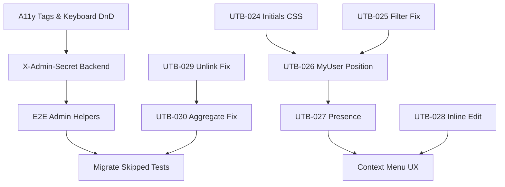
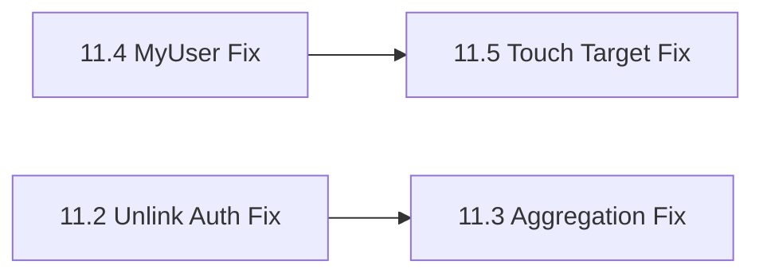

# Phase 8-5 Design Plan

**Created**: 2026-01-02
**Status**: Draft - Pending Approval
**Author**: Principal Engineer

---

## 1. Executive Summary

Phase 8-5 addresses critical concerns before implementing new features:
1. **E2E Test Infrastructure** - Fix socket/admin detection issues causing 21 skipped tests
2. **DnD Accessibility** - Enable keyboard-based drag-drop testing with proper a11y tags (done early to support QA)
3. **Card Linking Bugs** - Fix critical unlink and aggregation issues (UTB-029, UTB-030)

Then implements 6 additional UTB bugs and 1 UX enhancement from user testing.

**Total: 12 UTB bugs + 1 UX enhancement**

**Bug Summary:**
| Priority | Bugs | Description |
|----------|------|-------------|
| P0 | UTB-020, 029, 030 | Card editing, unlink, aggregates |
| P1 | UTB-022, 031, 032 | Tooltip, touch target, a11y selector |
| P2 | UTB-024-028 | Avatar/UI improvements |

---

## 2. Priority 1: E2E Infrastructure Fixes

### 2.1 Problem Statement

The Phase 8-4 QA Report shows:
- 21 tests skipped due to WebSocket/admin detection timing
- 10 tests skipped due to @dnd-kit incompatibility with Playwright
- Pass rate: 72.6% (below 90% target)

### 2.2 Root Cause Analysis

**Admin Detection Issue:**
```
Current flow (broken):
1. User creates board → cookie_hash stored as admins[0]
2. User navigates to board
3. WebSocket connects (non-deterministic timing)
4. Frontend waits for admin status via WebSocket event
5. Tests timeout waiting for admin dropdown
```

**DnD Issue:**
- @dnd-kit PointerSensor expects native pointer* events
- Playwright fires mouse* events (different API)
- KeyboardSensor expects focus on element with listeners

### 2.3 Recommended Solutions

#### Solution A: X-Admin-Secret Header (Backend + E2E)

**Why this is cleanest:**
| Criterion | X-Admin-Secret | Pre-seeded Board | Mock WebSocket |
|-----------|----------------|------------------|----------------|
| Code changes | ~50 lines | ~200 lines | ~300 lines |
| Test reliability | 100% | 95% (timing) | 90% (fragile) |
| Production risk | Zero | Low | Medium |
| Maintenance | Low | Medium | High |

**Implementation:**
```typescript
// Backend middleware (~20 lines)
export function adminOverrideMiddleware(req, res, next) {
  const adminSecret = req.headers['x-admin-secret'];
  if (adminSecret === process.env.ADMIN_SECRET) {
    req.isAdminOverride = true;
  }
  next();
}

// E2E helper (~30 lines)
export async function adminRequest(request, method, url, data?) {
  return request[method.toLowerCase()](url, {
    headers: { 'X-Admin-Secret': ADMIN_SECRET },
    data
  });
}
```

#### Solution B: DnD Keyboard Testing (Unit/Integration Level)

**Why not E2E for DnD:**
- @dnd-kit architecture incompatible with Playwright event dispatch
- Integration tests already pass with React Testing Library
- Unit tests provide faster feedback

**Recommended approach:**
1. Keep E2E DnD tests skipped (infrastructure limitation)
2. Enhance integration tests with keyboard scenarios
3. Add explicit aria-* attributes for accessibility audit

```typescript
// Integration test with keyboard
it('keyboard drag: Space to pick up, arrows to move, Space to drop', () => {
  // Simulate keyboard sensor behavior at ViewModel level
  act(() => {
    result.current.handleKeyboardDragStart('card-1', { key: 'Space' });
    result.current.handleKeyboardMove('down');
    result.current.handleKeyboardDrop();
  });
  expect(result.current.dropResult).toEqual({ action: 'move_to_column', ... });
});
```

---

## 3. Priority 2: Critical Card Linking Bugs

### 3.0 UTB-029: Card Unlink Not Working

**Problem:** Clicking the link icon on a child card does not unlink it from its parent. Cards remain linked after the unlink action.

**Symptoms:**
- Link icon is clickable but nothing happens
- Cards remain in parent-child relationship
- No error message displayed
- E2E test failure: `06-parent-child-cards.spec.ts:70`

**Root cause investigation:**
1. API call may be failing silently
2. WebSocket `card:unlinked` event not handled
3. Store not updating `parent_card_id` to null
4. UI not reflecting store changes

**Solution:** Debug and fix the unlink flow end-to-end

```typescript
// Expected flow:
1. User clicks link icon
2. Frontend calls DELETE /cards/:id/link (or similar)
3. Backend removes parent_card_id, updates aggregates
4. Backend emits card:unlinked WebSocket event
5. Frontend store updates card (parent_card_id = null)
6. UI re-renders showing separated cards
```

**Complexity:** High (full-stack debugging)
**Files:**
- `frontend/src/features/card/components/Card.tsx`
- `frontend/src/models/stores/cardStore.ts`
- `backend/src/domains/card/card.controller.ts`

---

### 3.1 UTB-030: Aggregated Reaction Count Not Syncing

**Problem:** Parent card's `aggregated_reaction_count` doesn't update when:
- A child card is linked
- A child card is unlinked
- Reactions are added/removed on parent or children

**Symptoms:**
- Parent shows stale reaction count after linking
- Adding reaction to child doesn't update parent
- E2E test failure: `06-parent-child-cards.spec.ts:83` (timeout waiting for count)

**Root cause investigation:**
1. `incrementReactionCount` not propagating to parent
2. Backend not recalculating aggregate on link/unlink
3. WebSocket event not including updated parent data

**Solution:** Implement bidirectional aggregate updates

```typescript
// Frontend: cardStore.ts
incrementReactionCount(cardId: string) {
  const card = this.cards.get(cardId);
  if (!card) return;

  card.direct_reaction_count++;

  // Propagate to parent if exists
  if (card.parent_card_id) {
    const parent = this.cards.get(card.parent_card_id);
    if (parent) {
      parent.aggregated_reaction_count++;
    }
  }

  // If this is a parent, update its own aggregate
  if (!card.parent_card_id) {
    card.aggregated_reaction_count = card.direct_reaction_count +
      this.getChildrenReactionSum(cardId);
  }
}

// On link/unlink, recalculate parent aggregate
recalculateParentAggregate(parentId: string) {
  const parent = this.cards.get(parentId);
  const children = [...this.cards.values()].filter(c => c.parent_card_id === parentId);
  const childSum = children.reduce((sum, c) => sum + c.direct_reaction_count, 0);
  parent.aggregated_reaction_count = parent.direct_reaction_count + childSum;
}
```

**Complexity:** High (store logic + backend sync)
**Files:**
- `frontend/src/models/stores/cardStore.ts`
- `backend/src/domains/card/card.service.ts`

---

## 4. Priority 3: Phase 8-4 Failing Tests (Must Fix)

### 4.0 UTB-020: Card Content Editing Broken

**Problem:** Card owners cannot click on card content to enter edit mode. The edit textarea does not appear.

**Failing tests (3):**
- `11-bug-regression.spec.ts:305` - card owner can click to enter edit mode
- `11-bug-regression.spec.ts` - edited content is saved on blur
- `11-bug-regression.spec.ts` - Escape cancels edit without saving

**Root cause investigation:**
1. Click handler on card content not triggering edit mode
2. `card-edit-textarea` testid not present in DOM
3. Edit state not being set correctly

**Solution:** Debug and fix edit mode trigger

**Complexity:** Medium
**Files:**
- `frontend/src/features/card/components/RetroCard.tsx`
- `frontend/src/features/card/viewmodels/useCardViewModel.ts`

---

### 4.1 UTB-022: Avatar Tooltip Shows Wrong Text

**Problem:** Hovering over a participant avatar shows "All Users" instead of the user's name.

**Failing test:**
- `11-bug-regression.spec.ts:665` - hovering avatar shows tooltip with full name

**Root cause:** Tooltip bound to wrong element or using wrong data source.

**Solution:** Fix tooltip binding in ParticipantAvatar

**Complexity:** Low
**Files:** `frontend/src/features/participant/components/ParticipantAvatar.tsx`

---

### 4.2 UTB-031: Touch Target Size Too Small

**Problem:** Reaction button is 28px, below 32px minimum for mobile accessibility.

**Failing test:**
- `08-tablet-viewport.spec.ts:80` - touch target sizes are adequate

**Solution:**
```tsx
<button className="min-w-8 min-h-8 ...">
```

**Complexity:** Low (CSS)
**Files:** `frontend/src/features/card/components/RetroCard.tsx` - Reaction button

---

### 4.3 UTB-032: A11y Selector Strict Mode Violation

**Problem:** Accessibility test fails - selector matches 2 elements instead of 1.

**Failing test:**
- `10-accessibility-basic.spec.ts:55` - drag handles have accessible names

**Solution:** Fix test selector or ensure unique aria-labels
```typescript
// Option A: Use .first()
const dragHandle = page.getByRole('button', { name: /drag/i }).first();

// Option B: Unique aria-labels per card
aria-label={`Drag card: ${card.content.substring(0, 30)}`}
```

**Complexity:** Low
**Files:**
- `frontend/tests/e2e/10-accessibility-basic.spec.ts`
- `frontend/src/features/card/components/RetroCard.tsx`

---

## 5. Priority 4: UTB Bug Fixes (New Features)

### 5.1 UTB-024: Avatar Initials Overflow

**Problem:** Two-letter initials overflow 38px avatar circle
**Solution:** Decrease font from 14px to 12px, add letter-spacing: -0.5px

```css
.avatar-initials {
  font-size: 12px;
  font-weight: 600;
  letter-spacing: -0.5px;
  line-height: 1;
}
```

**Complexity:** Low (CSS only)
**Files:** ParticipantAvatar.tsx or avatar styles

---

### 5.2 UTB-025: Avatar Filter Inverted Logic

**Problem:** Clicking avatar hides user's cards instead of showing only theirs
**Root cause:** Filter logic checking `!== userId` instead of `=== userId`

**Solution:** Fix filter predicate in cardStore or useCardFilterViewModel

```typescript
// Before (broken)
const filteredCards = cards.filter(c => c.created_by_hash !== selectedUserId);

// After (correct)
const filteredCards = cards.filter(c => c.created_by_hash === selectedUserId);
```

**Complexity:** Medium (store logic)
**Files:** cardStore.ts or useCardFilterViewModel.ts

---

### 5.3 UTB-026: MyUser Special Avatar Position

**Problem:** Current user's avatar mixed with others, hard to identify "me"
**Solution:** Separate filter controls (All, Anonymous, Me) from participant list

**Proposed layout:**
```
┌─────────────────────────────────────────────────────────────┐
│ [All] [👻] [Me]  │  [👤U1] [👤U2] [👤U3] ... (scrollable)   │
│  ↑ filter controls    ↑ other participants                   │
└─────────────────────────────────────────────────────────────┘
```

**Implementation:**
1. Add `isCurrentUser` prop to ParticipantAvatar
2. Render current user in left section with "Me" label
3. Add vertical divider
4. Other participants in scrollable right section

**Complexity:** Medium (layout restructure)
**Files:** ParticipantBar.tsx, ParticipantAvatar.tsx

---

### 5.4 UTB-027: Active/Inactive Presence Indicator

**Problem:** No way to see who is currently connected
**Solution:** Green dot indicator (8px) for online users

**Visual design:**
```
  ┌───┐
  │JS │●  ← green dot (online)
  └───┘

  ┌───┐
  │AK │○  ← gray/hollow dot (offline/away)
  └───┘
```

**Implementation:**
1. Track presence via WebSocket `user:joined` / `user:left` events
2. Add `isOnline` state to participant store
3. Render presence dot on avatar component

**Complexity:** High (WebSocket presence tracking)
**Files:** participantStore.ts, ParticipantAvatar.tsx, WebSocket handlers

---

### 5.5 UTB-028: Rename Pen Too Close to Add

**Problem:** Board rename icon confused with Add Card button
**Solution:** Inline title edit on click (remove pencil icon)

**Behavior:**
- Admin hovers title → cursor: text, subtle underline
- Admin clicks title → inline edit mode
- Blur or Enter → save
- Escape → cancel

**Complexity:** Medium (UX pattern change)
**Files:** RetroBoardHeader.tsx or BoardTitle component

---

### 5.6 UX Enhancement: Avatar Context Menu

**Problem:** "Make Admin" dropdown clutters header
**Solution:** Right-click/long-press context menu on avatars

**Interaction model:**
| Platform | Primary Action | Secondary Action |
|----------|----------------|------------------|
| Desktop | Click → Filter | Right-click → Context menu |
| Touch | Tap → Filter | Long-press → Context menu |

**Context menu content:**
```
For admins viewing non-admin:
┌─────────────────────┐
│ 👑 Make Admin       │
│ ─────────────────── │
│ 👁️ View Cards       │
└─────────────────────┘

For non-admins:
┌─────────────────────┐
│ 👁️ View Cards       │
└─────────────────────┘
```

**Implementation:**
- Use shadcn/ui `<ContextMenu>` component
- Desktop: onContextMenu
- Touch: onTouchStart + 500ms timer

**Complexity:** High (new interaction pattern)
**Files:** ParticipantBar.tsx, new ContextMenu integration

---

### 5.7 UTB-014 E2E Test: Participant Bar Verification

**Problem:** No E2E test verifies user appears in participant bar after board creation.

**Note:** The feature works (fixed in Phase 7), but lacks automated test coverage.

**Solution:** Add E2E test to verify:
1. Creator appears in participant bar after board creation
2. User avatar shows correct initials
3. Participant count updates correctly

**Complexity:** Low (test only)
**Files:** `frontend/tests/e2e/01-board-creation.spec.ts` or new test file

---

## 6. Architecture Decisions

### 6.1 Component Hierarchy Change

**Current:**
```
ParticipantBar
├── AllUsersButton
├── AnonymousButton
└── ParticipantAvatars[] (mixed)
```

**Proposed:**
```
ParticipantBar
├── FilterControls
│   ├── AllUsersButton
│   ├── AnonymousButton
│   └── MyUserAvatar (special)
├── Divider
└── ParticipantList (scrollable)
    └── ParticipantAvatar[] (others only)
        └── ContextMenu (admin actions)
```

### 6.2 State Management

**New state in participantStore:**
```typescript
interface ParticipantState {
  participants: Map<string, Participant>;
  currentUserId: string | null;
  onlineUserIds: Set<string>;  // NEW: presence tracking
}
```

### 6.3 WebSocket Events for Presence

Leverage existing events:
- `user:joined` → add to onlineUserIds
- `user:left` → remove from onlineUserIds
- Heartbeat timeout (30s) → mark as offline

---

## 7. Dependencies & Sequencing



**Phase 1 (Early - Unblocks QA):**
- A11y tags + keyboard DnD (enables better E2E selectors)

**Phase 2 (Critical Path):**
- X-Admin-Secret → E2E Helpers → Migrate Tests (unblocks 21 tests)

**Phase 3 (Card Linking - High Priority):**
- UTB-029 (Unlink) → UTB-030 (Aggregates)

**Phase 4 (UI/UX):**
- Avatar & participant bar improvements

---

## 8. Risk Assessment

| Risk | Impact | Mitigation |
|------|--------|------------|
| X-Admin-Secret in production | High | Environment check: skip in NODE_ENV=production |
| Unlink fix affects existing linked cards | High | Thorough testing of link/unlink cycle |
| Aggregate sync race conditions | Medium | Atomic updates, optimistic UI with rollback |
| Presence tracking performance | Medium | Throttle updates, batch WebSocket events |
| Context menu discoverability | Medium | Tooltip hints for admins |
| Breaking existing filter behavior | High | Comprehensive test coverage before/after |

---

## 9. Out of Scope (Deferred)

Per FUTURE_NEEDS.md:
- Admin Dashboard (/admin route)
- Role-Based Access Control (RBAC)
- Audit Logging
- Multi-Tenant Admin

---

## 10. Success Metrics

| Metric | Current | Target |
|--------|---------|--------|
| E2E Pass Rate | 72.6% | 90%+ |
| E2E Failing Tests | 10 | 0 |
| Skipped Tests | 21 | <5 |
| UTB Bug Fixes | 0/12 | 12/12 |
| Card Editing Works | No | Yes |
| Card Unlink Works | No | Yes |
| Aggregates Sync | No | Yes |
| A11y Test Coverage | Partial | Complete |

---

## 11. Phase 8.5.1: QA Verification Fixes

**Status**: In Progress
**Created**: 2026-01-02
**Source**: QA_TEST_REPORT.md verification findings

### 11.1 Root Cause Analysis Summary

QA verification revealed 4 issues that were not fully resolved in Phase 8.5:

| Issue | Root Cause | Impact |
|-------|------------|--------|
| UTB-029 Unlink | Backend checks PARENT creator, not CHILD creator | Child owner cannot unlink |
| UTB-030 Aggregation | WebSocket events missing parentCardId | Parent aggregate not updated |
| MyUser Display | ParticipantBar filters by undefined `user_hash` | User appears in both sections |
| Touch Target | Conflicting height classes (min-h-8 vs h-7) | Alignment issues |

### 11.2 UTB-029: Card Unlink Authorization Fix

**Problem**: `unlinkCards` in `card.service.ts` line 423-432 only checks source (parent) creator:
```typescript
// BROKEN: Only checks parent creator
const isSourceCreator = sourceCard.created_by_hash === userHash;
const isAdmin = board.admins.includes(userHash);
if (!isSourceCreator && !isAdmin) {
  throw new ApiError(ErrorCodes.FORBIDDEN, ...);
}
```

**Solution**: Add target (child) creator check:
```typescript
// FIX: Check both parent AND child creator
const isSourceCreator = sourceCard.created_by_hash === userHash;
const isTargetCreator = targetCard.created_by_hash === userHash;
const isAdmin = board.admins.includes(userHash);
if (!isSourceCreator && !isTargetCreator && !isAdmin) {
  throw new ApiError(ErrorCodes.FORBIDDEN, ...);
}
```

**Files**: `backend/src/domains/card/card.service.ts`
**Complexity**: Low (1 line change)

### 11.3 UTB-030: Reaction Aggregation Sync Fix

**Problem**: WebSocket reaction events don't include parentCardId:
```typescript
// useCardViewModel.ts line 356-366
socket.on('reaction:added', ({ card_id }) => {
  // No parentCardId - cannot update parent aggregate
});
```

**Solution**:
1. Backend: Include parentCardId in reaction WebSocket events
2. Frontend: Update parent aggregate when reaction event received

```typescript
// Backend: card.controller.ts
socket.emit('reaction:added', {
  card_id: card.id,
  parent_card_id: card.parent_card_id  // NEW
});

// Frontend: useCardViewModel.ts
socket.on('reaction:added', ({ card_id, parent_card_id }) => {
  cardStore.incrementReactionCount(card_id);
  if (parent_card_id) {
    cardStore.recalculateParentAggregate(parent_card_id);
  }
});
```

**Files**:
- `backend/src/domains/card/card.controller.ts`
- `frontend/src/features/card/viewmodels/useCardViewModel.ts`
- `frontend/src/models/stores/cardStore.ts`

**Complexity**: Medium (WebSocket + store changes)

### 11.4 MyUser Avatar Display Fix

**Problem**: ParticipantBar.tsx line 59 filters by `user.user_hash` which doesn't exist:
```typescript
// ActiveUser type MISSING user_hash
export interface ActiveUser {
  alias: string;
  is_admin: boolean;
  last_active_at: string;
  created_at: string;
  // user_hash MISSING!
}

// ParticipantBar broken filter
const otherUsers = activeUsers.filter((user) => user.user_hash !== currentUserHash);
// user.user_hash is always undefined → filter always fails
```

**Solution Options**:

**Option A: Add cookie_hash to ActiveUser**
```typescript
export interface ActiveUser {
  alias: string;
  cookie_hash: string;  // ADD
  is_admin: boolean;
  last_active_at: string;
  created_at: string;
}
```

**Option B: Filter by alias comparison** (simpler, preferred)
```typescript
const currentUserAlias = currentUser?.alias;
const otherUsers = activeUsers.filter((user) => user.alias !== currentUserAlias);
```

**Files**:
- `frontend/src/models/types/user.ts`
- `frontend/src/features/participant/components/ParticipantBar.tsx`

**Complexity**: Low (type + filter fix)

### 11.5 Touch Target Alignment Fix

**Problem**: Conflicting CSS classes on buttons:
```tsx
// Parent card reaction: conflicting classes
className="min-w-8 min-h-8 h-7 gap-1 px-2"  // h-7 (28px) overrides min-h-8 (32px)

// Delete button: no min sizing
className="h-7 w-7"  // Only 28px

// Child card reaction: too small
className="h-5"  // Only 20px!
```

**Solution**: Standardize all interactive buttons to minimum 32px:
```tsx
// All buttons use consistent sizing
className="min-w-8 min-h-8 h-8 w-8"  // 32px square
```

**Visual alignment approach**:
```
┌─────────────────────────────────────┐
│ Card content                        │
│                                     │
│ [♥ 5]  [🗑️]                        │  ← 32px buttons, right-aligned
└─────────────────────────────────────┘
```

**Files**: `frontend/src/features/card/components/RetroCard.tsx`
**Complexity**: Low (CSS cleanup)

### 11.6 Dependencies



Both tracks can run in parallel.

---

*Phase 8.5.1 Design Update - 2026-01-02*
*Source: QA Verification Deep-Dive*

---

*Design Plan by Principal Engineer - 2026-01-02*
*Pending user approval before implementation*
