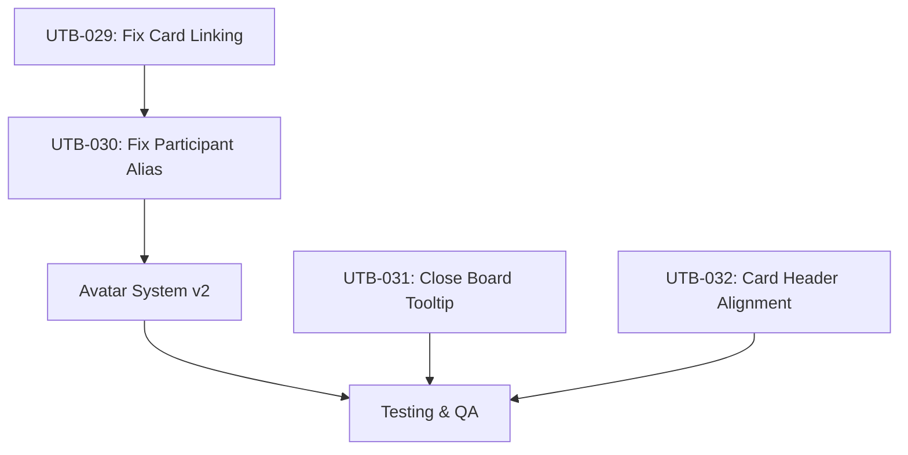

# Phase 8.6 Design Plan

**Created**: 2026-01-03
**Status**: Draft - Pending Approval
**Author**: Principal Engineer

---

## 1. Executive Summary

Phase 8.6 addresses 4 bug fixes and 1 major feature enhancement from user testing:

| Category | Items | Priority |
|----------|-------|----------|
| Bug Fixes (High) | UTB-029, UTB-030 | P0 - Critical |
| Bug Fixes (Low) | UTB-031, UTB-032 | P2 - Minor UX |
| Feature | Participant Avatar System v2 | P1 - Enhancement |

**Estimated Effort**: 2-3 development cycles

---

## 2. Bug Fixes

### 2.1 UTB-029: Card Linking Creates Duplicates (High Priority)

**Problem**: When linking Card 2 to Card 1, duplicate cards appear in the UI. Unlinking also fails.

**Root Cause Analysis**:
1. **Race condition**: After `CardAPI.linkCards()` succeeds, `fetchCards()` is called AND a socket event `card:linked` is broadcast
2. The socket handler calls `linkChildStore()` while `fetchCards()` is still loading
3. Both operations try to update the store, creating duplicates

**Solution**: Remove `fetchCards()` after linking - rely solely on socket events for store updates.

```typescript
// BEFORE (broken):
await CardAPI.linkCards(parentId, {...});
await fetchCards();  // Race with socket

// AFTER (fixed):
await CardAPI.linkCards(parentId, {...});
// Socket event will handle store update - no fetchCards()
```

**Files**:
- [useCardViewModel.ts:668-679](frontend/src/features/card/viewmodels/useCardViewModel.ts#L668-L679)

**Complexity**: Medium

---

### 2.2 UTB-030: New Participant Alias Not Shown (High Priority)

**Problem**: When a new user joins, their alias doesn't appear in the participant bar.

**Root Cause**: Socket payload field name mismatch between backend (camelCase) and frontend (snake_case):

| Field | Backend sends | Frontend expects |
|-------|---------------|------------------|
| Board ID | `boardId` | `board_id` |
| User Alias | `userAlias` | `alias` |
| Admin Status | `isAdmin` | `is_admin` |

**Solution**: Update frontend socket handler to use camelCase field names:

```typescript
// BEFORE (broken):
const handleUserJoined = (event: { board_id: string; alias: string; is_admin: boolean })

// AFTER (fixed):
const handleUserJoined = (event: { boardId: string; userAlias: string; isAdmin: boolean })
```

**Files**:
- [frontend/src/models/socket/socket-types.ts:135-139](frontend/src/models/socket/socket-types.ts#L135-L139)
- [frontend/src/features/participant/viewmodels/useParticipantViewModel.ts:235-247](frontend/src/features/participant/viewmodels/useParticipantViewModel.ts#L235-L247)

**Complexity**: Low

---

### 2.3 UTB-031: Close Board Button Needs Tooltip (Low Priority)

**Problem**: Users don't understand what "Close Board" means before clicking.

**Solution**: Add tooltip with explanation:
- Tooltip text: "Makes the board read-only. No new cards, edits, or reactions allowed. This action cannot be undone."
- Improved confirmation dialog with bullet points explaining consequences

**Files**:
- [RetroBoardHeader.tsx](frontend/src/features/board/components/RetroBoardHeader.tsx)

**Complexity**: Low

---

### 2.4 UTB-032: Card Header Elements Misaligned (Low Priority)

**Problem**: Card header left/right elements not vertically aligned.

**Root Cause**: Header uses `items-start` instead of `items-center`:
```tsx
className="mb-2 flex items-start justify-between"  // items-start causes issue
```

**Solution**: Change to `items-center`:
```tsx
className="mb-2 flex items-center justify-between"
```

**Files**:
- [RetroCard.tsx:333-454](frontend/src/features/card/components/RetroCard.tsx#L333-L454)

**Complexity**: Low (CSS only)

---

## 3. Feature: Participant Avatar System v2

### 3.1 Overview

Complete redesign of the participant bar with improved UX:

```
┌──────────────────────────────────────────────────────────────────────────────────┐
│ Filter Group     │ Other Participants         │ Me (You)                         │
│ [All] [Anon]     │ [P1] [P2] [P3] ...        │ ╭JS╮ John Smith  ✏️              │
│                  │ (scrolls only if overflow) │ gold+green, clickable            │
└──────────────────────────────────────────────────────────────────────────────────┘
```

### 3.2 Status Indicators (Simplified)

| Visual | Meaning |
|--------|---------|
| Gold/amber fill | Admin user |
| Regular fill (blue/accent) | Non-admin user |
| Green ring (2px) | Currently online |
| No ring | Offline |
| Thicker ring + scale | Selected for filtering |

### 3.3 MeSection Component (New)

**Purpose**: Shows current user identity with avatar-style display
**Location**: Right side of ParticipantBar (after divider)
**Features**:
- Avatar with initials (not generic icon)
- Gold fill if admin
- Green ring (always online)
- Alias displayed next to avatar
- Edit button (pencil) to change alias
- Click avatar = filter to your cards

### 3.4 Mandatory Alias Prompt

**Trigger**: User has no existing session cookie for this board.

**Modal Design**:
```
┌─────────────────────────────────────────┐
│              Join the Retro             │
│                                         │
│  What should we call you?               │
│  ┌───────────────────────────────────┐  │
│  │                                   │  │
│  └───────────────────────────────────┘  │
│                                         │
│  This name will be visible to others.   │
│                                         │
│              [Join Board]               │
└─────────────────────────────────────────┘
```

**Rules**:
- Input required (1-50 characters)
- No "skip" option
- Modal cannot be dismissed without entering alias

### 3.5 Admin Management (Simplified)

**Current**: "Manage Admins" dropdown button in header
**New**: Right-click context menu on avatars

**Context Menu**:
```
┌─────────────────────┐
│ John Smith          │
├─────────────────────┤
│ Filter by user      │
│ Make Admin      👑  │
└─────────────────────┘
```

- Click avatar = filter by user's cards
- Right-click = context menu
- Any admin can promote others

### 3.6 Other Changes

| Change | Description |
|--------|-------------|
| Remove MyUserCard from header | MeSection in ParticipantBar replaces it |
| Move UUID to Edit Dialog | Show UUID only when editing alias |
| Smart scrolling | Avatars scroll only when exceeding available width |
| Remove presence dot | Use ring instead (green = online) |
| Remove crown icon | Gold fill indicates admin |

---

## 4. Architecture Decisions

### 4.1 Component Hierarchy

**Current**:
```
ParticipantBar
├── AllUsersButton
├── AnonymousButton
├── MeButton
└── ParticipantAvatars[] (scrollable)
```

**New**:
```
ParticipantBar
├── FilterControls
│   ├── AllUsersButton
│   └── AnonymousButton
├── Divider
├── OtherParticipants (scrollable)
│   └── ParticipantAvatar[] (with context menu)
├── Divider
└── MeSection
    ├── MyAvatar (filterable)
    ├── AliasDisplay
    └── EditButton
```

### 4.2 State Management

**New state in participantStore**:
```typescript
interface ParticipantState {
  participants: Map<string, Participant>;
  currentUserId: string | null;
  onlineUserIds: Set<string>;  // Updated via WebSocket
}
```

### 4.3 New Components

| Component | Purpose | Complexity |
|-----------|---------|------------|
| AliasPromptModal | Mandatory alias entry for new users | Medium |
| MeSection | Current user display with avatar + name + edit | Medium |
| AvatarContextMenu | Right-click menu for admin actions | Low |

---

## 5. Dependencies & Sequencing



### 5.1 Parallel Work Opportunities

**Track 1: Bug Fixes (can run in parallel)**
- UTB-029: Card Linking (agent 1)
- UTB-030: Participant Alias (agent 2)
- UTB-031: Tooltip (agent 3)
- UTB-032: Alignment (agent 3 - same file area)

**Track 2: Feature Work (sequential)**
- Depends on UTB-030 completion (participant store changes)
- Avatar System v2 components

---

## 6. Risk Assessment

| Risk | Impact | Mitigation |
|------|--------|------------|
| Card linking race condition persists | High | Comprehensive E2E testing with multiple scenarios |
| Socket event changes break other features | Medium | Update all affected socket handlers consistently |
| Avatar system changes break filtering | Medium | Keep existing filter buttons working alongside new MeSection |
| Mandatory alias blocks existing users | High | Only apply to users WITHOUT cookie (new users) |
| Context menu not discoverable | Medium | Add visual hint or tooltip for admins |

---

## 7. Success Metrics

| Metric | Target |
|--------|--------|
| UTB-029 resolved | Card linking creates no duplicates |
| UTB-030 resolved | New participants appear immediately |
| UTB-031 resolved | Tooltip explains Close Board action |
| UTB-032 resolved | Card header elements aligned |
| Avatar System v2 | All acceptance criteria in design doc met |
| E2E Test Pass Rate | ≥90% |
| Unit Test Pass Rate | 100% |

---

## 8. Out of Scope (Deferred)

- Admin Dashboard (/admin route)
- Role-Based Access Control (RBAC)
- Audit Logging
- Multi-device avatar sync
- Avatar image upload (initials only)

---

*Design Plan by Principal Engineer - 2026-01-03*
*Pending user approval before implementation*
