# Front-End Component Design - Collaborative Retro Board
**Document Version**: 2.1
**Date**: 2025-12-31
**Architecture**: React MVVM Pattern
**Status**: Design Review

---

## Table of Contents

1. [Overview](#1-overview)
2. [MVVM Architecture](#2-mvvm-architecture)
3. [Component Hierarchy](#3-component-hierarchy)
4. [View Components](#4-view-components)
5. [ViewModel Layer](#5-viewmodel-layer)
6. [Model Layer](#6-model-layer)
7. [Data Flow Patterns](#7-data-flow-patterns)
8. [API Requirements Summary](#8-api-requirements-summary)

---

## 1. Overview

### 1.1 Architecture Principles

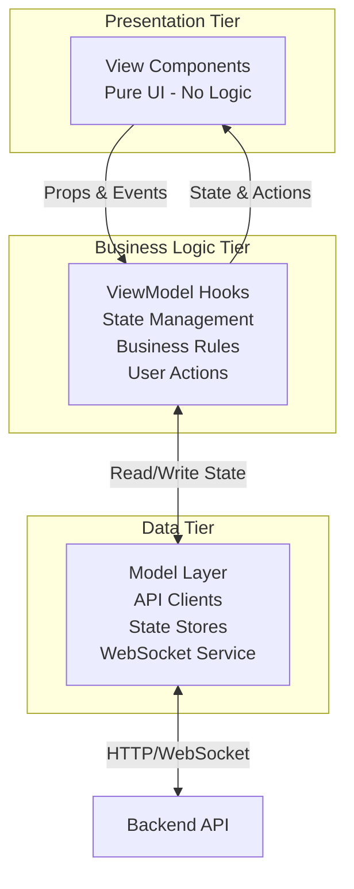

**Key Principles**:
- **View**: Only rendering logic, no state mutations
- **ViewModel**: All business logic, user interactions, state orchestration
- **Model**: Data fetching, caching, real-time sync

---

### 1.2 Technology Stack

| Layer | Technology | Purpose |
|-------|-----------|---------|
| **Framework** | React 19+ | Component-based UI |
| **Language** | TypeScript 5+ | Type safety, shared types with backend |
| **State Management** | Zustand | Lightweight global state (3KB) |
| **UI Library** | shadcn/ui + Tailwind CSS | Copy-paste components, utility-first styling |
| **Icons** | Lucide React | Consistent icon set, tree-shakeable |
| **Drag & Drop** | @dnd-kit | Accessible drag-drop, modern API |
| **Real-time** | Socket.IO Client | WebSocket connection to backend |
| **Build Tool** | Vite | Fast development server, HMR |

> **Note:** shadcn/ui was chosen over Material-UI for smaller bundle size (~5-15KB vs 80-150KB), faster test execution, build-time CSS (Tailwind) vs runtime CSS-in-JS, and full component source ownership.

---

## 2. MVVM Architecture

### 2.1 Pattern Overview

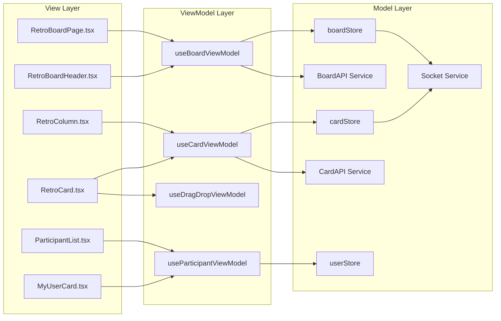

---

### 2.2 Responsibility Separation

| Layer | Responsibilities | Does NOT Handle |
|-------|-----------------|-----------------|
| **View** | - Render UI elements<br/>- Handle user events (click, type)<br/>- Pass data to children<br/>- Display loading/error states | - API calls<br/>- Business logic<br/>- State mutations<br/>- Data transformation |
| **ViewModel** | - Business logic execution<br/>- User action orchestration<br/>- State reads/writes<br/>- Data validation<br/>- Error handling | - DOM manipulation<br/>- UI styling<br/>- Direct API calls (delegates to Model) |
| **Model** | - API communication<br/>- WebSocket management<br/>- State persistence<br/>- Caching strategies<br/>- Data normalization | - UI logic<br/>- User workflows<br/>- Component state |

---

## 3. Component Hierarchy

### 3.1 Full Component Tree

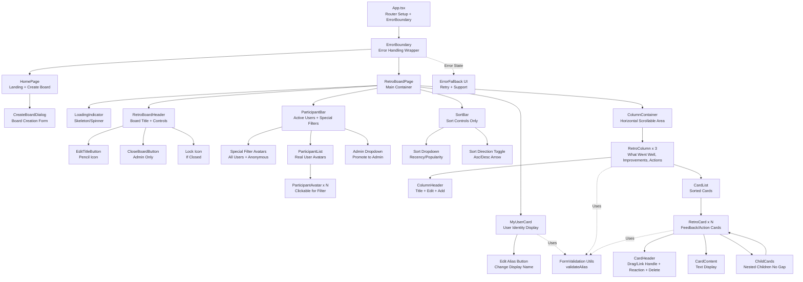

---

## 4. View Components

### 4.0 HomePage (Landing Page)

**Purpose**: Entry point for the application, allows users to create new boards

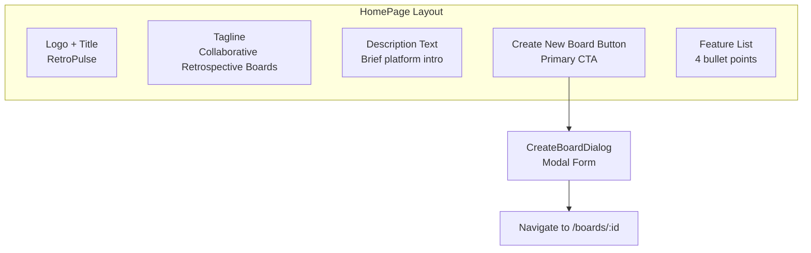

**Props**: None (top-level route component)

**State Dependencies**:
- `isCreating` - Whether board creation is in progress
- `error` - Error state from board creation

**Responsibilities**:
1. **Display Welcome Content**: Logo, tagline, description
2. **Provide Create Board CTA**: Prominent button to start board creation
3. **Show Feature Highlights**: Brief list of platform capabilities
4. **Handle Board Creation Flow**: Open dialog, submit to API, navigate on success

**Does NOT Handle**:
- Board data loading (that's RetroBoardPage)
- User session management (handled by cookie on board join)

**Visual Design** (from UI/UX Spec):
- Centered content container (max-width 600px)
- Vertically centered on viewport
- Primary CTA button: 280px wide, 48px tall
- Responsive: Stacks on mobile

**Routes**:
- `/` → HomePage
- `/boards/:boardId` → RetroBoardPage

---

### 4.0.1 CreateBoardDialog

**Purpose**: Modal form for creating a new board

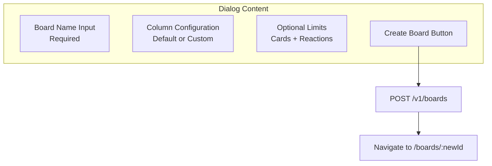

**Props**:
```typescript
{
  open: boolean
  onOpenChange: (open: boolean) => void
  onBoardCreated: (boardId: string) => void
}
```

**Form Fields**:
1. **Board Name** (required): Text input, 1-200 chars
2. **Columns** (optional): Use default template or customize
   - Default: "What Went Well", "To Improve", "Action Items"
3. **Card Limit** (optional): Number input, null = unlimited
4. **Reaction Limit** (optional): Number input, null = unlimited

**Validation**:
- Board name: Required, 1-200 characters
- Column names: 1-100 characters each
- Limits: Positive integers or empty

**API Call**:
```typescript
POST /v1/boards
{
  name: string
  columns: { name: string }[]
  card_limit_per_user?: number
  reaction_limit_per_user?: number
}
```

**Success Flow**:
1. API returns `{ id: "abc123", ... }`
2. Close dialog
3. Navigate to `/boards/abc123`

---

### 4.1 RetroBoardPage (Container)

**Purpose**: Top-level page container, orchestrates all sub-components

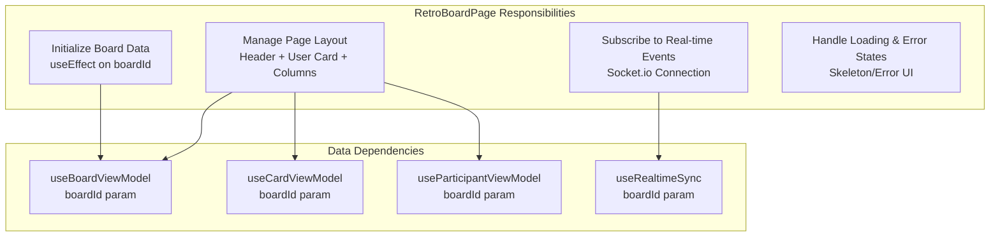

**Props**: `{ boardId: string }` (from URL param)

**State Dependencies**:
- `board` - Board metadata (name, state, columns, admins)
- `cards` - All cards for this board (with embedded children)
- `activeUsers` - Currently active participants
- `currentUser` - Current user session info (UUID + alias)
- `isLoading` - Initial load state
- `error` - Error state

**Responsibilities**:
1. **Initialization**: Fetch board data on mount
2. **Layout Management**: Arrange header, my user card, participant bar, sort bar, columns
3. **Real-time Sync**: Establish WebSocket connection
4. **Loading States**: Show skeleton UI during load
5. **Error Handling**: Display error messages
6. **Closed Board State**: Disable write operations when board.state === 'closed'

**Does NOT Handle**:
- Business logic (delegates to ViewModels)
- Direct API calls (handled by Model layer)
- Card sorting logic (delegated to ViewModel)

---

### 4.2 RetroBoardHeader

**Purpose**: Display board title, edit controls, close button, lock indicator

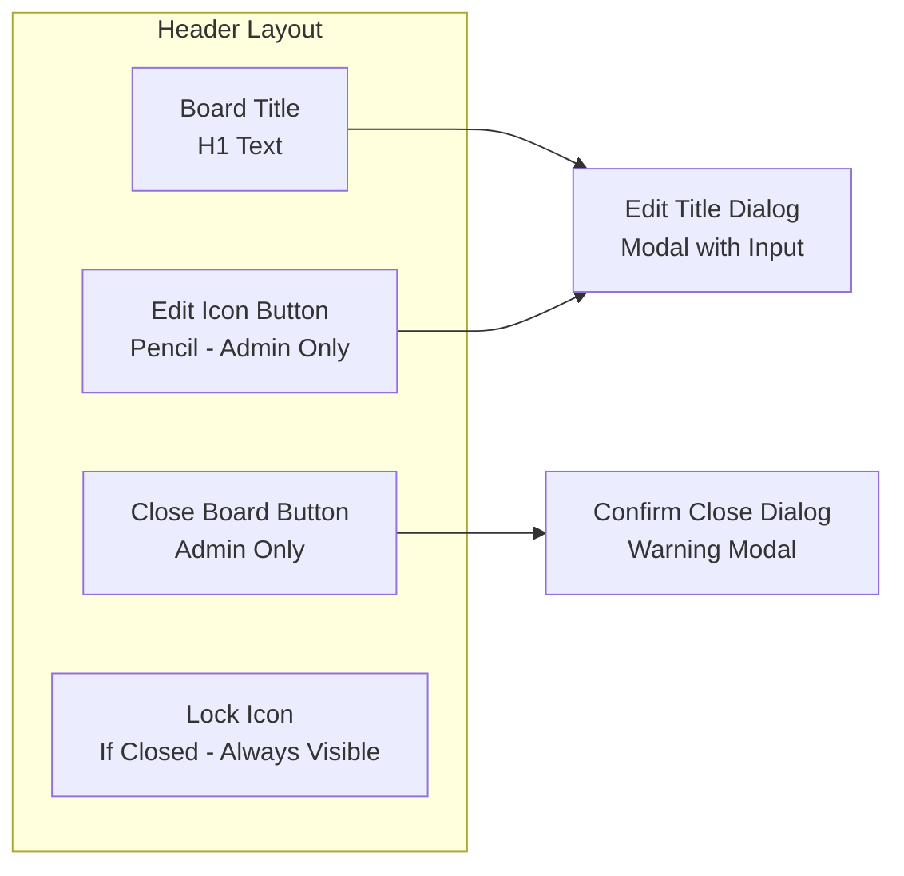

**Props**:
```typescript
{
  boardTitle: string
  isClosed: boolean
  isAdmin: boolean
  onEditTitle: (newTitle: string) => void
  onCloseBoard: () => void
}
```

**User Interactions**:
1. **Edit Title**: Click pencil → Open modal → User types → Submit → Call `onEditTitle()`
2. **Close Board**: Click close → Confirm dialog → User confirms → Call `onCloseBoard()`

**Visual States**:
- **Active Board**: Edit and Close buttons visible (if admin), no lock icon
- **Closed Board**: Lock icon displayed, edit/close buttons hidden

**Responsibilities**:
- Render board title prominently
- Show/hide admin controls based on permissions
- Display lock icon when board is closed
- Emit user actions to parent ViewModel

---

### 4.3 MyUserCard

**Purpose**: Display current user's UUID and alias, allow alias editing

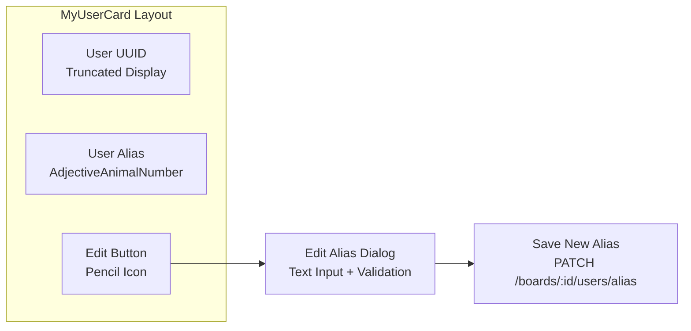

**Props**:
```typescript
{
  currentUser: {
    uuid: string
    alias: string
  }
  onUpdateAlias: (newAlias: string) => Promise<void>
}
```

**Default Alias Generation**:
- Pattern: `{Adjective}{Animal}{2DigitNumber}`
- Example: `SneakyPanda42`, `BraveEagle17`, `CleverFox93`
- Generated on first board join (backend generates random alias)

**Responsibilities**:
1. **Display User Identity**: Show UUID (truncated) and current alias
2. **Edit Alias**: Provide button to change display name
3. **Validation**: Ensure alias follows backend pattern (1-50 chars, alphanumeric + space/dash/underscore)
4. **Real-time Update**: Reflect alias change immediately after save

**Visual Design**:
- Card-style component with border
- UUID shown with tooltip for full value
- Alias displayed prominently
- Edit button appears on hover

---

### 4.4 ParticipantBar

**Purpose**: Display special filter avatars, active users, admin dropdown

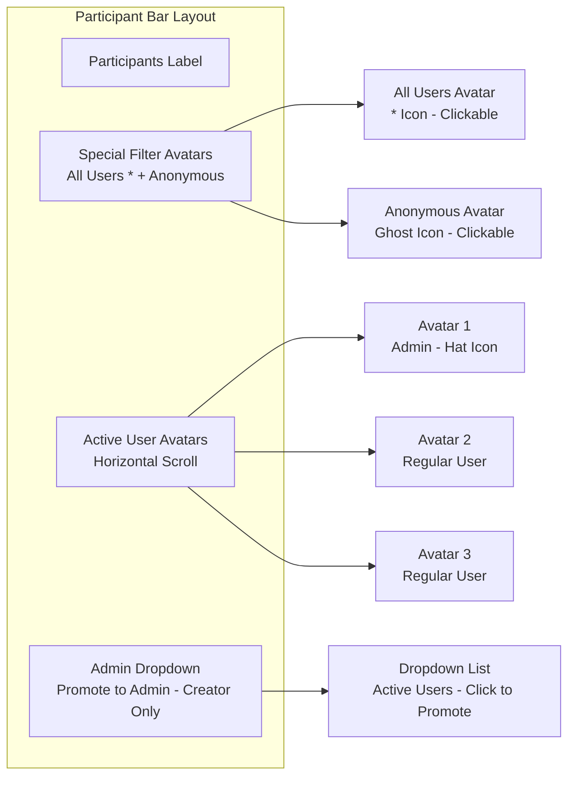

**Props**:
```typescript
{
  activeUsers: User[]
  currentUserHash: string
  admins: string[]
  isCreator: boolean
  activeFilters: {
    showAll: boolean
    showAnonymous: boolean
    users: string[]
  }
  onToggleAllUsersFilter: () => void
  onToggleAnonymousFilter: () => void
  onToggleUserFilter: (userHash: string) => void
  onPromoteToAdmin: (userHash: string) => void
}
```

**Special Filter Avatars**:

1. **All Users Avatar**:
   - Icon: `*` (asterisk)
   - Purpose: Show all cards (default active state)
   - Behavior: Clicking deactivates user-specific filters
   - Visual: Active when no user filters applied

2. **Anonymous Avatar**:
   - Icon: Ghost emoji or mask icon
   - Purpose: Show/hide anonymous cards
   - Behavior: Toggle anonymous card visibility
   - Visual: Active border when anonymous cards shown
   - **Cannot be promoted to admin** (not a real user)

**Admin Dropdown** (Simplified):
- Only visible to board creator
- Click dropdown → Show list of active users
- Click user → Promote to admin (simpler than drag-and-drop)
- No drag-and-drop complexity needed

**Responsibilities**:
1. **Display Special Filters**: "All Users" and "Anonymous" avatars
2. **Display Active Users**: Render participant avatars with admin indicators
3. **Filter Management**: Handle click events to toggle filters
4. **Admin Promotion**: Show dropdown for creator to designate admins

---

### 4.5 ParticipantAvatar

**Purpose**: Single user avatar, clickable for filtering

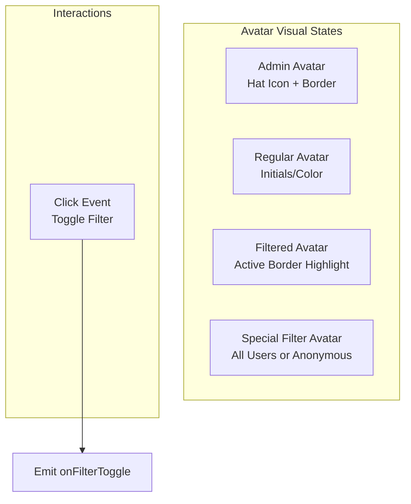

**Props**:
```typescript
{
  user: User | null  // null for special avatars
  isAdmin: boolean
  isFiltered: boolean
  isSpecial: boolean  // true for "All Users" / "Anonymous"
  specialType: 'all' | 'anonymous' | null
  onFilterToggle: () => void
}
```

**Visual Design**:
- **Admin**: Hat emoji (🎩) on top, orange/gold border
- **Regular**: Colored circle with alias initials or small avatar
- **Filtered**: Green/blue ring indicator around avatar
- **All Users**: Asterisk (*) icon, always available
- **Anonymous**: Ghost icon, always available

**Responsibilities**:
- Render user visual representation
- Show admin hat indicator
- Show filter active state (ring/border)
- Emit filter toggle on click
- Support special filter avatars

**Note**: Removed drag-and-drop complexity - admin promotion via dropdown instead

---

### 4.6 SortBar (Simplified)

**Purpose**: Display sort controls only (filters moved to avatars)

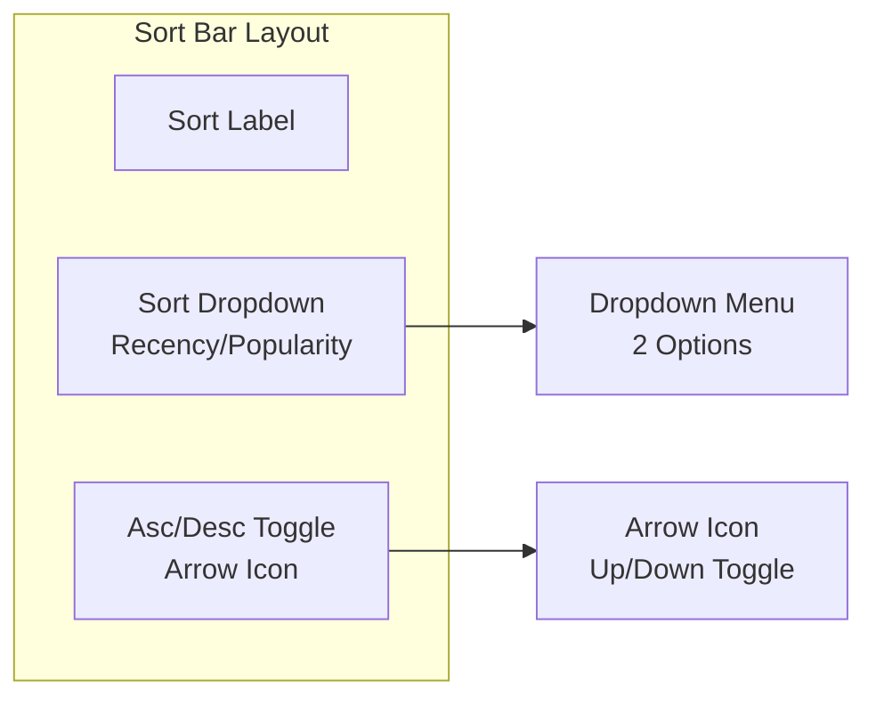

**Props**:
```typescript
{
  sortMode: {
    type: 'recency' | 'popularity'
    direction: 'asc' | 'desc'
  }
  onSortChange: (mode: SortMode) => void
}
```

**Responsibilities**:
- Display current sort mode
- Allow sort type change (recency vs popularity)
- Allow sort direction toggle
- Emit sort changes to parent

**Simplified Design**:
- No filter chips (filters handled by avatars)
- Only sorting functionality
- Cleaner, more focused UI

---

### 4.7 RetroColumn

**Purpose**: Single column container (What Went Well, Improvements, Actions)

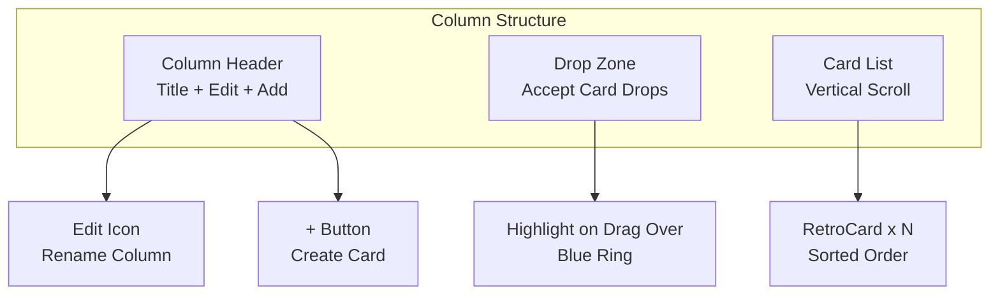

**Props**:
```typescript
{
  column: Column
  cards: Card[]  // with embedded children
  canEdit: boolean
  canCreateCard: boolean  // based on quota
  onAddCard: (columnId: string) => void
  onEditColumn: (columnId: string, newName: string) => void
  onCardDropped: (cardId: string, targetColumnId: string) => void
}
```

**Responsibilities**:
1. **Render Column Layout**: Header, drop zone, card list
2. **Handle Card Drops**: Detect dropped cards, emit event
3. **Add Card Flow**: Check quota, then show create dialog
4. **Edit Column Name**: Admin-only rename functionality
5. **Visual Feedback**: Highlight drop zone on drag-over

**Visual States**:
- **Default**: Column background color (green/orange/blue)
- **Drag Over**: Blue ring around drop zone
- **Empty**: Placeholder text if no cards
- **Quota Reached**: Disable + button, show tooltip

---

### 4.8 RetroCard (Revised)

**Purpose**: Single card display (feedback or action) with embedded children

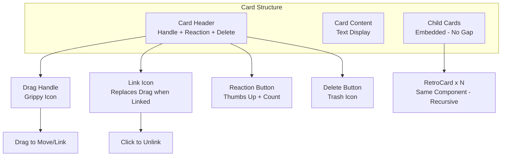

**Props**:
```typescript
{
  card: Card & {
    children: Card[]  // embedded from API
    linked_feedback_cards: Card[]  // for action cards
  }
  canDelete: boolean
  isChild: boolean  // true if this card has parent_card_id
  onReaction: (cardId: string) => void
  onDelete: (cardId: string) => void
  onDragStart: (cardId: string) => void
  onDropOnCard: (sourceId: string, targetId: string) => void
  onUnlinkFromParent: (childId: string) => void
}
```

**Card Header Layout**:
1. **Drag Handle** (default):
   - Grippy/hamburger icon
   - Initiates drag operation
   - Visible when card has NO parent (standalone or parent)

2. **Link Icon** (replaces drag handle):
   - Chain/link icon
   - Appears when card IS LINKED to parent
   - Click to unlink from parent
   - Replaces drag handle (not both)

3. **Reaction Button**:
   - Thumbs up icon + count
   - Shows aggregated count for parents
   - Shows direct count for children/standalone

4. **Delete Button**:
   - Trash icon
   - Only visible to card creator
   - Confirms before delete

**Visual Design**:
- **Feedback Card**: White background, column border color
- **Action Card**: Light blue background
- **Parent Card**: Slightly bolder border
- **Child Card**: Same styling as standalone, NO gap from parent

**Drag Behaviors**:
1. **Drag Feedback Card**: Can drop on another feedback → Create parent-child
2. **Drag Action Card**: Can drop on feedback → Create action link
3. **Drag Any Card**: Can drop on column → Move to column

**Children Rendering**:
- Children cards rendered directly below parent
- **No gap** between parent and first child
- Children are same component (recursive rendering)
- Each child shows link icon to unlink

**Responsibilities**:
1. **Render Card UI**: Content, reactions, metadata
2. **Handle Drag Events**: Initiate drag, detect drop target
3. **Link/Unlink UI**: Show link icon when linked, handle unlink
4. **Reaction Management**: Show count, handle click
5. **Delete Flow**: Show delete button (if owner), confirm, execute
6. **Render Children**: Recursive rendering with no gap

---

### 4.9 AdminDropdown

**Purpose**: Simplified admin promotion (replaces drag-and-drop)

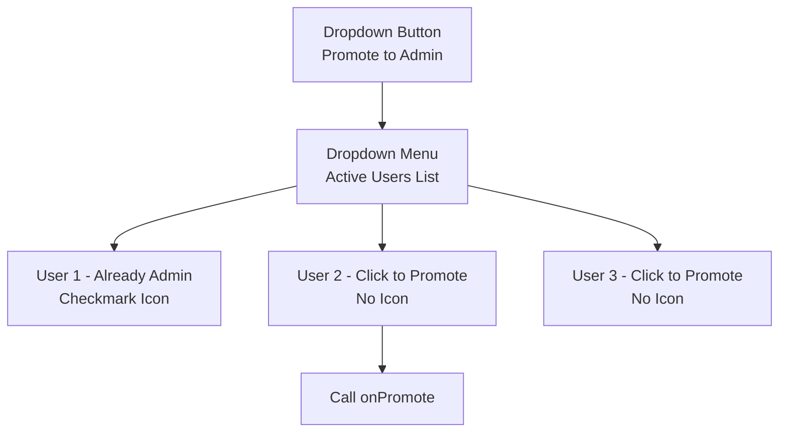

**Props**:
```typescript
{
  activeUsers: User[]
  admins: string[]
  isCreator: boolean
  onPromote: (userHash: string) => void
}
```

**Responsibilities**:
- Show dropdown button (creator only)
- Display list of active users
- Indicate current admins (checkmark)
- Promote non-admin users on click

**Simplified Approach**:
- No drag-and-drop complexity
- Simple click interaction
- Clearer UX for admin designation

---

### 4.10 ErrorBoundary

**Purpose**: Catch React errors and display fallback UI

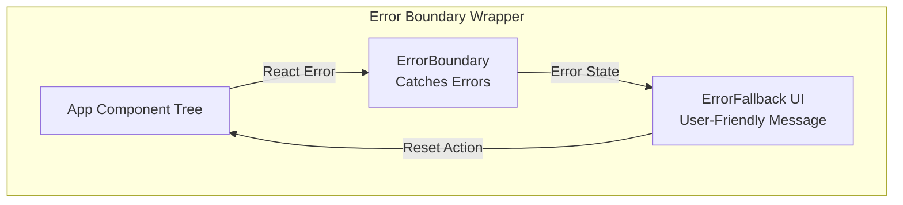

**Props**:
```typescript
{
  children: ReactNode
  fallback?: (error: Error, resetError: () => void) => ReactNode
  onError?: (error: Error, errorInfo: ErrorInfo) => void
}
```

**Responsibilities**:
1. **Catch React Errors**: Intercept errors in component tree
2. **Display Fallback UI**: Show user-friendly error message
3. **Error Logging**: Send error details to monitoring service
4. **Reset Functionality**: Allow user to retry after error
5. **Prevent White Screen**: Keep app partially functional

**Error Fallback UI**:
- Clear error message (no technical jargon)
- "Retry" button to reset error boundary
- "Go to Home" link as escape hatch
- Error ID for support reference

**Usage**:
```typescript
<ErrorBoundary onError={logToMonitoring}>
  <RetroBoardPage boardId={id} />
</ErrorBoundary>
```

**Does NOT Handle**:
- Event handler errors (use try/catch)
- Async errors (use error state in hooks)
- Server-side rendering errors

---

### 4.11 LoadingIndicator

**Purpose**: Show loading state during async operations

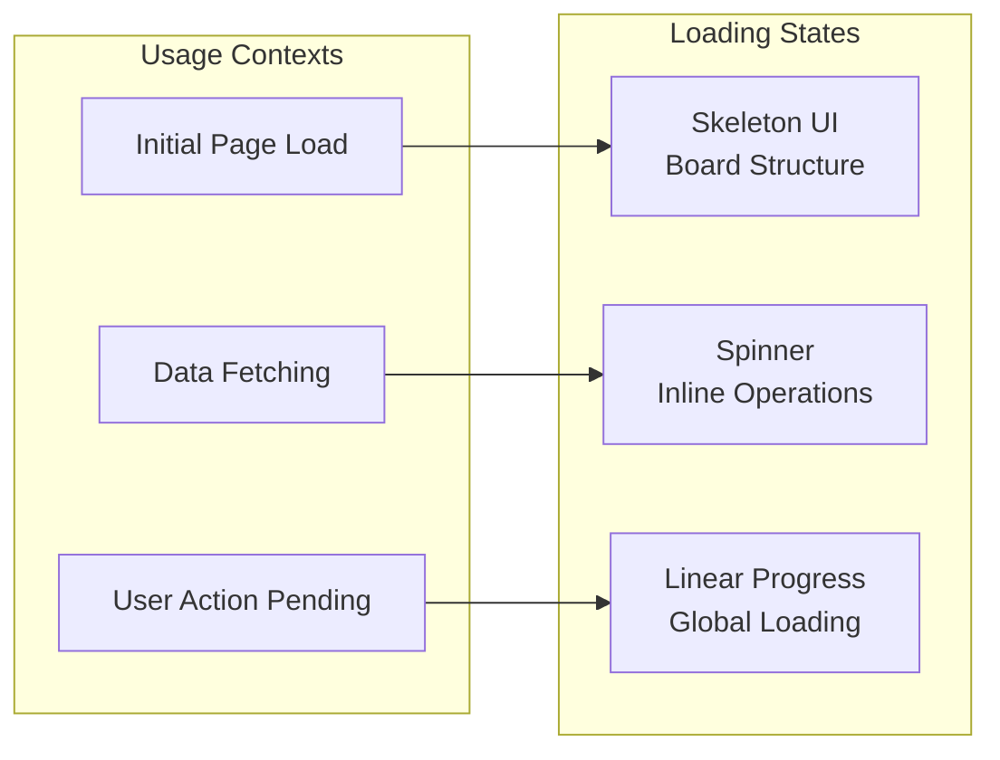

**Variants**:

1. **Full Page Skeleton** (Board loading):
```typescript
<BoardSkeleton>
  <HeaderSkeleton />
  <ParticipantBarSkeleton />
  <ColumnSkeleton count={3} />
</BoardSkeleton>
```

2. **Inline Spinner** (Card creation):
```typescript
<CircularProgress size={20} />
```

3. **Linear Progress** (Global actions):
```typescript
<LinearProgress position="fixed" top={0} />
```

**Responsibilities**:
- Prevent layout shift (reserve space)
- Match UI structure (skeleton mirrors real content)
- Show progress for long operations (>2s)
- Accessible labels (aria-busy, aria-live)

**Props**:
```typescript
{
  variant: 'skeleton' | 'spinner' | 'progress'
  size?: 'small' | 'medium' | 'large'
  message?: string  // "Loading board..."
}
```

---

### 4.12 FormValidation Utilities

**Purpose**: Centralized validation logic for user input

**File**: `shared/validation/index.ts`

**Alias Validation**:
```typescript
export const ALIAS_PATTERN = /^[a-zA-Z0-9 _-]+$/
export const MAX_ALIAS_LENGTH = 50
export const MIN_ALIAS_LENGTH = 1

export interface ValidationResult {
  valid: boolean
  error?: string
}

export function validateAlias(alias: string): ValidationResult {
  if (!alias || alias.trim().length === 0) {
    return { valid: false, error: 'Alias is required' }
  }

  const trimmed = alias.trim()

  if (trimmed.length < MIN_ALIAS_LENGTH) {
    return { valid: false, error: 'Alias is too short' }
  }

  if (trimmed.length > MAX_ALIAS_LENGTH) {
    return { valid: false, error: `Alias must be ${MAX_ALIAS_LENGTH} characters or less` }
  }

  if (!ALIAS_PATTERN.test(trimmed)) {
    return {
      valid: false,
      error: 'Only alphanumeric characters, spaces, hyphens, and underscores allowed'
    }
  }

  return { valid: true }
}
```

**Card Content Validation**:
```typescript
export const MAX_CARD_CONTENT_LENGTH = 5000
export const MIN_CARD_CONTENT_LENGTH = 1

export function validateCardContent(content: string): ValidationResult {
  if (!content || content.trim().length === 0) {
    return { valid: false, error: 'Card content is required' }
  }

  if (content.length > MAX_CARD_CONTENT_LENGTH) {
    return {
      valid: false,
      error: `Content must be ${MAX_CARD_CONTENT_LENGTH} characters or less`
    }
  }

  return { valid: true }
}
```

**Board Name Validation**:
```typescript
export const MAX_BOARD_NAME_LENGTH = 200
export const MIN_BOARD_NAME_LENGTH = 1

export function validateBoardName(name: string): ValidationResult {
  if (!name || name.trim().length === 0) {
    return { valid: false, error: 'Board name is required' }
  }

  if (name.length > MAX_BOARD_NAME_LENGTH) {
    return {
      valid: false,
      error: `Board name must be ${MAX_BOARD_NAME_LENGTH} characters or less`
    }
  }

  return { valid: true }
}
```

**Column Name Validation**:
```typescript
export const MAX_COLUMN_NAME_LENGTH = 100
export const MIN_COLUMN_NAME_LENGTH = 1

export function validateColumnName(name: string): ValidationResult {
  if (!name || name.trim().length === 0) {
    return { valid: false, error: 'Column name is required' }
  }

  if (name.length > MAX_COLUMN_NAME_LENGTH) {
    return {
      valid: false,
      error: `Column name must be ${MAX_COLUMN_NAME_LENGTH} characters or less`
    }
  }

  return { valid: true }
}
```

**Responsibilities**:
- Consistent validation across all forms
- Clear, user-friendly error messages
- Shared constants (avoid magic numbers)
- Type-safe validation results
- Reusable across ViewModels

**Usage in Components**:
```typescript
// In MyUserCard
const handleAliasChange = (newAlias: string) => {
  const validation = validateAlias(newAlias)

  if (!validation.valid) {
    setError(validation.error)
    return
  }

  onUpdateAlias(newAlias)
}
```

---

## 5. ViewModel Layer

### 5.1 useBoardViewModel

**Purpose**: Manage board-level state and operations

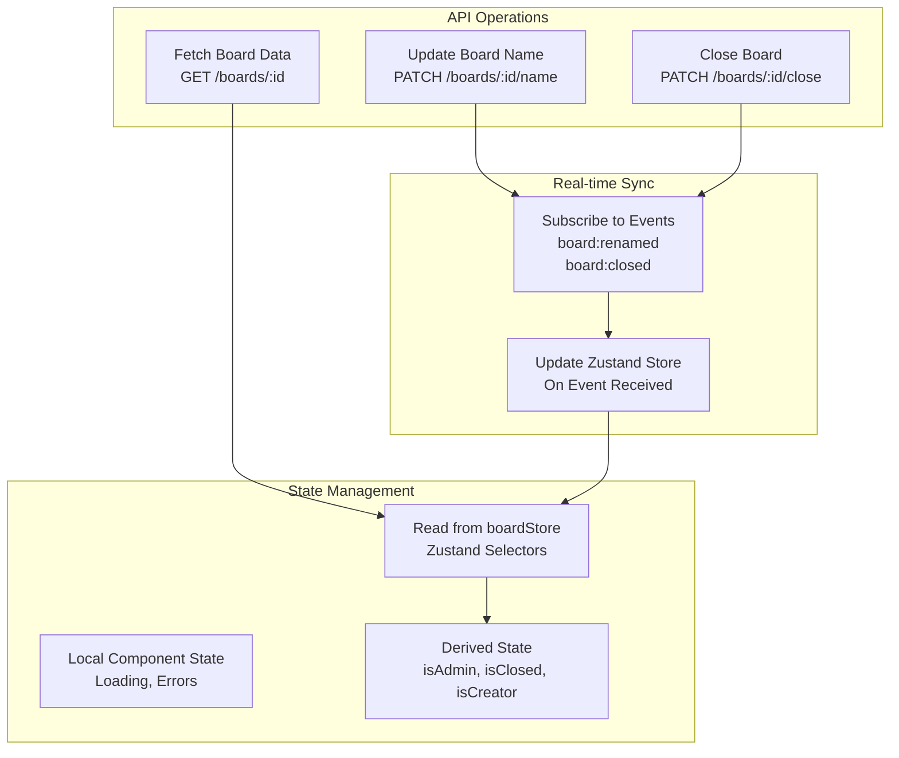

**Responsibilities**:

1. **Board Data Loading**:
   - Fetch board on mount using `boardId`
   - Handle loading and error states
   - Store in Zustand store

2. **Admin Check**:
   - Derive `isAdmin` from `board.admins.includes(currentUserHash)`
   - Derive `isCreator` from `board.admins[0] === currentUserHash`
   - Re-compute when board or user changes

3. **Board State Management**:
   - Track if board is closed (`board.state === 'closed'`)
   - Disable write operations when closed

4. **Board Operations**:
   - Rename board (admin only)
   - Close board (admin only)
   - Validate permissions before API calls

5. **Real-time Sync**:
   - Subscribe to `board:renamed` event → Update store
   - Subscribe to `board:closed` event → Update UI

**Return Interface**:
```typescript
{
  // State
  board: Board | null
  isLoading: boolean
  error: Error | null
  isAdmin: boolean
  isCreator: boolean
  isClosed: boolean

  // Actions
  handleRenameBoard: (newName: string) => Promise<void>
  handleCloseBoard: () => Promise<void>
  refreshBoard: () => Promise<void>
}
```

---

### 5.2 useCardViewModel (Revised)

**Purpose**: Manage card operations, sorting, filtering, quotas

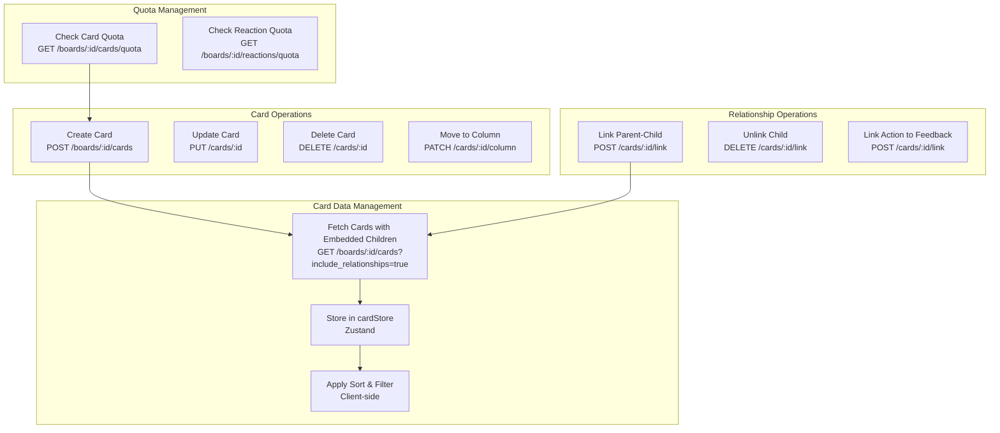

**Responsibilities**:

1. **Card Loading**:
   - Fetch all cards with embedded children/linked cards
   - Single API call returns complete tree
   - Store normalized in cardStore

2. **Quota Management**:
   - Check card quota before create dialog
   - Check reaction quota before allowing reaction
   - Display quota status (e.g., "3/5 cards created")

3. **Card CRUD**:
   - Create card (validate quota first)
   - Update card content (owner only)
   - Delete card (cascade children, reactions)
   - Move card to different column

4. **Sorting Logic** (Client-side):
   - Sort by recency (created_at)
   - Sort by popularity (aggregated_reaction_count for parents)
   - User-specific sorting (not persisted)

5. **Filtering Logic** (Client-side):
   - Filter by "All Users" (show all)
   - Filter by "Anonymous" (show/hide anonymous cards)
   - Filter by specific user (show only user's cards)
   - Multiple user filters (OR logic)

6. **Parent-Child Linking**:
   - Validate both cards are feedback type
   - Check for circular relationships
   - Update via API (backend recalculates aggregated counts)

7. **Action Linking**:
   - Validate source is action, target is feedback
   - Store link in `linked_feedback_ids` array

8. **Real-time Updates**:
   - Optimistic updates (immediate UI change)
   - Server confirmation (rollback on error)
   - Event-based sync (other users' changes)

**Return Interface**:
```typescript
{
  // State
  cards: Card[]  // with embedded children
  sortedAndFilteredCards: Card[]
  isLoading: boolean
  cardQuota: { current: number, limit: number, can_create: boolean }
  reactionQuota: { current: number, limit: number, can_react: boolean }

  // CRUD Actions
  handleCreateCard: (data: CreateCardDTO) => Promise<void>
  handleUpdateCard: (cardId: string, content: string) => Promise<void>
  handleDeleteCard: (cardId: string) => Promise<void>
  handleMoveCard: (cardId: string, columnId: string) => Promise<void>

  // Relationship Actions
  handleLinkParentChild: (parentId: string, childId: string) => Promise<void>
  handleUnlinkChild: (childId: string) => Promise<void>
  handleLinkAction: (actionId: string, feedbackId: string) => Promise<void>

  // Quota Checks
  checkCardQuota: () => Promise<QuotaStatus>
  checkReactionQuota: () => Promise<QuotaStatus>

  // Filtering & Sorting
  applySortFilter: (cards: Card[], mode: SortMode, filters: Filters) => Card[]
}
```

---

### 5.3 useParticipantViewModel (Revised)

**Purpose**: Manage participant list, alias management, admin designation

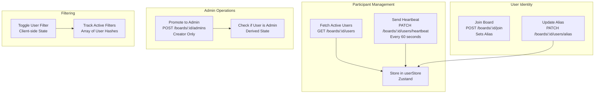

**Responsibilities**:

1. **Active User Tracking**:
   - Fetch active users (last active < 2 min)
   - Send heartbeat every 60 seconds
   - Update `last_active_at` timestamp

2. **User Identity Management**:
   - Generate default alias on first join (backend generates)
   - Allow user to update alias
   - Display UUID + alias in MyUserCard

3. **Admin Designation** (Simplified):
   - Dropdown-based promotion (no drag-and-drop)
   - Creator-only operation
   - Update board.admins array

4. **User Filtering**:
   - Maintain list of filtered users
   - Toggle filter on avatar click
   - Clear all filters option
   - Special filters: "All Users", "Anonymous"

5. **Real-time Sync**:
   - Subscribe to `user:joined` → Add to active list
   - Subscribe to `user:alias_changed` → Update display

**Return Interface**:
```typescript
{
  // State
  activeUsers: User[]
  currentUser: User & { uuid: string, alias: string }
  filteredUsers: string[]
  showAllUsers: boolean
  showAnonymous: boolean

  // Actions
  handleUpdateAlias: (newAlias: string) => Promise<void>
  handlePromoteToAdmin: (userHash: string) => Promise<void>
  handleToggleAllUsersFilter: () => void
  handleToggleAnonymousFilter: () => void
  handleToggleUserFilter: (userHash: string) => void
  handleClearFilters: () => void
  sendHeartbeat: () => Promise<void>
}
```

---

### 5.4 useDragDropViewModel (Revised)

**Purpose**: Manage drag-and-drop logic for cards (avatars no longer draggable)

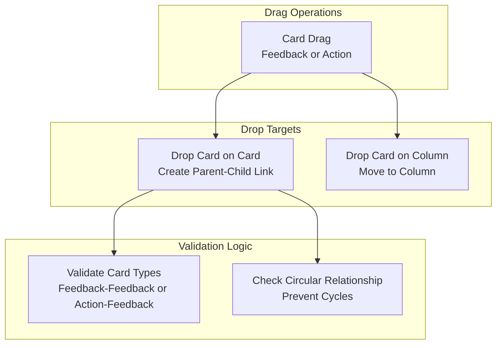

**Responsibilities**:

1. **Card Drag Initialization**:
   - Set drag data (card ID, type)
   - Show ghost image during drag
   - Highlight valid drop targets

2. **Drop Target Validation**:
   - **Card on Card**: Check card types (feedback-feedback or action-feedback)
   - **Card on Column**: Always valid (just move)

3. **Drop Handling**:
   - **Parent-Child Link**: Call `handleLinkParentChild()`
   - **Action Link**: Call `handleLinkAction()`
   - **Move to Column**: Call `handleMoveCard()`

4. **Circular Relationship Prevention**:
   - Check if target card is ancestor of source card
   - Traverse parent chain to root
   - Block drop if circular

5. **Visual Feedback**:
   - Highlight drop zones on drag-over
   - Show error cursor if invalid drop
   - Animate drop success/failure

**Return Interface**:
```typescript
{
  // Drag State
  isDragging: boolean
  draggedItem: { id: string; type: 'feedback' | 'action' } | null

  // Card Drag Handlers
  handleCardDragStart: (cardId: string, cardType: string) => void
  handleCardDragOver: (targetId: string, targetType: 'card' | 'column') => boolean
  handleCardDrop: (sourceId: string, targetId: string, targetType: string) => void
  handleCardDragEnd: () => void
}
```

**Note**: Avatar drag-and-drop removed - admin promotion via dropdown instead

---

## 6. Model Layer

### 6.1 Zustand State Stores

#### 6.1.1 boardStore

**Purpose**: Global state for board data

```mermaid
graph TB
    subgraph "Board State"
        Board[board: Board or null]
        Columns[columns: Column array]
        Admins[admins: string array]
        State[state: active or closed]
    end

    subgraph "Actions"
        SetBoard[setBoard: Board]
        UpdateName[updateName: string]
        CloseBoard[closeBoard: void]
        AddAdmin[addAdmin: userHash]
    end

    SetBoard --> Board
    UpdateName --> Board
    CloseBoard --> State
    AddAdmin --> Admins
```

**State Shape**:
```typescript
{
  board: Board | null
  isLoading: boolean
  error: Error | null

  // Actions
  setBoard: (board: Board) => void
  updateBoardName: (name: string) => void
  closeBoard: (closedAt: Date) => void
  addAdmin: (userHash: string) => void
}
```

---

#### 6.1.2 cardStore

**Purpose**: Global state for all cards (with embedded children)

```mermaid
graph TB
    subgraph "Card State"
        Cards[cards: Map cardId to Card]
        ByBoard[cardsByBoard: Map boardId to cardId array]
        ByColumn[cardsByColumn: Map columnId to cardId array]
    end

    subgraph "Actions"
        AddCard[addCard: Card]
        UpdateCard[updateCard: Partial Card]
        RemoveCard[removeCard: cardId]
        LinkCards[linkCards: parentId childId]
        UnlinkCards[unlinkCards: childId]
    end

    AddCard --> Cards
    UpdateCard --> Cards
    LinkCards --> Cards
    UnlinkCards --> Cards
```

**State Shape**:
```typescript
{
  cards: Map<string, Card & { children: Card[] }>

  // Normalized indexes
  cardsByBoard: Map<string, string[]>
  cardsByColumn: Map<string, string[]>

  // Actions
  addCard: (card: Card) => void
  updateCard: (cardId: string, updates: Partial<Card>) => void
  removeCard: (cardId: string) => void
  setCardsWithChildren: (cards: Card[]) => void  // from API response
  incrementReactionCount: (cardId: string) => void
  decrementReactionCount: (cardId: string) => void
}
```

---

#### 6.1.3 userStore (Revised)

**Purpose**: Global state for participants and current user

```mermaid
graph TB
    subgraph "User State"
        CurrentUser[currentUser: User with UUID and Alias]
        ActiveUsers[activeUsers: User array]
        SessionId[sessionId: string Cookie Value]
    end

    subgraph "Actions"
        SetCurrentUser[setCurrentUser: User]
        UpdateAlias[updateAlias: string]
        AddActiveUser[addActiveUser: User]
        RemoveInactive[removeInactiveUsers: void]
        UpdateHeartbeat[updateHeartbeat: void]
    end

    SetCurrentUser --> CurrentUser
    UpdateAlias --> CurrentUser
    AddActiveUser --> ActiveUsers
    UpdateHeartbeat --> ActiveUsers
```

**State Shape**:
```typescript
{
  currentUser: User & { uuid: string, alias: string } | null
  activeUsers: User[]
  sessionId: string  // Cookie value

  // Actions
  setCurrentUser: (user: User) => void
  updateAlias: (newAlias: string) => void
  addActiveUser: (user: User) => void
  removeUser: (userHash: string) => void
  updateHeartbeat: (userHash: string) => void
}
```

---

### 6.2 API Service Layer

#### 6.2.1 BoardAPI Service

**Purpose**: Handle board-related HTTP requests

```mermaid
graph LR
    subgraph "BoardAPI Methods"
        GetBoard[getBoard boardId]
        CreateBoard[createBoard CreateBoardDTO]
        UpdateName[updateBoardName boardId name]
        CloseBoard[closeBoard boardId]
        AddAdmin[addAdmin boardId userHash]
        JoinBoard[joinBoard boardId alias]
    end

    subgraph "HTTP Client"
        Axios[Axios Instance Base URL Config Interceptors]
    end

    GetBoard --> Axios
    CreateBoard --> Axios
    UpdateName --> Axios
    CloseBoard --> Axios
    AddAdmin --> Axios
    JoinBoard --> Axios

    Axios --> Backend[Backend API /boards/*]
```

**Methods**:
```typescript
interface BoardAPI {
  getBoard(boardId: string): Promise<Board>
  createBoard(data: CreateBoardDTO): Promise<Board>
  updateBoardName(boardId: string, name: string): Promise<Board>
  closeBoard(boardId: string): Promise<Board>
  addAdmin(boardId: string, userHash: string): Promise<void>
  joinBoard(boardId: string, alias: string): Promise<UserSession>
  updateAlias(boardId: string, alias: string): Promise<UserSession>
}
```

---

#### 6.2.2 CardAPI Service (Revised)

**Purpose**: Handle card-related HTTP requests with quota checks

```mermaid
graph LR
    subgraph "CardAPI Methods"
        GetCards[getCards boardId includeRelationships]
        CreateCard[createCard CreateCardDTO]
        UpdateCard[updateCard cardId content]
        DeleteCard[deleteCard cardId]
        MoveCard[moveCard cardId columnId]
        LinkCards[linkCards sourceId targetId linkType]
        UnlinkCards[unlinkCards sourceId targetId linkType]
        CheckCardQuota[checkCardQuota boardId]
        CheckReactionQuota[checkReactionQuota boardId]
    end

    GetCards --> Axios[Axios Instance]
    CreateCard --> Axios
    LinkCards --> Axios
    CheckCardQuota --> Axios
    CheckReactionQuota --> Axios

    Axios --> Backend[Backend API /cards/* /boards/:id/cards/quota /boards/:id/reactions/quota]
```

**Methods**:
```typescript
interface CardAPI {
  getCards(boardId: string, includeRelationships?: boolean): Promise<Card[]>
  createCard(data: CreateCardDTO): Promise<Card>
  updateCard(cardId: string, content: string): Promise<Card>
  deleteCard(cardId: string): Promise<void>
  moveCard(cardId: string, columnId: string): Promise<Card>
  linkCards(sourceId: string, targetId: string, linkType: LinkType): Promise<void>
  unlinkCards(sourceId: string, targetId: string, linkType: LinkType): Promise<void>
  checkCardQuota(boardId: string): Promise<QuotaStatus>
  checkReactionQuota(boardId: string): Promise<QuotaStatus>
}
```

---

#### 6.2.3 ReactionAPI Service (Revised)

**Purpose**: Handle reaction operations with quota checks

```mermaid
graph LR
    subgraph "ReactionAPI Methods"
        AddReaction[addReaction cardId type]
        RemoveReaction[removeReaction cardId]
        CheckQuota[checkQuota boardId]
    end

    AddReaction --> Axios[Axios Instance]
    RemoveReaction --> Axios
    CheckQuota --> Axios

    Axios --> Backend[Backend API /cards/:id/reactions /boards/:id/reactions/quota]
```

**Methods**:
```typescript
interface ReactionAPI {
  addReaction(cardId: string, type: string): Promise<Reaction>
  removeReaction(cardId: string): Promise<void>
  checkQuota(boardId: string): Promise<QuotaStatus>
}
```

---

### 6.3 Socket Service

**Purpose**: Manage WebSocket connection and event handling

```mermaid
graph TB
    subgraph "Socket Service"
        Connect[connect boardId]
        Disconnect[disconnect]
        Subscribe[on eventType handler]
        Emit[emit eventType data]
    end

    subgraph "Event Handling"
        CardCreated[card:created Add to cardStore]
        CardUpdated[card:updated Update cardStore]
        CardDeleted[card:deleted Remove from cardStore]
        BoardClosed[board:closed Update boardStore]
        UserJoined[user:joined Add to userStore]
        AliasChanged[user:alias_changed Update userStore]
    end

    Subscribe --> CardCreated
    Subscribe --> CardUpdated
    Subscribe --> CardDeleted
    Subscribe --> BoardClosed
    Subscribe --> UserJoined
    Subscribe --> AliasChanged

    CardCreated --> UpdateStore[Update Zustand Stores]
    CardUpdated --> UpdateStore
    AliasChanged --> UpdateStore
```

**Interface**:
```typescript
interface SocketService {
  connect(boardId: string): void
  disconnect(): void
  on(eventType: string, handler: (data: any) => void): void
  off(eventType: string): void
  emit(eventType: string, data: any): void
}
```

**Event Subscriptions**:
- `card:created` → Add card to store (with children if embedded)
- `card:updated` → Update card in store
- `card:deleted` → Remove card from store
- `card:moved` → Update card column
- `card:linked` → Update parent-child relationship
- `reaction:added` → Increment reaction count
- `reaction:removed` → Decrement reaction count
- `board:renamed` → Update board name
- `board:closed` → Update board state
- `user:joined` → Add user to active list
- `user:alias_changed` → Update user alias

---

## 7. Data Flow Patterns

### 7.1 Card Creation with Quota Check

```mermaid
sequenceDiagram
    participant User
    participant View as RetroColumn View
    participant VM as useCardViewModel ViewModel
    participant API as CardAPI Model
    participant Backend

    User->>View: Click + button
    View->>VM: handleCreateCard
    VM->>API: checkCardQuota boardId
    API->>Backend: GET /boards/:id/cards/quota
    Backend-->>API: current: 3 limit: 5 can_create: true
    API-->>VM: Quota status
    VM->>VM: Validate can_create = true
    VM->>View: Show create card dialog
    User->>View: Enter card content Submit
    View->>VM: handleCreateCard data
    VM->>API: createCard data
    API->>Backend: POST /boards/:id/cards
    Backend-->>API: 201 Created + Card
    API-->>VM: Card object
    VM->>Store: addCard card
    Store-->>View: Re-render with new card
    Backend->>Socket: Broadcast card:created
    Socket->>OtherUsers: WebSocket card:created
```

**Key Points**:
1. **Quota Check First**: Before showing dialog
2. **Optimistic Update**: Can be added after quota validation
3. **Real-time Sync**: Other users receive update via WebSocket

---

### 7.2 Parent-Child Linking with Embedded Response

```mermaid
sequenceDiagram
    participant User
    participant View as RetroCard View
    participant DragVM as useDragDropViewModel ViewModel
    participant CardVM as useCardViewModel ViewModel
    participant API as CardAPI Model
    participant Backend

    User->>View: Drag Card A
    View->>DragVM: handleCardDragStart cardA
    DragVM-->>View: Set isDragging=true

    User->>View: Drop on Card B
    View->>DragVM: handleCardDrop cardA cardB
    DragVM->>DragVM: Validate both feedback type
    DragVM->>DragVM: Check circular relationship
    DragVM->>CardVM: handleLinkParentChild B A
    CardVM->>API: POST /cards/B/link target: A type: parent_of
    API->>Backend: HTTP Request
    Backend-->>API: 201 Created
    Backend->>Backend: Update aggregated counts
    API-->>CardVM: Success
    CardVM->>CardVM: Refresh cards with embedded children
    CardVM->>API: GET /boards/:id/cards?include_relationships=true
    API->>Backend: HTTP Request
    Backend-->>API: Cards with embedded children
    API-->>CardVM: Full card tree
    CardVM->>Store: setCardsWithChildren cards
    Store-->>View: Re-render hierarchy
```

**Validation Steps**:
1. Both cards must be `card_type: "feedback"`
2. Target card must not be ancestor of source (prevent circular)
3. Backend recalculates aggregated reaction counts
4. Frontend refreshes to get updated tree

---

### 7.3 User Alias Update Flow

```mermaid
sequenceDiagram
    participant User
    participant MyUserCard as MyUserCard View
    participant ParticipantVM as useParticipantViewModel ViewModel
    participant API as BoardAPI Model
    participant Backend

    User->>MyUserCard: Click Edit Alias
    MyUserCard->>MyUserCard: Show edit dialog
    User->>MyUserCard: Enter new alias SneakyPanda42
    MyUserCard->>ParticipantVM: handleUpdateAlias SneakyPanda42
    ParticipantVM->>API: PATCH /boards/:id/users/alias
    API->>Backend: HTTP Request
    Backend-->>API: 200 OK new alias
    API-->>ParticipantVM: Success
    ParticipantVM->>Store: updateAlias SneakyPanda42
    Store-->>MyUserCard: Re-render with new alias
    Backend->>Socket: Broadcast user:alias_changed
    Socket->>OtherUsers: Update participant list
```

**Key Points**:
- Alias updates immediately in MyUserCard
- Other users see updated alias in ParticipantBar
- No page refresh needed

---

### 7.4 Filtering with Special Avatars

```mermaid
graph TB
    subgraph "User Action"
        ClickAllUsers[User Clicks All Users Avatar]
        ClickAnonymous[User Clicks Anonymous Avatar]
        ClickParticipant[User Clicks Participant Avatar]
    end

    subgraph "ViewModel Processing"
        ToggleAll[useParticipantViewModel handleToggleAllUsersFilter]
        ToggleAnon[useParticipantViewModel handleToggleAnonymousFilter]
        ToggleUser[useParticipantViewModel handleToggleUserFilter]
        UpdateFilters[Update activeFilters State]
    end

    subgraph "Card Transformation"
        FilterCards[useCardViewModel applySortFilter]
        RenderCards[Re-render Card List With filtered cards]
    end

    ClickAllUsers --> ToggleAll
    ClickAnonymous --> ToggleAnon
    ClickParticipant --> ToggleUser

    ToggleAll --> UpdateFilters
    ToggleAnon --> UpdateFilters
    ToggleUser --> UpdateFilters

    UpdateFilters --> FilterCards
    FilterCards --> RenderCards
```

**Filter Logic**:
- **All Users** (default): Show all cards
- **Anonymous**: Toggle anonymous card visibility
- **Specific User**: Show only selected user's cards
- **Multiple Users**: OR logic (show if created by any selected user)

---

## 8. API Requirements Summary

After reviewing the Backend API Specification V2, the following APIs are **available and support all front-end requirements**:

### 8.1 New APIs Added ✅

| Feature | API Endpoint | Notes |
|---------|-------------|-------|
| **Cards with Relationships** | `GET /boards/:id/cards?include_relationships=true` | ✅ Embedded children + linked feedback |
| **Card Quota Check** | `GET /boards/:id/cards/quota` | ✅ Returns current count, limit, can_create flag |
| **Reaction Quota Check** | `GET /boards/:id/reactions/quota` | ✅ Returns current count, limit, can_react flag |
| **Update Alias** | `PATCH /boards/:id/users/alias` | ✅ Change user display name |

### 8.2 All Required APIs ✅

| Feature | API Endpoint | Status |
|---------|-------------|--------|
| Board CRUD | `POST /boards`, `GET /boards/:id`, `PATCH /boards/:id/name` | ✅ |
| Column Rename | `PATCH /boards/:id/columns/:columnId` | ✅ |
| Join Board | `POST /boards/:id/join` | ✅ |
| Close Board | `PATCH /boards/:id/close` | ✅ |
| Admin Management | `POST /boards/:id/admins` | ✅ |
| Active Users | `GET /boards/:id/users` | ✅ |
| Heartbeat | `PATCH /boards/:id/users/heartbeat` | ✅ |
| Card CRUD | `POST /boards/:id/cards`, `PUT /cards/:id`, `DELETE /cards/:id` | ✅ |
| Card Linking | `POST /cards/:id/link`, `DELETE /cards/:id/link` | ✅ |
| Move Card | `PATCH /cards/:id/column` | ✅ |
| Reactions | `POST /cards/:id/reactions`, `DELETE /cards/:id/reactions` | ✅ |

### 8.3 No Missing APIs ✅

All front-end component requirements are fully supported by the backend API.

---

## Document Status

**Status**: Design Review v2.1 Complete - MVP Ready

**Changes from v1.0**:
1. ❌ Removed ClosedBoardBanner (lock icon in header instead)
2. ✅ Simplified admin promotion (dropdown instead of drag-and-drop)
3. ✅ Added special filter avatars (All Users `*`, Anonymous ghost)
4. ✅ Simplified FilterBar → SortBar (filters in avatars)
5. ✅ Revised RetroCard header (link icon replaces drag handle when linked)
6. ✅ Child cards have no gap from parent (same component, recursive)
7. ✅ Added MyUserCard component (UUID + alias display/edit)
8. ✅ Default alias generation (AdjectiveAnimal2Digit pattern)
9. ✅ Removed all Mermaid style fills per requirements
10. ✅ Added quota check APIs to CardAPI/ReactionAPI

**Changes from v2.0 (MVP Essentials)**:
11. ✅ Added ErrorBoundary component for production error handling
12. ✅ Added LoadingIndicator components (skeleton, spinner, progress)
13. ✅ Added FormValidation utilities (alias, card content, board name, column name)

**Changes from v2.1 (Phase 8.1 - Home Page)**:
14. ✅ Added HomePage component (landing page at `/`)
15. ✅ Added CreateBoardDialog component (board creation flow)
16. ✅ Updated routing: `/` → HomePage, `/boards/:id` → RetroBoardPage
17. ✅ Added useCreateBoardViewModel hook for board creation logic

**Deferred to Post-MVP**:
- Network connectivity detection and offline handling
- Keyboard navigation for drag-and-drop (accessibility)
- QuotaIndicator visual progress bars
- Socket reconnection with exponential backoff

**Next Steps**:
1. Review simplified admin promotion UX with team
2. Validate special filter avatar design
3. Create UI mockup for MyUserCard component
4. Set up embedded children rendering (recursive RetroCard)
5. Test link icon interaction for unlinking cards
6. Implement ErrorBoundary with error logging service integration
7. Design skeleton UI components matching board layout

**Related Documents**:
- [HIGH_LEVEL_TECHNICAL_DESIGN.md](./docs/HIGH_LEVEL_TECHNICAL_DESIGN.md) - Backend architecture
- [BACKEND_API_SPECIFICATION_V2.md](./docs/BACKEND_API_SPECIFICATION_V2.md) - API contracts
- [UX_DECISIONS_SUMMARY.md](./UX_DECISIONS_SUMMARY.md) - UX requirements
- [Wireframe-1-drawio.xml](./Wireframe-1-drawio.xml) - Visual wireframe
